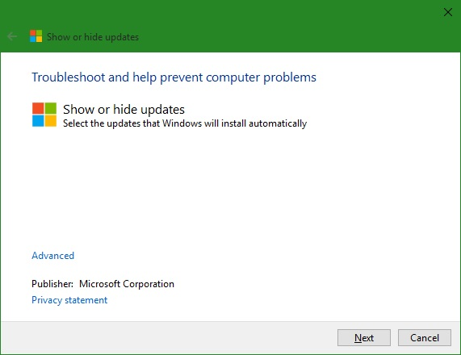
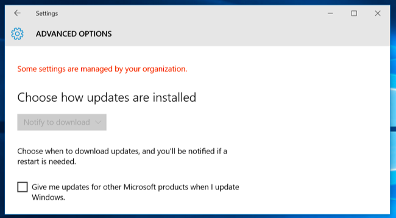

+++
title = "طريقة إيقاف التحديثات التلقائية في ويندوز 10"
date = "2015-09-01"
description = "في ويندوز 10 وعلى خلاف كل إصدارات الويندوز السابقة، قامت مايكروسوفت بإلغاء جميع الإعدادات الخاصة بالتحكم في التحديثات، وبهذا لم تعد هناك طريقة لإيقاف التحديثات التلقائية من لوحة التحكم أو تطبيق الإعدادات، في درس اليوم ستتعرف عزيزي القارئ على 6 طرق لإيقاف التحديثات التلقائية في ويندوز 10."
categories = ["ويندوز",]
tags = ["مجلة لغة العصر"]
series = ["ويندوز 10"]

+++

في ويندوز 10 وعلى خلاف كل إصدارات الويندوز السابقة، قامت مايكروسوفت بإلغاء جميع الإعدادات الخاصة بالتحكم في التحديثات، وبهذا لم تعد هناك طريقة لإيقاف التحديثات التلقائية من لوحة التحكم أو تطبيق الإعدادات، في درس اليوم ستتعرف عزيزي القارئ على 6 طرق لإيقاف التحديثات التلقائية في ويندوز 10.

في البداية يجب عليك عزيزي القارئ أن تعلم أن إيقاف التحديثات غير موصى به على الإطلاق، ولذلك قامت مايكروسوفت بجعل التحديثات تلقائية في ويندوز 10، فعندما تقوم بإيقاف التحديثات التلقائية يصبح جهازك أكثر عرضه للفايروسات ومشاكل التعريفات القديمة، لذلك لا ينصح بإيقافها.

### مميزات إيقاف التحديثات في ويندوز

-   توفير موارد الجهاز للعمليات الأخرى.

-   زيادة سرعة الإنترنت.

-   المحافظة على المساحة الفارغة في قرص الويندوز.

## أولا: منع التحديث التلقائي على اتصال إنترنت معين (Wi-Fi فقط)

عندما تقوم بتحديد اتصالك الحالي بالإنترنت على أنه "محدد metered" لن يقوم الويندوز بالتحديثات تلقائيا ولكن سيقوم فقط بالتحقق من التحديثات، فمثلا لو أنك قمت بتحديد الإنترنت الموجود في منزلك على أنه "محدد metered" عندما تقوم بالاتصال بأي شبكة إنترنت أخرى سيبدأ الويندوز بتحميل التحديثات، ولفعل هذا اتبع الخطوات الآتية:

1. قم بالدخول إلى تطبيق الإعدادات، ثم قسم "Network & Internet".

2. من التبويب Wi-Fi قم بالضغط على Advanced options.

3. قم بتفعيل الاختيار "Set as metered connection".

4. عندما تقوم بالدخول إلى إعدادات Windows Update ستخبرك بأنه بمجرد اتصالك بشبكة أخرى سيبدأ تحميل التحديثات.

## ثانيا: منع تثبيت تحديث معين

قامت مايكروسوفت بإطلاق أداة تمكن المستخدم من منع وصول التحديثات التي لا يريد تثبيتها.

1. قم بتحميل الأداة [من هنا](https://support.microsoft.com/en-us/kb/3073930?utm_source=twitter).

2. بمجرد أن تقوم بتشغيلها اضغط Next.

3. ستبحث الأداة عن التحديثات المتاحة.

4. بعد أن تنتهي من البحث ستظهر لك الاختيارات الآتية:

5. اضغط على Hide Updates لإخفاء التحديثات ثم قم باختيار التحديثات التي لا تريدها واضغط Next.

## ثالثا: إيقاف التحديثات التلقائية بتفعيل وضع توفير الطاقة

عند تفعيل وضع توفير الطاقة من Action center أو الإعدادات يقوم الويندوز بمنع تحميل التحديثات وذلك حتى توصيل الجهاز (اللاب توب) بمصدر للكهرباء.

عند الدخول إلى إعدادات Windows Update سيخبرك الويندوز بأنه عند توصيل الجهاز بالكهرباء سيبدأ تحميل التحديثات.

## رابعا: تعطيل التحديثات التلقائية بشكل دائم عن طريق (Windows Services)

تعمل هذه الطريقة والطريقتين التاليتين على إصدارات Professional، Enterprise، وEducation فقط.

1. قم بالضغط على Windows Key + R ثم اكتب "`services.msc`".

    

2. قم بالنزول إلى الأسفل واختيار Windows Update.

3. اضغط بزر الفأرة الأيسر مرتين ثم قم بتغيير الإعدادات كما بالصورة.

4. عند الدخول إلى إعدادات Windows Update سيخبرك الويندوز بأنه توجد مشكلة ويرجى إعادة المحاولة.

## خامسا: تعطيل التحديثات التلقائية بشكل دائم عن طريق (Group Policy)

1. قم بالضغط على Windows Key + R ثم اكتب "gpedit.msc".

2. انتقل إلى المسار Computer ConfigurationAdministrative TemplatesWindows ConfigurationWindows Updates.

3. قم بفتح الاختيار "Configure Automatic Updates".

4. اضغط Enable ثم من القائمة المنسدلة Configure automatic Updating اختر "Notify for download and notify for install".

## سادسا: تعطيل التحديثات التلقائية بشكل دائم عن طريق (Windows Registry)

1. قم بتحميل [هذا الملف من هنا](http://cdn4.howtogeek.com/wp-content/uploads/2015/07/Disable-Automatic-Updates-on-Windows-10.zip).

2. قم بفتح الملف "Notify for download and notify for install.reg".

3. عندما تقوم بفتح إعدادات التحديث ستظهر الإعدادات مغلقة كما بالصورة:

## سابعا: إلغاء جميع التغييرات السابقة واستعادة الإعدادات الافتراضية

1. قم بتحميل [هذا الملف من هنا](http://cdn4.howtogeek.com/wp-content/uploads/2015/07/Disable-Automatic-Updates-on-Windows-10.zip).

2. قم بفتح الملف "Remove this setting and use the default.reg".

3. بهذا تكون قد ألغيت جميع التعديلات على إعدادات التحديث التلقائي واستعدت الإعدادات الطبيعية.

---

هذا الموضوع نشر باﻷصل في مجلة لغة العصر العدد 177 شهر 09-2015 ويمكن الإطلاع عليه [هنا](https://drive.google.com/file/d/1ojopa8YTh5uvl6MjovNoqCPUd-ORvro8/view?usp=sharing).

