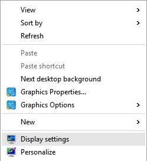
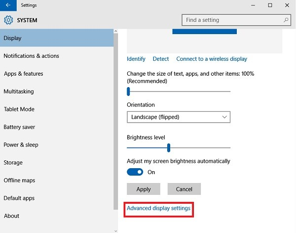
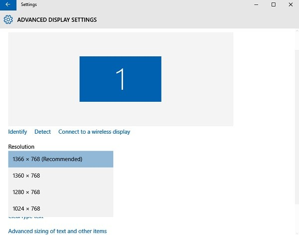
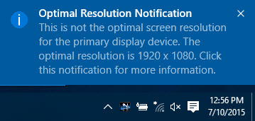

+++
title = "طريقة تغيير أبعاد الشاشة في ويندوز 10"
date = "2015-08-09"
description = "بعد تثبيتك لويندوز 10 قد تجد أن أبعاد الشاشة لديك قد تغيرت عن الويندوز السابق، كما أن طريقة التحكم في أبعاد الشاشة مختلفة تماما عن الإصدارات السابقة، في هذا الدرس نقدم لك طريقة التحكم في أبعاد الشاشة في ويندوز 10."
categories = ["ويندوز",]
series = ["ويندوز 10"]
tags = ["موقع لغة العصر"]

+++

بعد تثبيتك لويندوز 10 قد تجد أن أبعاد الشاشة لديك قد تغيرت عن الويندوز السابق، كما أن طريقة التحكم في أبعاد الشاشة مختلفة تماما عن الإصدارات السابقة، في هذا الدرس نقدم لك طريقة التحكم في أبعاد الشاشة في ويندوز 10.

من أهم الضروريات اختيار الدقة الصحيحة لشاشتك، فهي أكثر راحة للعين، وتعطى نقاءً في الألوان والصور، ولذا يوصى دائما بتحديث تعريفات كارت الشاشة في جهازك وإعداد أبعاد الشاشة بالطريقة الصحيحة إليك الخطوات:

1. في أي مكان فارغ على سطح المكتب قم بالضغط بزر الفأرة الأيمن ثم قم باختيار Display Settings.

2. ستظهر لك الشاشة التالية، قم بالضغط على Advanced Display Settings.

3. 1366 X 768 هي دقة الشاشة المثالية بالنسبة لجهازي، قد يختلف الأمر بالنسبة لك، ولكن يفضل أن تختار الدقة المكتوب أمامها Recommended أو أعلى دقة في القائمة.

4. إذا قمت باختيار أي دقة شاشة غير المثالية سيظهر لك هذا الإشعار.

5. قم بالضغط عليه لتظهر لك هذه الشاشة، اضغط Keep The Changes لحفظ التغييرات أو Revert لإلغائها.

---

هذا الموضوع نٌشر باﻷصل على موقع مجلة لغة العصر.

http://aitmag.ahram.org.eg/News/22306.aspx
