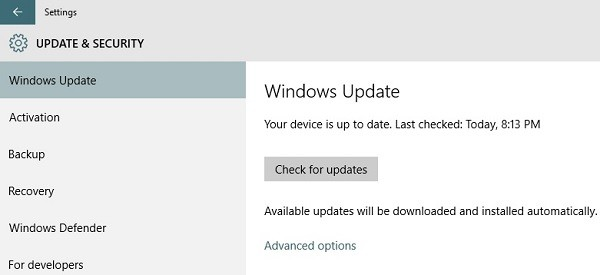

+++
title = "طريقة استعادة إصدار الويندوز السابق بعد الترقية الى ويندوز 10"
date = "2015-06-21"
description = "هل قمت بالترقية إلى النسخة التجريبية من ويندوز 10 ولم تعجبك؟ بدلا من إعادة تثبيت نظام الويندوز من جديد قامت مايكروسوفت بتوفير قسم داخل إعدادات ويندوز 10 يمكنك من الرجوع الى نسختك السابقة من الويندوز والتي قمت بالترقية من خلالها، وبدون فقدان أي بيانات، اليكم الطريقة."
categories = ["ويندوز",]
series = ["ويندوز 10"]
tags = ["موقع لغة العصر"]

+++

هل قمت بالترقية إلى النسخة التجريبية من ويندوز 10 ولم تعجبك؟ بدلا من إعادة تثبيت نظام الويندوز من جديد قامت مايكروسوفت بتوفير قسم داخل إعدادات ويندوز 10 يمكنك من الرجوع الى نسختك السابقة من الويندوز والتي قمت بالترقية من خلالها، وبدون فقدان أي بيانات، اليكم الطريقة.

يجب أن تكون قد قمت بعمل الترقية إلى ويندوز 10 عن طريق أداة التحديث التي سبق شرحها، وليس عن طريق عمل Clean Install لتعمل معك هذه الطريقة.

1. قم بفتح PC Settings عن طريق كتابة Settings في مربع البحث.
2. بعد فتح الإعدادات توجه إلى قسم Update and Security.

3. ستظهر لك العديد من الإعدادات كما بالصورة، قم بالدخول الى Recovery،

4. ستجد ثلاثة اختيارات هي:

-   Reset this PC وهو الاختيار الخاص بعمل ضبط مصنع لنسخة الويندوز، وإرجاعها كما كانت بعد التثبيت مباشرة.
-   Go back to your previous version of Windows وهو الاختيار الخاص بإلغاء ترقية ويندوز 10 والعودة إلى الإصدار القديم.
-   Advanced Startup وهو الاختيار الخاص بالإعدادات المتقدمة للإقلاع.

5. قم بالضغط على Go back to your previous version of Windows لتقوم بإلغاء ترقية ويندوز 10.
6. سيظهر لك feedback يسألك عن سبب رغبتك في الغاء تثبيت ويندوز 10.

7. قم بمتابعة خطوات المعالج لكي تستكمل إلغاء التثبيت.

---

هذا الموضوع نٌشر باﻷصل على موقع مجلة لغة العصر.

http://aitmag.ahram.org.eg/News/17832.aspx
