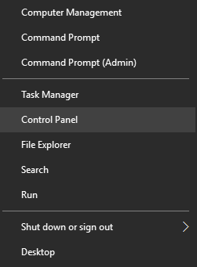
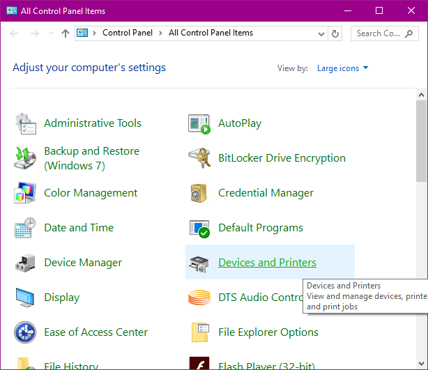
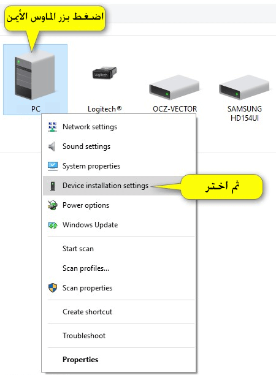

+++
title = "كيفية التحكم في ميزة تحميل تحديثات التعريفات تلقائيا في ويندوز 10"
date = "2016-02-17"
description = "هل تعلم عزيزي القارئ أن من جملة التحديثات التي يدعمها ويندوز 10 هي تحديثات التعريفات، في هذا الدرس ستتعرف على طريقة تشغيل هذه الميزة أو اغلاقها"
categories = ["ويندوز",]
series = ["ويندوز 10"]
tags = ["موقع لغة العصر"]
+++

هل تعلم عزيزي القارئ أن من جملة التحديثات التي يدعمها ويندوز 10 هي تحديثات التعريفات، في هذا الدرس ستتعرف على طريقة تشغيل هذه الميزة أو اغلاقها.

يجب أن تسجل الدخول بحساب المسئول Administrator لتتمكن من التحكم في هذه الميزة.

1- قم بالدخول إلى لوحة التحكم Control Panel.

2- اختر Devices and Printers.

3- اضغط بزر الماوس الأيمن على اسم الجهاز الخاص بك كما بالصورة ثم اختر Device installation settings.

4- اختر Yes, do this automatically لتفعيل ميزة تحميل تحديثات التعريفات تلقائيا، أو No (your device might not work as expected) لتعطيلها.

---
هذا الموضوع نٌشر باﻷصل على موقع مجلة لغة العصر.

http://aitmag.ahram.org.eg/News/44117.aspx