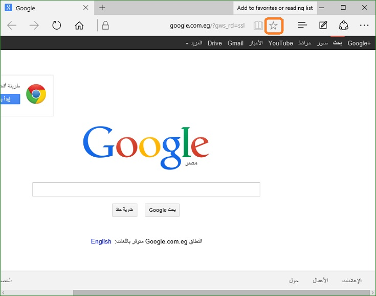
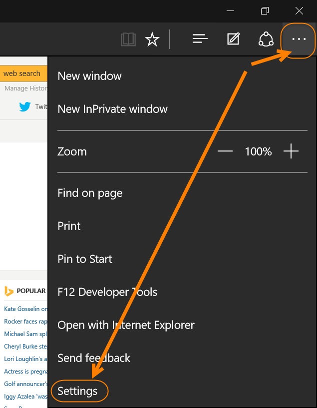
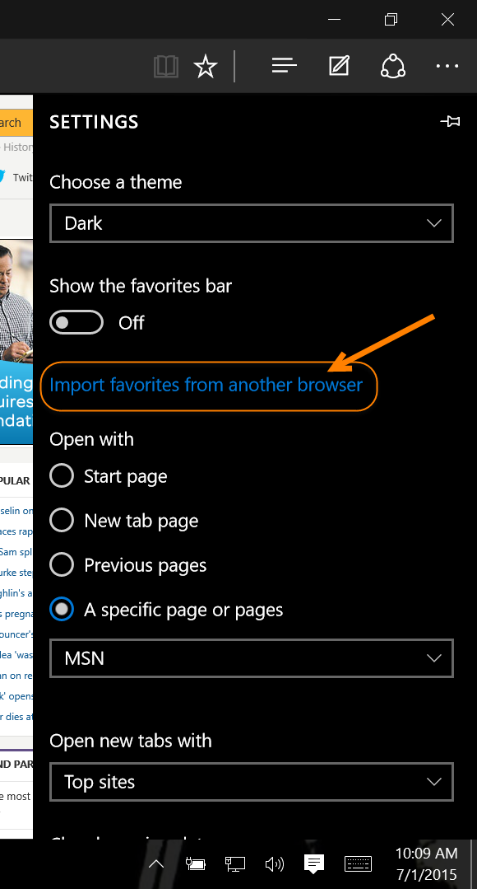
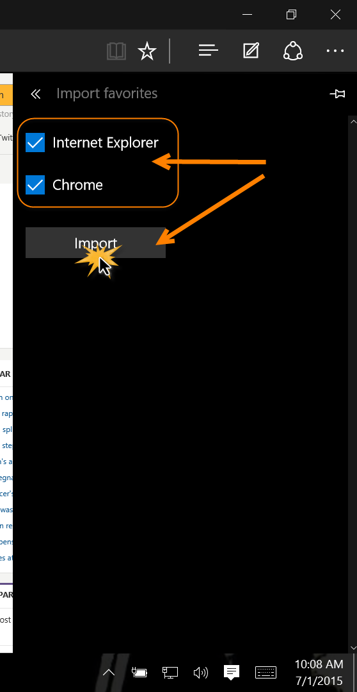
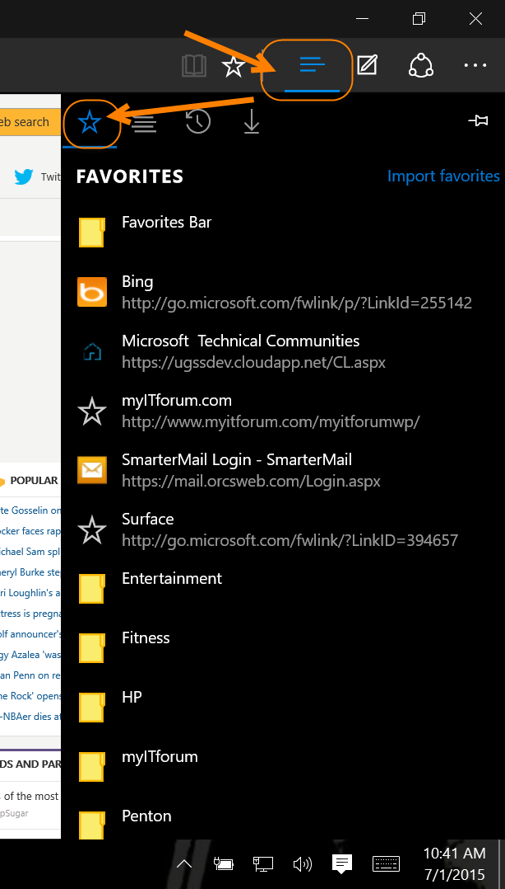

+++
title = "تعلم ويندوز 10 ..دليلك الشامل للتعامل مع المواقع المفضلة في متصفح Edge"
date = "2015-08-26"
description = "ربما يبهرك عند استخدامه، بواجهته البسيطة وخصائصه الفريدة وسرعته المذهلة، ولكن يجب عليك عزيزي القارئ أن تعرف جميع أسراره وخفاياه لتستفيد من كافة إمكانياته، إليك سر جديد من أسراره ومع طريقة إضافة مواقعك المفضلة إلى متصفح Edge."
categories = ["ويندوز",]
series = ["ويندوز 10"]
tags = ["موقع لغة العصر"]
images = ["images/2015-635761930532945673-294_thumb705x335.jpg"]

+++

ربما يبهرك عند استخدامه، بواجهته البسيطة وخصائصه الفريدة وسرعته المذهلة، ولكن يجب عليك عزيزي القارئ أن تعرف جميع أسراره وخفاياه لتستفيد من كافة إمكانياته، إليك سر جديد من أسراره ومع طريقة إضافة مواقعك المفضلة إلى متصفح Edge.

تستطيع من خلال متصفح Edge استيراد مواقعك المفضلة من متصفحات Google Chrome و Internet Explorer واضافتها إلى مفضلات متصفح Edge كما تستطيع أيضا استيراد المفضلات على هيئة ملف HTML، العيب الوحيد حتى الآن هو أنه لا يدعم الاستيراد من متصفح Firefox مباشرة، ولكن لا تقلق عزيزي القارئ في درس اليوم سأقدم لك حل هذه المشكلة.

**أولا: إضافة المفضلات بالطريقة العادية:**
ستجد علامة المفضلة على يمين شريط العنوان عند الضغط عليها سيتم إضافة الموقع الحالي إلى المفصلة.

**ثانيا: استيراد المفضلات من** **Google Chrome** **وInternet Explorer:**
1. قم بالدخول إلى إعدادات متصفح Edge من القائمة الموجودة أعلى يمين الشاشة.

2. اضغط على الاختيار Import favorites from another browser.

3. اختر المتصفحات التي تريد استيراد المفضلة منها ثم اضغط Import.

4. سيتم الانتهاء من الاستيراد خلال ثواني.

**ثالثا: استيراد المفضلات من** **Mozilla Firefox:**

حتى تاريخ كتابة هذا الدرس، لا يوجد طريقة مباشرة لاستيراد المفضلات من فايرفوكس مثل جوجل كروم، ولكن يمكن التغلب على هذه المشكلة بواسطة هذه الحيلة.
1. قم بالدخول إلى Internet Explorer ثم قم باستيراد المفضلات من متصفح فايرفوكس (File- Import and Export...).
2. الآن قم باستيراد المفضلات من متصفح Internet Explorer إلى متصفح Edge كما بالجزء السابق.

**رابعا: استيراد المفضلات من ملف** **HTML:**

أيضا لا توجد طريقة مباشرة لاستيراد المفضلات على هيئة ملف HTML في متصفح Edge، ولكن يمكنك استيراد ملف HTML في أي متصفح آخر ومن ثم استيراد هذه المفضلات في Edge بالطريقة العادية.

**خامسا: مشاهدة المفضلات وإدارتها في متصفح** **Edge:**

تستطيع رؤية المواقع التي قم بإضافتها إلى المفضلة أو قمت باستيرادها عن طريق الضغط على زر القائمة الجانبية ثم المفضلات كما بالصورة:

---
هذا الموضوع نٌشر باﻷصل على موقع مجلة لغة العصر.

http://aitmag.ahram.org.eg/News/23632.aspx