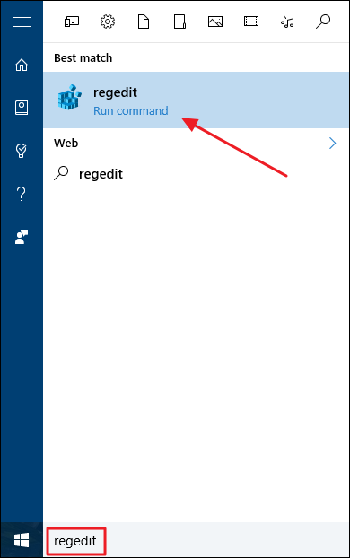
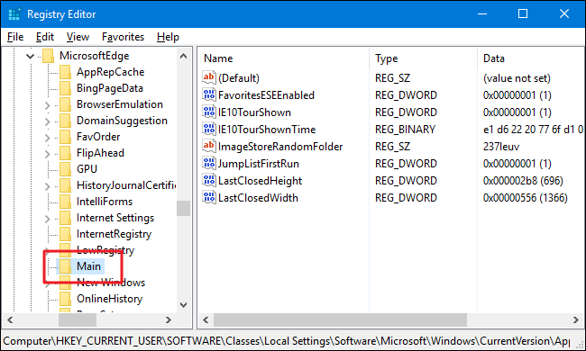
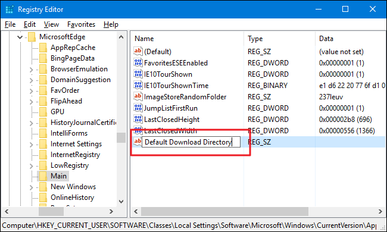
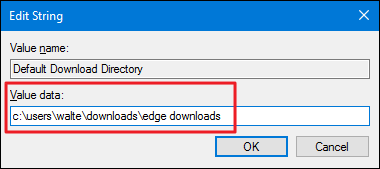

+++
title = "كيفية تغيير المكان الافتراضي لتحميل الملفات في متصفح Edge"
date = "2016-06-21"
description = "تحدثنا في العديد من الموضوعات عن متصفح مايكروسوفت Edge، وفى درس اليوم سنتعرف على سر جديد من اسرار المتصفح وهو طريقة تغيير المكان الافتراضي لمجلد التحميلات"
categories = ["ويندوز",]
series = ["ويندوز 10"]
tags = ["موقع لغة العصر"]
images = ["images/0.png"]
+++

تحدثنا في العديد من الموضوعات عن متصفح مايكروسوفت Edge، وفى درس اليوم سنتعرف على سر جديد من اسرار المتصفح وهو طريقة تغيير المكان الافتراضي لمجلد التحميلات.

أغلب المتصفحات مثل كروم وفايرفوكس تمكن المستخدم من التحكم في مكان التحميلات كما يرغب، لكن متصفح Edge يقوم بتحميل الملفات إلى مجلد Downloads فقط وليس هناك اختيار بداخل المتصفح لتغيير المكان، ولذلك سنقوم باستخدام محرر الريجسترى Registry Editor لتغيير مسار مجلد التحميلات.

1. قم بفتح قائمة البداية ثم اكتب regedit وقم بفتحه.

2. انتقل إلى المسار التالي:

`HKEY\_CURRENT\_USER\SOFTWARE\Classes\Local Settings\Software\Microsoft\Windows\CurrentVersion\AppContainer\Storage\microsoft.microsoftedge\_8wekyb3d8bbwe\MicrosoftEdge\Main`

3. اضغط بزر الماوس الأيمن ثم اختر New > String Value.

4. قم بتسمية المدخل الجديد Default Download Directory

5. اضغط عليه بزر الماوس الأيسر مرتين، في المربع Value data قم بكتابة مسار المجلد الذي تريد أن يستخدمه Edge في التحميل واضغط OK.

---
هذا الموضوع نٌشر باﻷصل على موقع مجلة لغة العصر.

http://aitmag.ahram.org.eg/News/53178.aspx