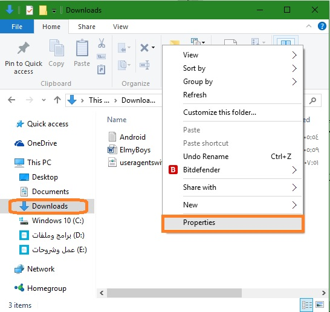
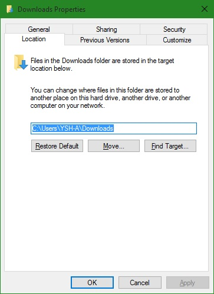
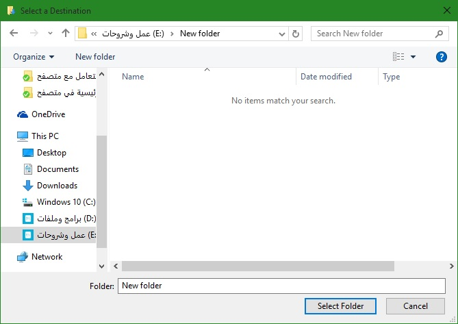
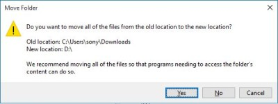
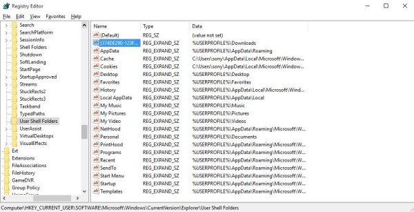
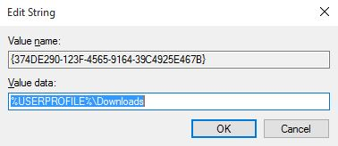
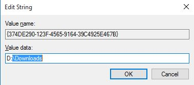

+++
title = "تعلم ويندوز 10 ..طريقة تغيير المكان الافتراضي للتحميل في متصفح Edge"
date = "2015-08-30"
description = "على عكس كل المتصفحات فإن مايكروسوفت إيدج Edge لا يتيح للمستخدم إعدادات مباشرة لتغيير مكان التنزيلات، فرغم سرعته الكبيرة في التصفح والتحميل وواجهته البسيطة وشكله المميز إلا أنه لا يقوم بالتحميل إلا في مجلد Downloads، إليك عزيزي القارئ طريقة تغيير المكان الافتراضي للتحميل في متصفح Edge"
categories = ["ويندوز",]
series = ["ويندوز 10"]
tags = ["موقع لغة العصر"]

+++

على عكس كل المتصفحات فإن مايكروسوفت إيدج Edge لا يتيح للمستخدم إعدادات مباشرة لتغيير مكان التنزيلات، فرغم سرعته الكبيرة في التصفح والتحميل وواجهته البسيطة وشكله المميز إلا أنه لا يقوم بالتحميل إلا في مجلد Downloads، إليك طريقة تغيير المكان الافتراضي للتحميل في متصفح Edge.

كما أوضحت في المقدمة فإنه لا يوجد اختيار بداخل المتصفح يسمح بتغيير مكان التحميل، ويبقى الحل الوحيد هو أن يقوم المستخدم بتعديل مكان مجلد التنزيلات Downloads بطريقة يدوية.

**أولا: عن طريق متصفح الملفات** **File Explorer:**

1. قم بفتح متصفح الملفات **File Explorer** ثم انتقل إلى المجلد **Downloads**.
2. اضغط بزر الفأرة الأيمن في أي مكان فارغ في المجلد ثم اختر من القائمة **Properties**.

3. انتقل إلى التبويب **Location**هنا ستجد المسار الخاص بمجلد التنزيلات، لتغييره تحتاج للضغط على **Move**.

4. قم باختيار المكان الجديد للمجلد ثم اضغط **Select Location**.

5. قم بالموافقة على نقل المجلد.

**ثانيا: عن طريق الريجسترى** **Registry:**

1. اضغط على **Windows+R** لفتح مربع **RUN**، ثم قم بكتابة الأمر **regedit**.
2. انتقل إلى المسار:
| HKEY\_CURRENT\_USER\Software\Microsoft\Windows\CurrentVersion\Explorer\User Shell Folders |

3. قم بإيجاد القيمة **%USERPROFILE%\Downloads** ثم اضغط بزر الفأرة الأيسر مرتين عليها لفتحها.

4. قم بكتابة المسار الجديد لمجلد التنزيلات في المربع **Value Data**.

- الآن عند قيامك بأي تحميل جديد من داخل متصفح **Edge** سيتم حفظ الملف في مسار **Downloads** الجديد.

---
هذا الموضوع نٌشر باﻷصل على موقع مجلة لغة العصر.

http://aitmag.ahram.org.eg/News/23947.aspx