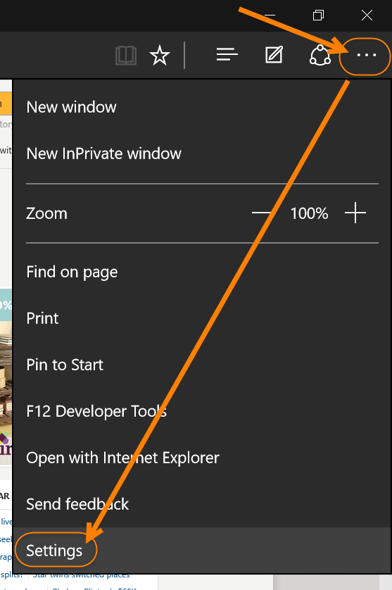
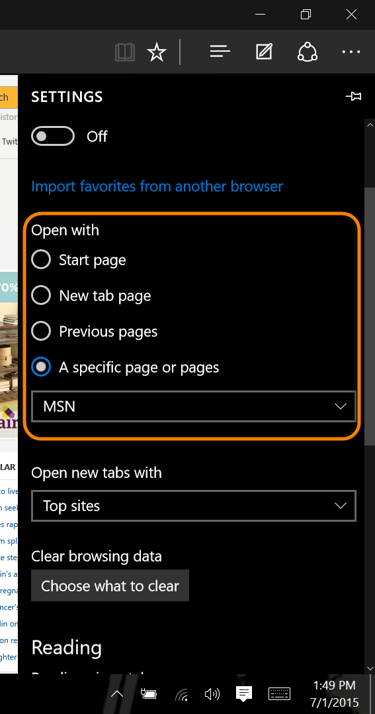
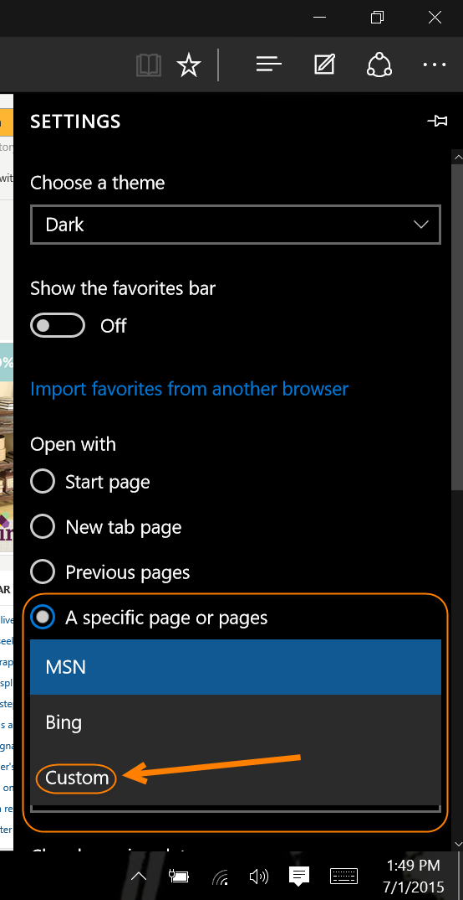
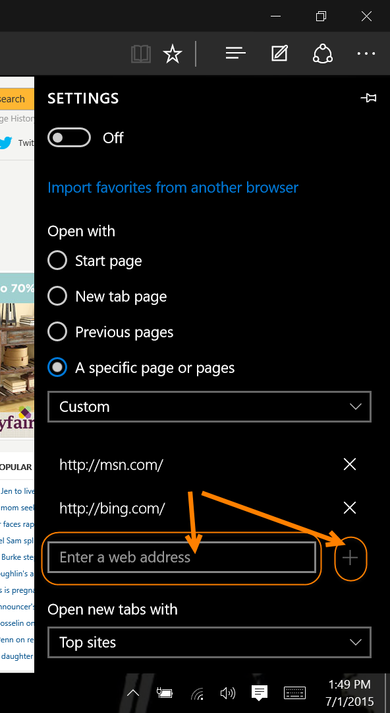
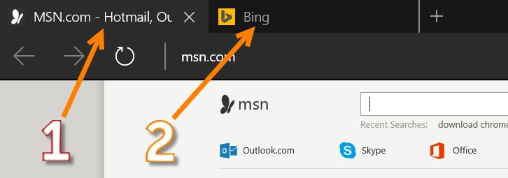

+++
title = "تعلم ويندوز 10 ..طريقة تغيير الصفحة الرئيسية في متصفح Edge"
date = "2015-08-23"
description = "تحدثنا في موضوعات سابقة عن طريقة تفعيل Dark Theme في متصفح Edge وأيضا عن تغيير محرك بحث متصفح Edge في ويندوز 10، وفى درس اليوم نتابع سلسلة دروس متصفح Microsoft Edge في ويندوز 10، ومع طريقة تغيير الصفحة الرئيسية."
categories = ["ويندوز",]
series = ["ويندوز 10"]
tags = ["موقع لغة العصر"]

+++

تحدثنا في موضوعات سابقة عن طريقة تفعيل Dark Theme في متصفح Edge وأيضا عن تغيير محرك بحث متصفح Edge في ويندوز 10، وفى درس اليوم نتابع سلسلة دروس متصفح Microsoft Edge في ويندوز 10، ومع طريقة تغيير الصفحة الرئيسية.

عندما كان المتصفح الخاص بالويندوز هو Internet Explorer كانت طريقة تغيير الصفحة الرئيسية هي الدخول إلى Internet Options من Control Panel،
 ثم كتابة عنوان الصفحة الرئيسية أو عدة عناوين، ولكن بعد التغييرات 
الكبيرة التي جاءت بها مايكروسوفت مع ويندوز 10 تغيرت الطريقة تماما.

1. قم بفتح متصفح Edge ثم اضغط على زر القائمة أعلى يمين الشاشة.

2. في القسم Open With ستجد 4 اختيارات:

- Start Page فتح شاشة البداية عند فتح المتصفح.
- New tab page فتح تبويب جديد عند فتح المتصفح.
- Pervious pages استرجاع الصفحات المفتوحة أخيرا عند فتح المتصفح.
- A specific page or pages تعيين صفحة أو عدة صفحات لتفتح عن بدء المتصفح.

3. قم باختيار A specific page or pages ثم من القائمة المنسدلة اختر Custom كما بالصورة:

4. قم بكتابة عنوان صفحتك الرئيسية، كما يمكنك إضافة أكثر من صفحة بالضغط على +.

5. الآن عند فتحك للمتصفح مجددا ستجد الصفحات الرئيسية التي قمت باختيارها قد فتحت كما بالصورة:

---
هذا الموضوع نٌشر باﻷصل على موقع مجلة لغة العصر.

http://aitmag.ahram.org.eg/News/23397.aspx