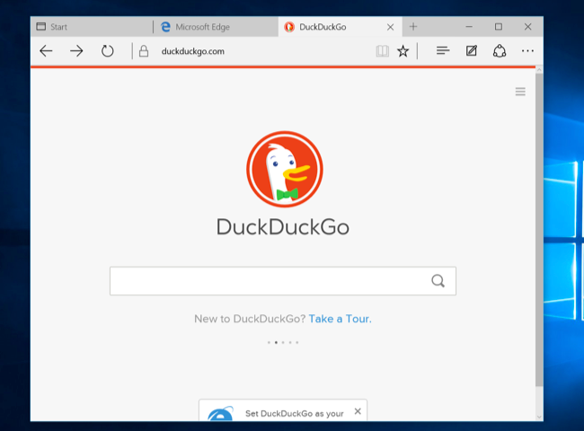
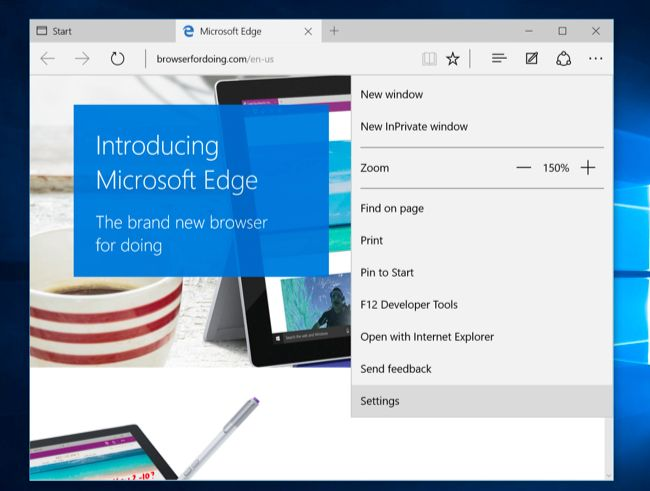
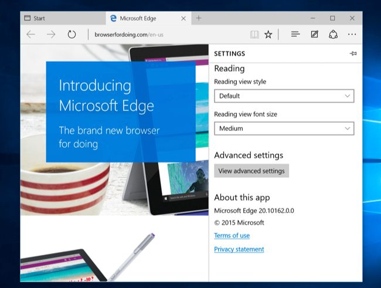
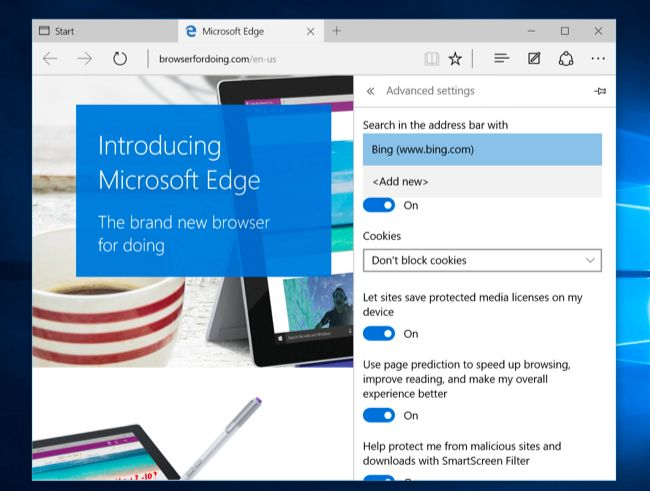
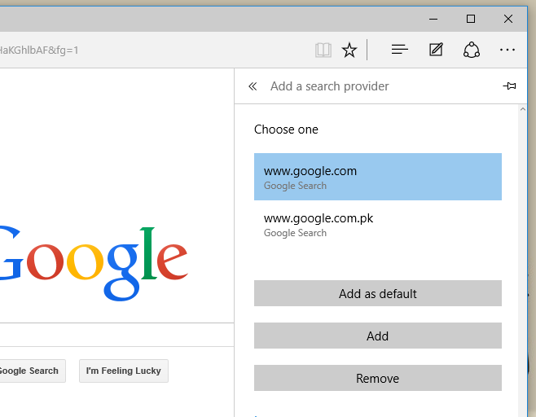
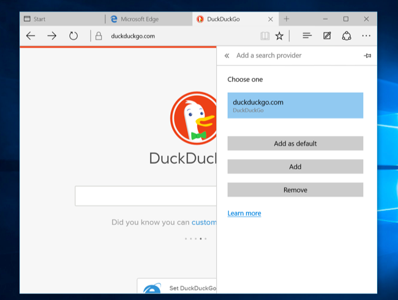

+++
title = "تغيير محرك بحث متصفح Edge في ويندوز 10"
date = "2015-08-20"
description = "بلا شك إن كنت ممن قام بتثبيت ويندوز 10 فإنك قد قمت بتجربة متصفح مايكروسوفت الجديد Edge، وكيف لا تجربه وقد تفوق على أسرع متصفح في العالم، وبالتأكيد قابلتك مشكلة محرك البحث، في درس اليوم إليك طريقة تغيير محرك بحث متصفح Edge في ويندوز 10."
categories = ["ويندوز",]
series = ["ويندوز 10"]
tags = ["موقع لغة العصر"]

+++

بلا شك إن كنت ممن قام بتثبيت ويندوز 10 فإنك قد قمت بتجربة متصفح مايكروسوفت الجديد Edge، وكيف لا تجربه وقد تفوق على أسرع متصفح في العالم، وبالتأكيد قابلتك مشكلة محرك البحث، في درس اليوم إليك طريقة تغيير محرك بحث متصفح Edge في ويندوز 10.

1. قم بفتح متصفح Edge ثم توجه إلى Google.com (أو أي محرك البحث الذي تريد استخدامه).

2. اضغط على زر القائمة أعلى يمين الشاشة ثم اختر "Settings”.

3. قم بالنزول إلى أسفل الإعدادات ستجد زر "View advanced settings” قم بالضغط عليه.

4. اضغط على المريع "Search in the address bar with” ثم اختر "Add new”.

5. ستجد محرك البحث الذي قمت بفتحه في الخطوة الأولى موجودا في هذه القائمة، قم باختياره.

6. بهذا عندما تبحث مرة أخرى سيتم استخدام محرك البحث الجديد بدلا من Bing.

---
هذا الموضوع نٌشر باﻷصل على موقع مجلة لغة العصر.

http://aitmag.ahram.org.eg/News/22743.aspx