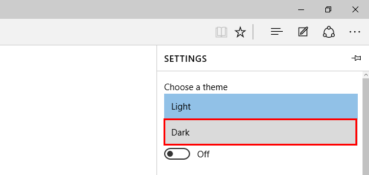

+++
title = "تعلم ويندوز 10 ..طريقة تفعيل Dark Theme في متصفح Edge"
date = "2015-08-21"
description = "تحدثنا في موضوع سابق عن طريقة تغيير لون وثيم التطبيقات في ويندوز 10 وفى درس اليوم نستكمل بعض من إعدادات التخصيص في ويندوز 10 ومع طريقة تفعيل Dark Theme المخفي بداخل متصفح Edge في ويندوز 10."
categories = ["ويندوز",]
series = ["ويندوز 10"]
tags = ["موقع لغة العصر"]

+++

تحدثنا في موضوع سابق عن طريقة تغيير لون وثيم التطبيقات في ويندوز 10 وفى درس اليوم نستكمل بعض من إعدادات التخصيص في ويندوز 10 ومع طريقة تفعيل Dark Theme المخفي بداخل متصفح Edge في ويندوز 10.

يتيح متصفح Edge في ويندوز 10 استخدام ثيم  جديد باللون الأسود بدلا من اللون التقليدي الأبيض، وذلك لأن كثير من المستخدمين يفضلون اللون الأسود وخاصة ليلا أو مع الإضاءة القليلة، كما أن اللون الأسود عموما يقوم بتقليل الطاقة المستخدمة من الشاشة وبالتالي زيادة أداء البطارية وجعلها تعمل لفترات أطول.

1. قم بفتح متصفح Edge ثم اضغط على زر القائمة أعلى يمين الشاشة.
2. اختر الإعدادات Settings.

3. من القائمة المنسدلة Choose a theme قم باختيار **Dark.**

4. سيتحول ثيم المتصفح إلى اللون الأسود كما بالصورة.

5. للرجوع للشكل الافتراضي قم بنفس الخطوات مجددا ثم اختر الثيم Light.

---
هذا الموضوع نٌشر باﻷصل على موقع مجلة لغة العصر.

http://aitmag.ahram.org.eg/News/22148.aspx