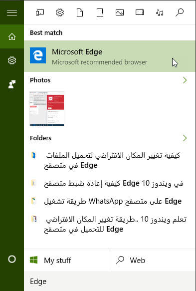
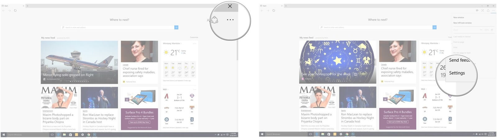
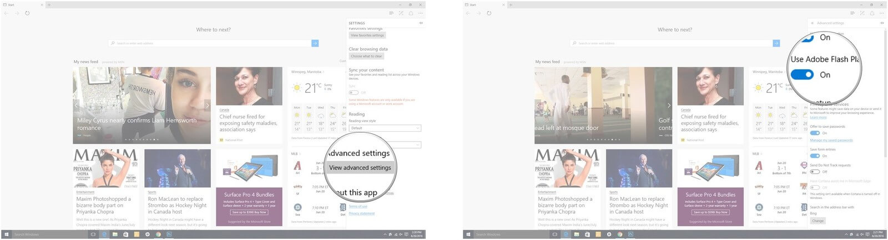

+++
title = "كيفية تعطيل الفلاش في متصفح Edge"
date = "2016-06-28"
description = "كان الفلاش جزءا أساسيا من الانترنت فيما مضي، ومع ظهور HTML5 تراجع الفلاش إلى الوراء، وأصبحت مشاكله تزداد مع الوقت مثل الإعلانات الخبيثة، إليك طريقة تعطيله في متصفح Edge على ويندوز 10"
categories = ["ويندوز",]
series = ["ويندوز 10"]
tags = ["موقع لغة العصر"]
images = ["images/0.png"]
+++

كان الفلاش جزءا أساسيا من الانترنت فيما مضي، ومع ظهور HTML5 تراجع الفلاش إلى الوراء، وأصبحت مشاكله تزداد مع الوقت مثل الإعلانات الخبيثة، إليك طريقة تعطيله في متصفح Edge على ويندوز 10.

 1. قم بفتح متصفح Edge.

2. اضغط على زر القائمة ثم اختر Settings.

3. قم بالنزول إلى الأسفل ثم اضغط على View advanced settings.

4. قم بتغيير الاختيار Use Adobe Flash Player من On إلى Off.

---
هذا الموضوع نٌشر باﻷصل على موقع مجلة لغة العصر.

http://aitmag.ahram.org.eg/News/54440.aspx