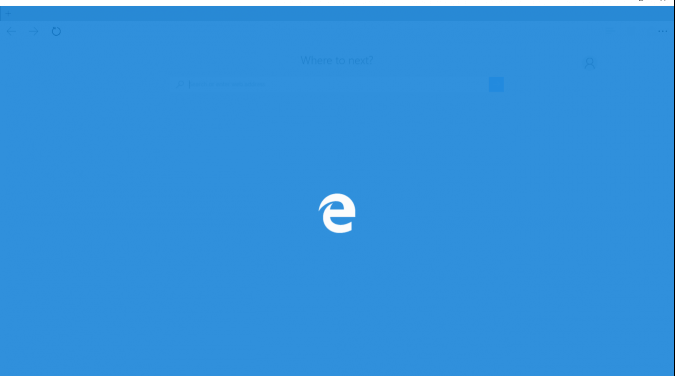
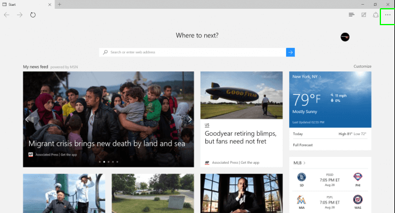
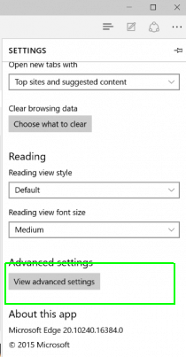
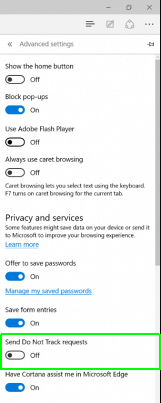

+++
title = "طريقة تفعيل عدم التتبع في متصفح Edge"
date = "2016-07-04"
description = "العديد من المواقع تقوم بتتبعنا طوال استخدامنا للإنترنت، مثل الصفحات التي نزورها والمنتجات التي نشتريها، ونستطيع الحد من هذا التتبع عن طريق إعداد المتصفح على وضع عدم التتبع، إليك الطريقة."
categories = ["ويندوز",]
series = ["ويندوز 10"]
tags = ["موقع لغة العصر"]
+++

العديد من المواقع تقوم بتتبعنا طوال استخدامنا للإنترنت، مثل الصفحات التي نزورها والمنتجات التي نشتريها، ونستطيع الحد من هذا التتبع عن طريق إعداد المتصفح على وضع عدم التتبع، إليك الطريقة.

وضع عدم التتبع في متصفح Edge هو وضع يقوم بإخبار المواقع بعدم ارسال طلبات التتبع إلى جهازك، ولتفعيله قم بالخطوات التالية.

1. قم بفتح متصفح Edge.

2. اضغط على زر القائمة أعلى يمين الشاشة.

3. قم بالنزول إلى الأسفل ثم اضغط على زر Advanced Settings.

4. فعل الاختيار Send Do Not Track Requests.

5. بعد قيامك بهذه الخطوة لن تقوم المواقع بتعقبك أثناء استخدامك لمتصفح Edge.

---
هذا الموضوع نٌشر باﻷصل على موقع مجلة لغة العصر.

http://aitmag.ahram.org.eg/News/54659.aspx