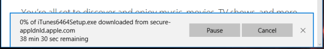
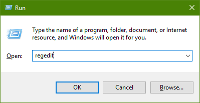
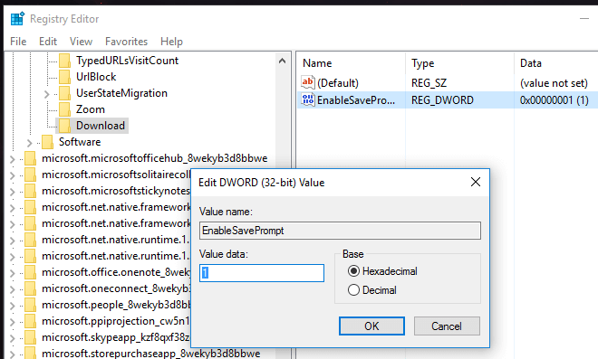
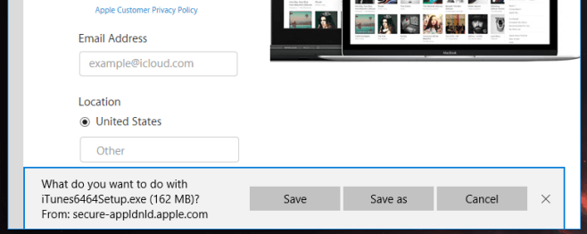

+++
title = "طريقة تفعيل تنبيه بدء التحميل في متصفح Edge"
date = "2016-07-23"
description = "لا يقوم متصفح Edge في ويندوز 10 بتنبيهك عند بدء تحميل أي ملف، بل يبدأ مباشرة بمجرد الضغط على تحميل، ولتفعيل هذه الميزة سنقوم بإجراء تعديل في الرجيستري."
categories = ["ويندوز",]
series = ["ويندوز 10"]
tags = ["موقع لغة العصر"]
+++

لا يقوم متصفح Edge في ويندوز 10 بتنبيهك عند بدء تحميل أي ملف، بل يبدأ مباشرة بمجرد الضغط على تحميل، ولتفعيل هذه الميزة سنقوم بإجراء تعديل في الرجيستري.

افتراضيا، عند القيام بتحميل أي ملف يظهر لنا كما بالصورة.

والآن سنقوم ببعض الخطوات البسيطة تفعيل تنبيه بدء التحميل:

1. قم بفتح مربع Run ثم اكتب regedit.

2. انتقل إلى المسار التالي

`HKEY\_CURRENT\_USER\SOFTWARE\Classes\Local Settings\Software\Microsoft\Windows\CurrentVersion\AppContainer\Storage\microsoft.microsoftedge\_8wekyb3d8bbwe\MicrosoftEdge\`

3. قم بإنشاء مفتاح جديد باسم Downloads عن طريق Edit>New>Key.

4. بداخل هذا المفتاح قم بإنشاء مدخل DWORD من Edit>New>DWORD (32.bit) value ثم قم بتسميته ‘EnableSavePrompt’ بدون علامات التنصيص، وأعطه القيمة 1.

5. اغلق الرجيستري ثم افتح متصفح Edge، ابدأ تحميل جديد ستجد التنبيه قد ظهر، ولبدء التحميل اضغط Save.

---
هذا الموضوع نٌشر باﻷصل على موقع مجلة لغة العصر.

http://aitmag.ahram.org.eg/News/55248.aspx