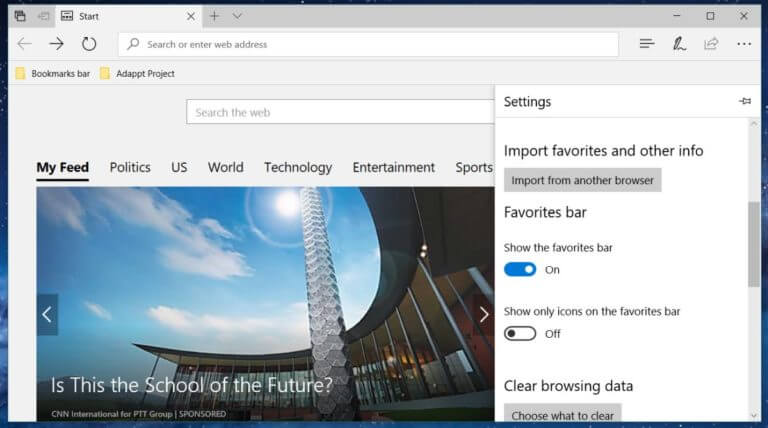
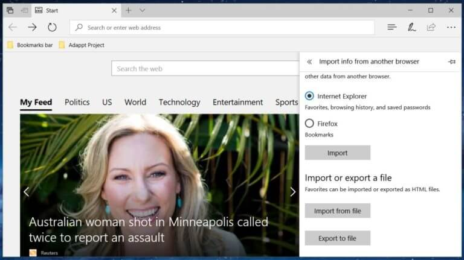

+++
title = "كيفية تصدير الإشارات المرجعية من متصفح Edge في ويندوز 10"
date = "2017-08-03"
description = "تعمل مايكروسوفت جاهدة على تطوير متصفح Edge، حتي تقنع المستخدمين بالانتقال إليه بدل المتصفحات الأخري، ولكن رغم هذا يحتاج بعض المستخدمين تصدير الإشارات المرجعية من Edge لاستخدامها مع المصفحات الأخري، إليك الطريقة."
categories = ["ويندوز",]
series = ["ويندوز 10"]
tags = ["المدونة",]
+++
تعمل مايكروسوفت جاهدة على تطوير متصفح Edge، حتي تقنع المستخدمين بالانتقال إليه بدل المتصفحات الأخري، ولكن رغم هذا يحتاج بعض المستخدمين تصدير الإشارات المرجعية من Edge لاستخدامها مع المصفحات الأخري، إليك الطريقة.

1- قم بفتح المتصفح ثم من القائمة الجانبية اختر الإعدادات Settings.

2- بعد ذلك قم بالنزول إلى أسفل حتى تجد مجموعة الاختيارات Import favorites and other info ثم اضغط على الزر Import from another browser.

3- ستنتقل إلى مجموعة أخري من الإعدادات بها الزر Export to file، بمجرد الضغط عليه سيتم تصدير ملف الإشارات المرجعية لمتصفح Edge إلى ملف HTML,

