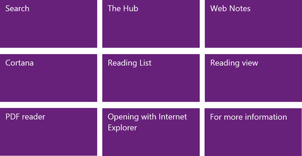

+++
title = "تعلم ويندوز 10 ..دليلك من مايكروسوفت للتعامل مع متصفح Edge كالمحترفين"
date = "2015-08-31"
description = "قدمنا منذ فترة كتابين لتعليم ويندوز 10 من البداية وحتى الاحتراف في موضوع للمبتدئين احترف ويندوز 10 كتاب جديد من مايكروسوفت ولينوفو، واستكمالا لسلسلة كتب تعليم ويندوز المقدمة من مايكروسوفت، نقدم لك عزيزي القارئ دليلا رسميا من مايكروسوفت للتعامل مع متصفح Edge كالمحترفين"
categories = ["ويندوز",]
series = ["ويندوز 10"]
tags = ["موقع لغة العصر"]
images = ["images/2015-635766285078969023-896_thumb705x335.jpg"]

+++
قدمنا منذ فترة كتابين لتعليم ويندوز 10 من البداية وحتى الاحتراف في موضوع للمبتدئين.. احترف ويندوز 10 كتاب جديد من مايكروسوفت ولينوفو، واستكمالا لسلسلة كتب تعليم ويندوز المقدمة من مايكروسوفت، نقدم لك عزيزي القارئ دليلا رسميا من مايكروسوفت للتعامل مع متصفح Edge كالمحترفين.

أطلقت مايكروسوفت كتابا بعنوان "Microsoft Edge Work Smart Guide" وهو متاح للتحميل على Microsoft Download Center، يتضمن الكتاب شرحا مفصلا للمتصفح الافتراضي الجديد لويندوز 10.

**محتويات الكتاب:**

كما تقول مايكروسوفت في هذا الكتاب، فإنه عند قراءتك لهذا الكتاب ستتعرف على كافة مميزات وخصائص متصفح Edge، زادت مايكروسوفت أيضا من الاهتمام بالجوانب الجديدة في المتصفح مثل Cortana-Reading List-Pdf Reader.

في النهاية فإن هذا الكتاب لا غنى عنه لمن يريد احتراف متصفح Edge وويندوز 10.

حجم الكتاب: 3.5 ميجا

صيغة الكتاب: مستند وورد .docx
[رابط التحميل من هنا](https://www.microsoft.com/en-us/download/details.aspx?id=48126)

---

هذا الموضوع نٌشر باﻷصل على موقع مجلة لغة العصر.

http://aitmag.ahram.org.eg/News/23397.aspx