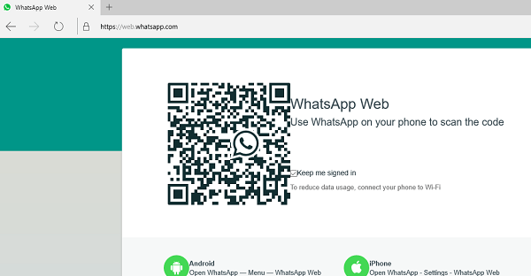

+++
title = "طريقة تشغيل WhatsApp على متصفح Edge"
date = "2016-02-05"
description = "كما تعلم عزيزي القارئ فانه يمكنك استخدام الواتس اب على متصفحك عن طريق خدمة Whatsapp Web ولكن متصفح ايدج Edge في ويندوز 10 لا يدعم تشغيل هذه الخدمة، في هذا الدرس سنقوم بحيلة سحرية لتشغيل الواتس اب على متصفح ايدج"
categories = ["ويندوز",]
series = ["ويندوز 10"]
tags = ["موقع لغة العصر"]
images = ["images/2016-635902832453774838-377.png"]

+++

كما تعلم عزيزي القارئ فانه يمكنك استخدام الواتس اب على متصفحك عن طريق خدمة Whatsapp Web ولكن متصفح ايدج Edge في ويندوز 10 لا يدعم تشغيل هذه الخدمة، في هذا الدرس سنقوم بحيلة سحرية لتشغيل الواتس اب على متصفح ايدج.

1- قم بفتح المتصفح ثم انتقل إلى العنوان التالي https://web.whatsapp.com/

2- ستظهر لك هذه الرسالة كما بالصورة.

3- من زر الخيارات اختر developer tools أو اضغط على F12 مباشرة.

4- اضغط على التبويب Emulation ستجد اختيار User Agent String اختر من القائمة أي متصفح من Opera/ Chrome/Mozilla Firefox.

5- ارجع مرة أخري الى صفحة واتس أب ويب ثم قم بعمل تحديث للصفحة.

6- ستجد الخدمة تعمل الآن على متصفح Edge كما بالصورة.

---
هذا الموضوع نٌشر باﻷصل على موقع مجلة لغة العصر.

http://aitmag.ahram.org.eg/News/42895.aspx