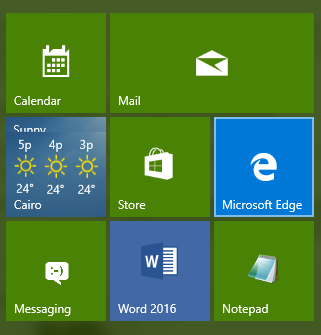
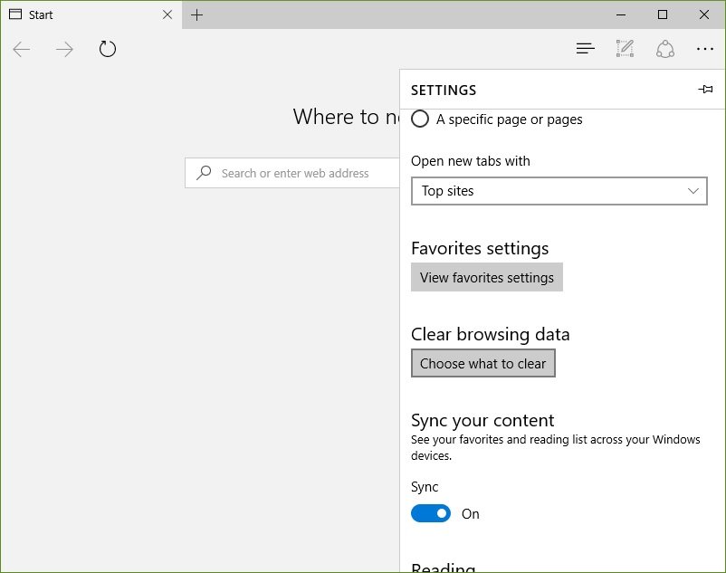
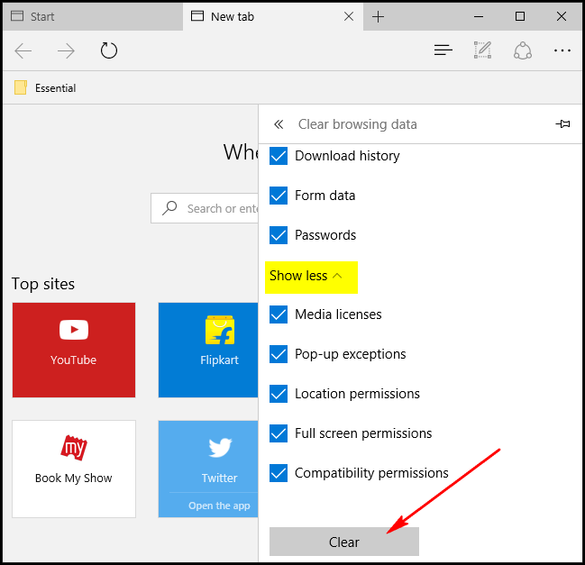

+++
title = "كيفية إعادة ضبط متصفح Edge في ويندوز 10"
date = "2016-02-28"
description = "لا يزال متصفح مايكروسوفت Edge في أيامه الأولى، وأحيانا تحصل به مشاكل أو بطء في الأداء، إليك عزيزي القارئ خطوات بسيطة لعمل إعادة ضبط لإعدادات متصفح Edge"
categories = ["ويندوز",]
series = ["ويندوز 10"]
tags = ["موقع لغة العصر"]
images = ["images/2016-635922722691887938-188_thumb705x335.png"]

+++

لا يزال متصفح مايكروسوفت Edge في أيامه الأولى، وأحيانا تحصل به مشاكل أو بطء في الأداء، إليك عزيزي القارئ خطوات بسيطة لعمل إعادة ضبط لإعدادات متصفح Edge.

1- قم بفتح متصفح Edge من قائمة البداية أو من خلال مربع البحث.

2- قم بالضغط على زر القائمة الموجودة أعلى يمين الشاشة.

3- اختر "الإعدادات Settings".

4- اضغط على زر Clear browsing data.

 5- اضغط Choose what to clear ثم Show more حدد ما تريد حذفه أو اختر الجميع ثم اضغط Clear.

6- قم بعمل إعادة تشغيل للجهاز ثم افتح متصفح Edge مرة أخرى.

---
هذا الموضوع نٌشر باﻷصل على موقع مجلة لغة العصر.

http://aitmag.ahram.org.eg/News/45166.aspx