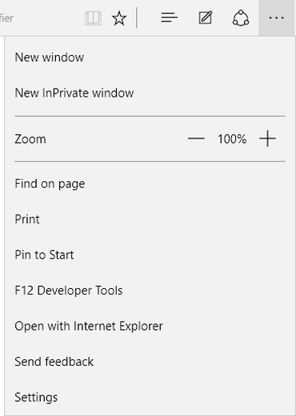
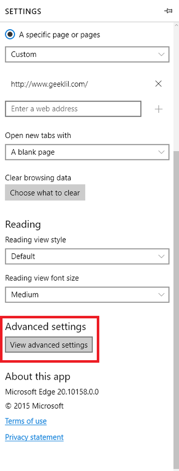
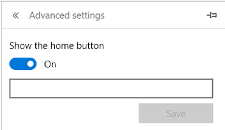
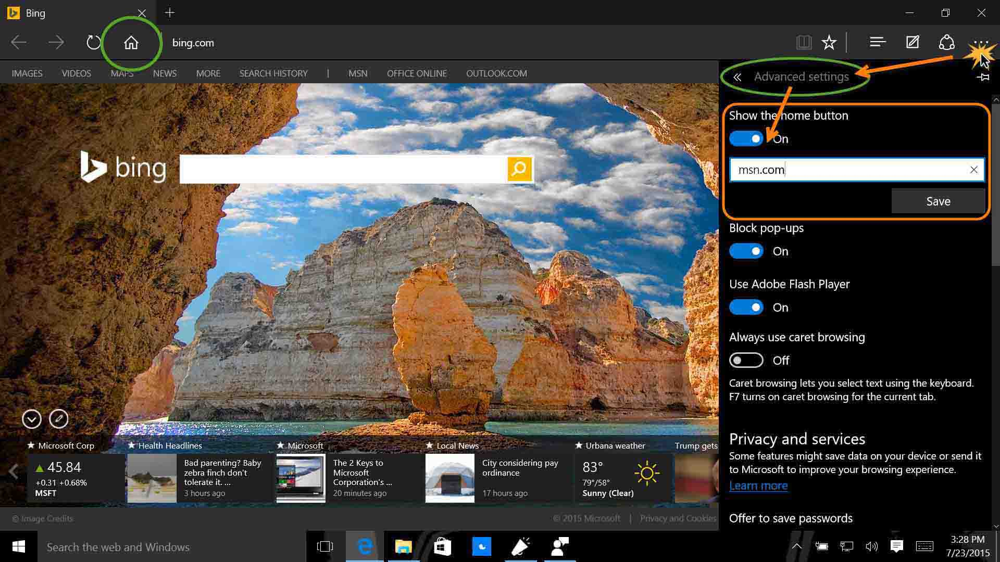

+++
title = "تعلم ويندوز 10 .. طريقة استعادة زر الصفحة الرئيسية في متصفح Edge"
date = "2015-08-30"
description = "من المشاكل التي قابلت العديد من مستخدمي متصفح Edge في ويندوز 10 هي عدم وجود زر الصفحة الرئيسية مثل باقي المتصفحات، ولكن مايكروسوفت لم تنسى بالتأكيد إضافة هذا الزر إلى المتصفح، كل ما في الأمر أنه غير ظاهر في الواجهة الخاصة ب Edge، إليك عزيزي القارئ طريقة ارجاع زر الصفحة الرئيسية في متصفح Edge."
categories = ["ويندوز",]
series = ["ويندوز 10"]
tags = ["موقع لغة العصر"]
images = ["images/2015-635764662426549623-654_thumb705x335.jpg"]

+++

من المشاكل التي قابلت العديد من مستخدمي متصفح Edge في ويندوز 10 هي عدم وجود زر الصفحة الرئيسية مثل باقي المتصفحات، ولكن مايكروسوفت لم تنسى بالتأكيد إضافة هذا الزر إلى المتصفح، كل ما في الأمر أنه غير ظاهر في الواجهة الخاصة ب Edge، إليك عزيزي القارئ طريقة ارجاع زر الصفحة الرئيسية في متصفح Edge.
1. قم بالدخول إلى إعدادات متصفح Edge من القائمة الجانبية الموجودة أعلى يمين الشاشة.

2. قم بالنزول إلى الأسفل ثم قم باختيار View advanced settings.

3. قم بتفعيل الاختيار Show the home button ثم قم بإدخال العنوان الذي تريد تعيينه كصفحة رئيسية.

- هذه صورة تشرح جميع الخطوات السابقة:

---
هذا الموضوع نٌشر باﻷصل على موقع مجلة لغة العصر.

http://aitmag.ahram.org.eg/News/23224.aspx