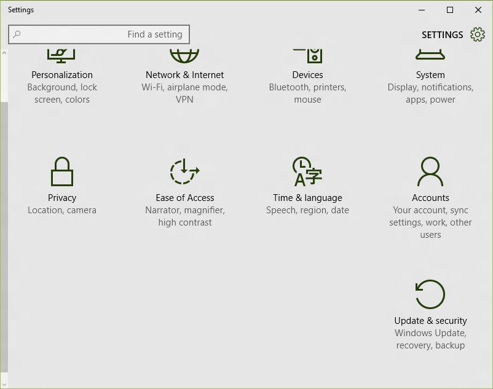
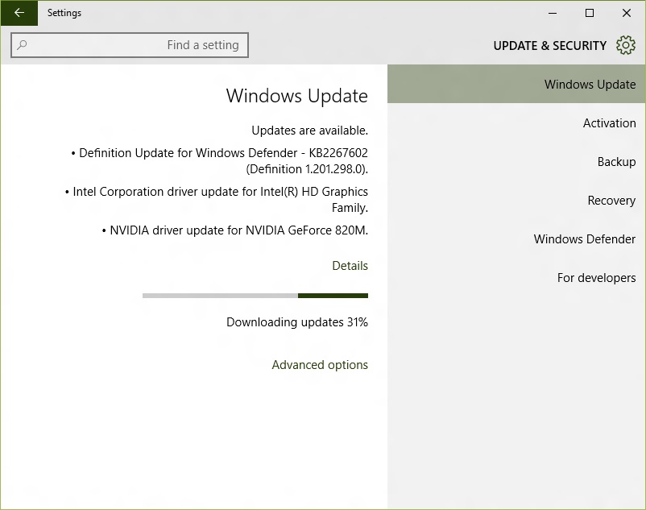
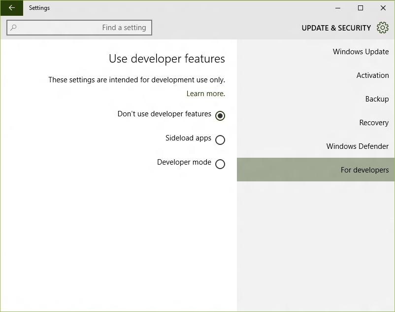
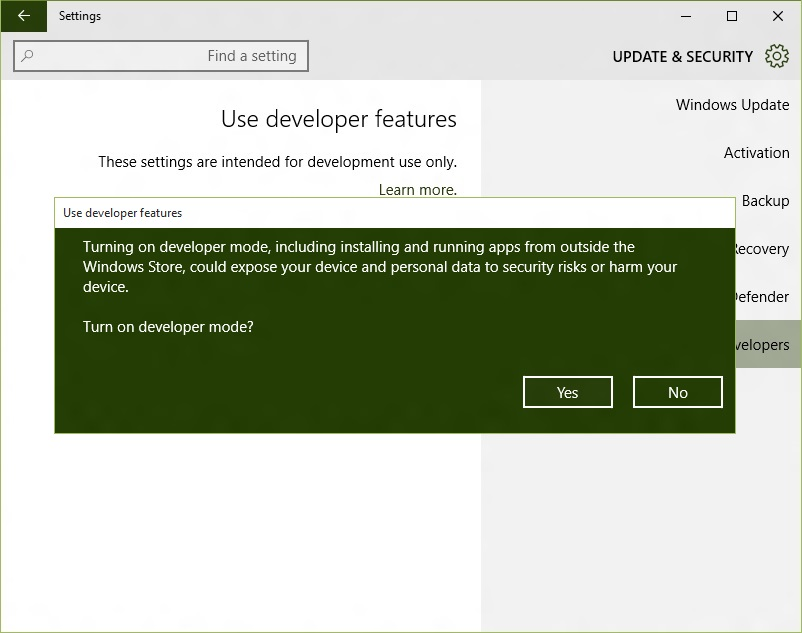

+++
title = "كيفية فتح وضع المطور في ويندوز 10"
date = "2015-06-29"
description = "ما زال ويندوز 10 لم يتم إطلاق النسخة النهائية منه للمستخدمين العاديين، وتستمر مايكروسوفت بتطوير نسخة المطورين التي سبق وشرحنا كيفية تحميلها وتثبيتها، ومن ضمن الميزات التي قامت مايكروسوفت بتفعيلها مع الإصدار الجديد من نسخة المطورين هي \"وضع المطور Developer Mode\" والتي تمكن مطوري تطبيقات الويندوز فون من تجربة تطبيقاتهم وتثبيت التطبيقات من خارج المتجر."
categories = ["ويندوز",]
series = ["ويندوز 10"]
tags = ["موقع لغة العصر"]

+++

ما زال ويندوز 10 لم يتم إطلاق النسخة النهائية منه للمستخدمين العاديين، وتستمر مايكروسوفت بتطوير نسخة المطورين التي سبق وشرحنا كيفية تحميلها وتثبيتها، ومن ضمن الميزات التي قامت مايكروسوفت بتفعيلها مع الإصدار الجديد من نسخة المطورين هي " وضع المطور Developer Mode" والتي تمكن مطوري تطبيقات الويندوز فون من تجربة تطبيقاتهم وتثبيت التطبيقات من خارج المتجر.

1. قم بفتح تطبيق الإعدادات، ثم القسم Update & Security.

2. قم بالضغط على التبويب For Developers ستجد ثلاثة خيارات.

3. اختيار Sideload apps هو الخاص بتشغيل خاصية تثبيت التطبيقات من خارج المتجر.
4. اختيار Developer mode هو الخاص بتشغيل صلاحيات المطور التي تتضمن تثبيت التطبيقات وعمل Debugging والعديد من الخيارات الأخرى.

5. عند تفعيل أي من الاختيارين السابقين سيظهر لك رسالة تحذيرية كما بالصورة:

بالتأكيد لن تحتاج أي من هذه الصلاحيات إذا لم تكن مطور برامج فهي لا تضيف أي مميزات خاصة أو إضافات جديدة بخلاف ما سبق وذكرته.

---
هذا الموضوع نٌشر باﻷصل على موقع مجلة لغة العصر.

http://aitmag.ahram.org.eg/News/18211.aspx