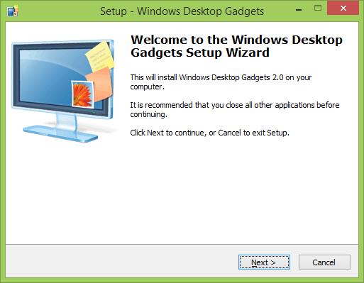
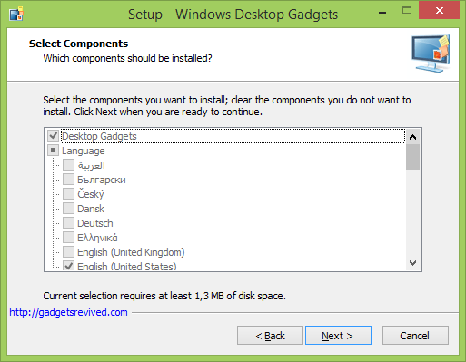
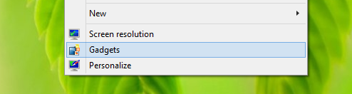
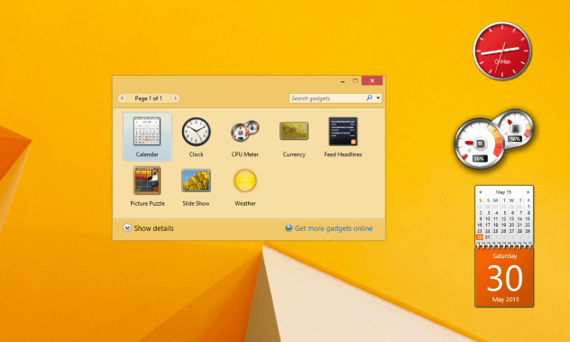

+++
title = "كيفية إعادة تفعيل أدوات Gadgets في ويندوز 8.1 و 10"
date = "2015-06-17"
description = "كما لاحظ الجميع فابتداء من ويندوز 8 وحتى ويندوز 10 تم إلغاء الأدوات الجانبية Gadgets التي اعتاد الكثير على استخدامها، اليكم طريقة استرجاعها بواسطة برنامج Sidebar."
categories = ["ويندوز",]

series = ["ويندوز 10"]

tags = ["موقع لغة العصر"]
images = ["images/2015-635700606306159182-615.png"]

+++

كما لاحظ الجميع فابتداء من ويندوز 8 وحتى ويندوز 10 تم إلغاء الأدوات الجانبية Gadgets التي اعتاد الكثير على استخدامها، اليكم طريقة استرجاعها بواسطة برنامج Sidebar.

1. قم بالدخول الى [موقع البرنامج من هنا](http://gadgetsrevived.com/download-sidebar/)، وبعد تحميله قم بفتحه.

2. قم بمتابعة خطوات التثبيت.

3. بعد اكتمال التثبيت قم بالضغط بزر الفأرة الأيمن ثم اختر Gadgets.

4. ستظهر لك الأدوات المصغرة كما في ويندوز 7.

5. قم باختيار الأدوات التي تريدها ستظهر كما بالصورة.

6. لتحميل المزيد من الأدوات يمكنك تحميلها [من موقع الأداة من هنا](http://gadgetsrevived.com/).

---
هذا الموضوع نٌشر باﻷصل على موقع مجلة لغة العصر.

http://aitmag.ahram.org.eg/News/17493.aspx