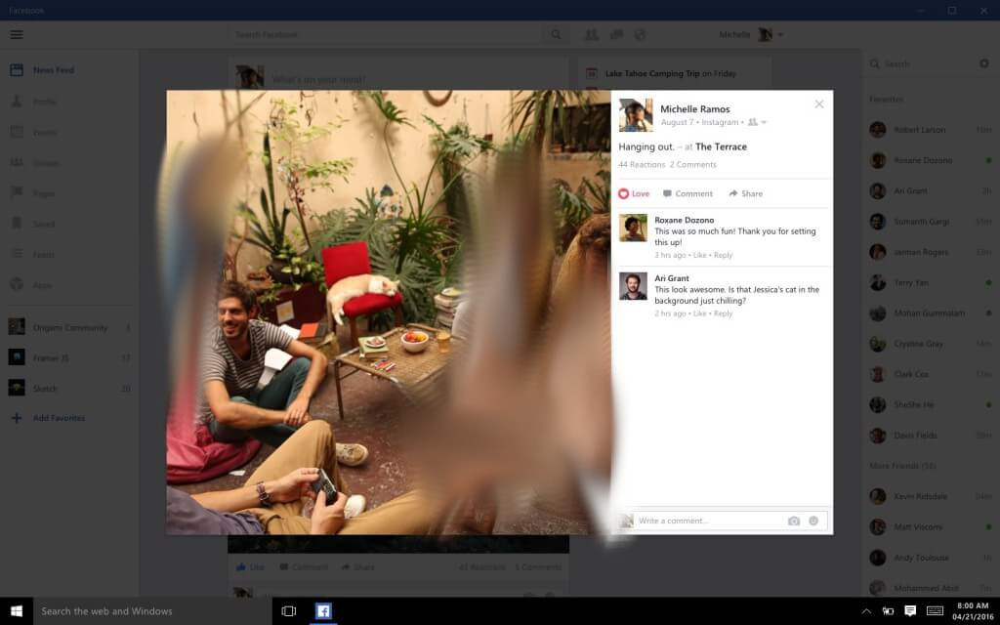
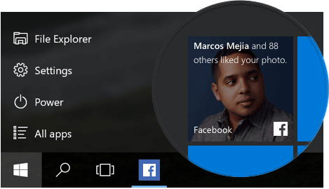
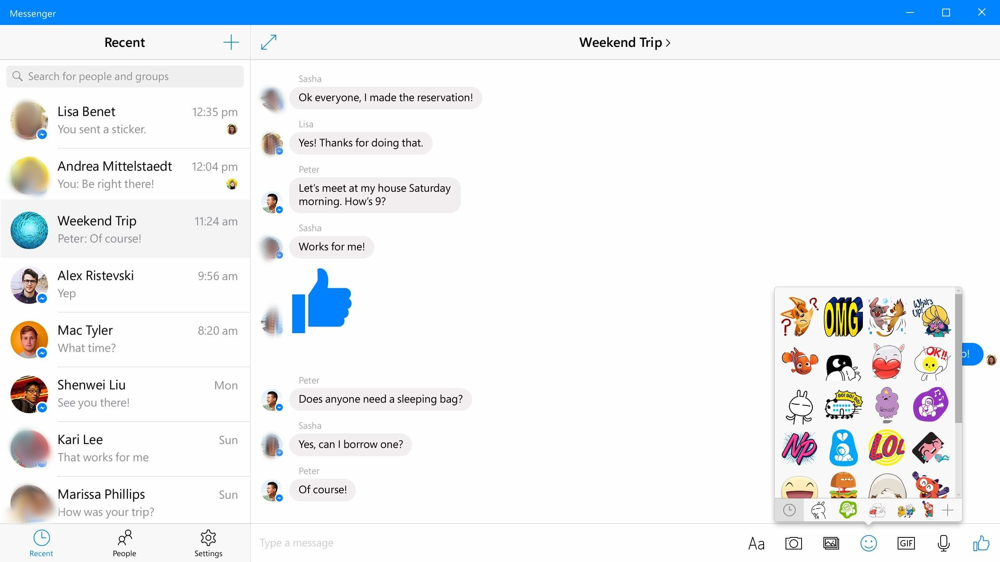
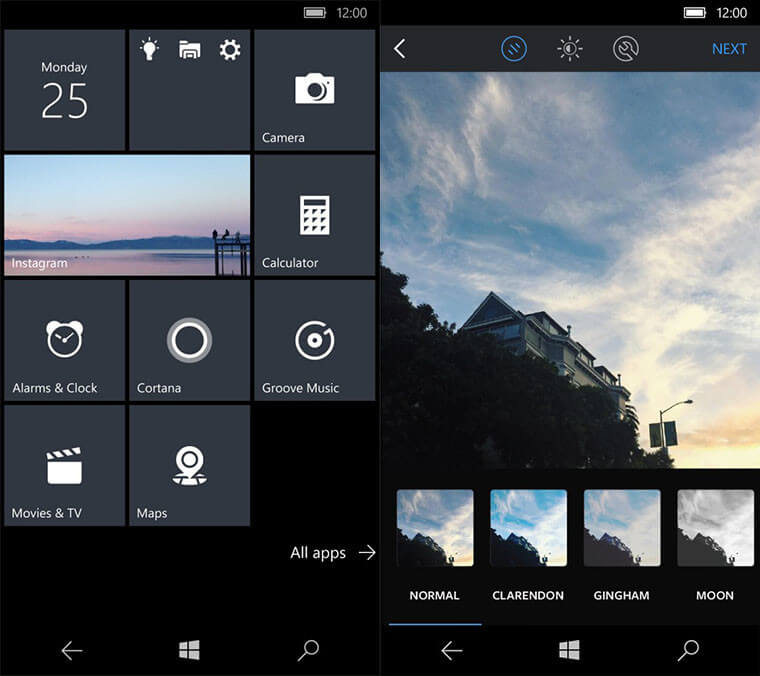

+++
title = "طريقة تحميل تطبيقات الفيس بوك والماسنجر وانستاجرام على ويندوز 10"
date = "2016-05-01"
description = "أطلق موقع الفيس بوك مجموعة التطبيقات الجديدة الخاصة بويندوز 10 هي الفيس بوك Facebook، الماسنجر Messenger وانستاجرام Instagram،والتي صممت لتعمل بالتكامل مع مميزات ويندوز 10 لتمنح المستخدم تجربة فريدة،اليكم طريقة تحميلها"
categories = ["ويندوز",]
series = ["ويندوز 10"]
tags = ["موقع لغة العصر"]
images = ["images/2016-635976558934175628-417_thumb705x335.png"]
+++

أطلق موقع الفيس بوك مجموعة التطبيقات الجديدة الخاصة بويندوز 10 وهي الفيس بوك Facebook، الماسنجر Messenger وانستاجرام Instagram، والتي صممت لتعمل بالتكامل مع مميزات ويندوز 10 لتمنح المستخدم تجربة فريدة، اليكم طريقة تحميلها.

تم تصميم هذه التطبيقات بحيث تستخدم مربعات Live Tiles في قائمة البداية والاشعارات في Action Center، إلى جانب التصميم الفريد الخاص بويندوز 10، مما يبسط على المستخدم رؤية المنشورات الجديدة والرسائل والصور من خلال قائمة البداية أو الشاشة الرئيسية.

يجب عليك عزيزي القارئ أن تعرف أن التطبيقات المتاحة للأجهزة المكتبية هي الفيس بوك والماسنجر، بينما التطبيقات المتاحة للهواتف هي الانستاجرام فقط حتى الآن.

**أولا: تطبيق الفيس بوك Facebook:**

إلى جانب المميزات التي ذكرتها بالأعلى فإن تطبيق الفيس بوك على ويندوز 10 يشمل دعم ردود الفعل والملصقات في التطبيقات.

 أيضا يتميز بالواجهة النظيفة التي تسهل الوصول للتحديثات وآخر الأخبار.

لتحميل التطبيق [من هنا](http://aka.ms/Lznyva)

**ثانيا: تطبيق الماسنجر** **Messenger:**

يعمل بنفس المميزات الموجودة على باقي الأجهزة مثل مشاركة الصور المتحركة والملصقات والمحادثات الجماعية، كما يدعم الاشعارات والمربعات الحية.

لتحميل التطبيق [من هنا](http://aka.ms/Hm3p7c)

**ثالثا: تطبيق انستاجرام** **Instagram:**

حتى الآن فإن التطبيق متاح فقط للهواتف التي تعمل بويندوز 10 وليس متاحا للأجهزة المكتبية، ولا توجد إشارة إذا ما كان سيتم اضافته في وقت لاحق ام لا.

لتحميل التطبيق [من هنا](http://aka.ms/Ulcua0)

كل ما تحتاج إلى القيام به هو الدخول إلى رابط التطبيق الذي سيقوم بتحويلك إلى متجر التطبيقات، ثم اضغط على زر تثبيت التطبيق للحصول عليه.

---
هذا الموضوع نٌشر باﻷصل على موقع مجلة لغة العصر.

http://aitmag.ahram.org.eg/News/47220.aspx