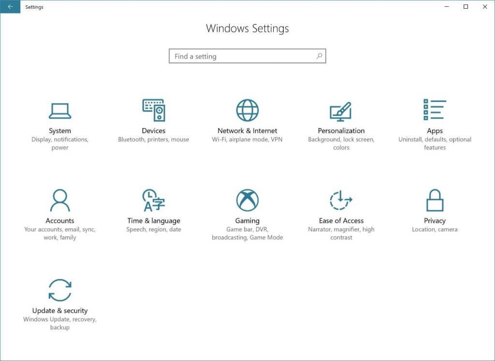
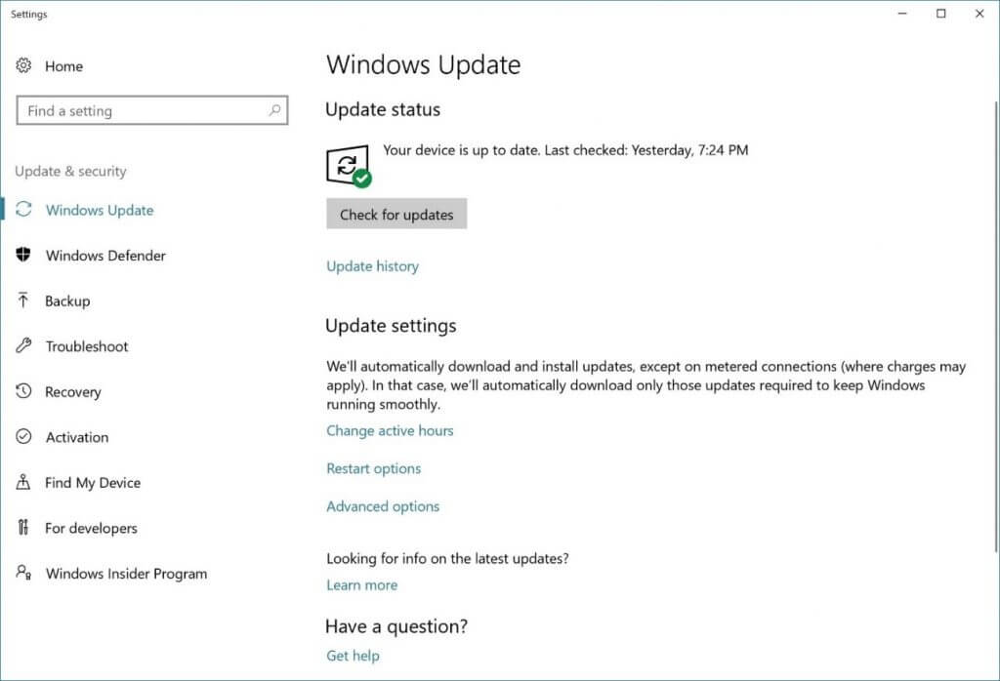
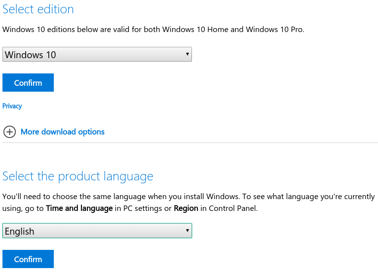
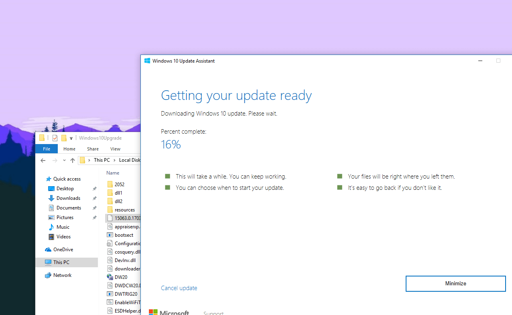

+++
title = "كل طرق تحميل تحديث ويندوز 10 خريف المبدعين Fall Creators"
date = "2017-10-17"
description = "الجميع متشوق لتجربة التحديث الجديد لويندوز 10، كما أن البعض لم يصل له التحديث بعد، في هذا الدرس ستتعرف عزيزي القارئ على أربعة طرق لتحميل التحديث حتى وإن لم يصلك!"
categories = ["ويندوز",]
series = ["ويندوز 10"]
tags = ["المدونة",]
images = ["images/0.jpg"]

+++
الجميع متشوق لتجربة التحديث الجديد لويندوز 10، كما أن البعض لم يصل له التحديث بعد، في هذا الدرس ستتعرف عزيزي القارئ على أربعة طرق لتحميل التحديث حتى وإن لم يصلك!

## الطريقة الأولى: التحديث من داخل إعدادات الويندوز:

1. قم بالدخول إلى تطبيق الإعدادات.

2. انتقل إلى القسم Update and Security ثم التبويب Windows Update.

3. اضغط على زر Check for update وانتظر حتى يكتمل البحث عن التحديث.

4. في حالة وصول التحديث لجهازك سيبدأ الويندوز بتحميله.

5. انتظر حتى الانتهاء من التثبيت والتحديث وإعادة تشغيل الجهاز.

## الطريقة الثانية: التحديث بواسطة ملفات ال ISO الرسمية من مايكروسوفت:

1. عن طريق موقع مايكروسوفت:
قم بالدخول إلى الموقع من هنا ثم اختر النسخة التي تريد تحميلها واللغة، بعد ذلك اضغط على رابط التحميل 32 أو 64.

لاحظ أن هذا الرابط لن يعمل في حالة الدخول إليه من جهاز يعمل بويندوز، لابد من استخدم لينكس / ماك أو هاتفك.

## الطريقة الثالثة: التحديث بواسطة أداة Windows 10 Update Assistant:

1. قم بالدخول إلى هذا الرابط
https://www.microsoft.com/en-us/software-download/windows10

2. اضغط على الزر Get the Update now لتحميل الأداة.

3. سيتم تحميل وحفظ الأداة، قم بفتحها  ثم اضغط Update Now.

4. ستقوم الأداة بفحص توافق التحديث مع جهازك.

5. يحتاج التحديث 20 جيجا مساحة خالية على القرص الصلب، وفى حالة توافر كل المتطلبات سيظهر لك الرسالة التالية، اضغط Next.

5. ستبدأ الأداة بتحميل التحديث ثم تثبيته، وبالطبع ستأخذ العملية بعض الوقت اعتمادا على سرعة الإنترنت لديك.

6. بعد اكتمال التحميل ستتطلب الأداة إعادة التشغيل لإكمال التثبيت.

7. باستخدام هذه الطريقة ستحافظ على كل الملفات والبرامج والإعدادات الموجودة على جهازك.

## الطريقة الرابعة: التحديث بواسطة أداة Media Creation Tool:

1. قم بتحميل الأداة من هنا.

2. بعد فتح الأداة اختر عمل ترقية للنظام أو إنشاء ملف ISO للتحديث واتبع الخطوات التي تطلبها الأداة منك.

