+++
title = "ما الجديد في تحديث ويندوز 10 خريف المبدعين؟"
date = "2017-09-01"
description = "ها نحن على موعد مع التحديث الرئيسي الرابع لويندوز 10 منذ إصداره في 2015، وكعادة مايكروسوفت في كل تحديث رئيسي، يتضمن تحديث Fall Creators أو \"خريف المبدعين\" العديد من المميزات الجديدة وتحسينات الاستقرار واﻷداء، إلى جانب بعض الخصائص التي تم حذفها من الويندوز في هذا التحديث، دعونا نتعرف على الجديد في تحديث Fall Creators."
categories = ["ويندوز",]
tags = ["مجلة لغة العصر"]
series = ["ويندوز 10"]
+++
ها نحن على موعد مع التحديث الرئيسي الرابع لويندوز 10 منذ إصداره في 2015، وكعادة مايكروسوفت في كل تحديث رئيسي، يتضمن تحديث Fall Creators أو "خريف المبدعين" العديد من المميزات الجديدة وتحسينات الاستقرار واﻷداء، إلى جانب بعض الخصائص التي تم حذفها من الويندوز في هذا التحديث، دعونا نتعرف على الجديد في تحديث Fall Creators.

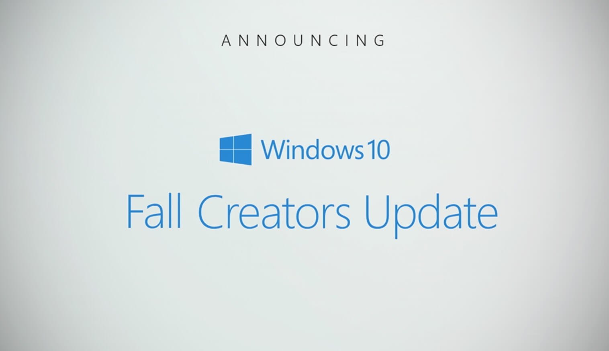

يحمل تحديث Fall Creators الاسم الكودي Redstone 3 وسيتم إصداره بشكل رسمي خلال هذا الشهر، وقد أعلنت عنه مايكروسوفت خلال حدثBuild 2017 في شهر مايو، ومع إصدارات برنامج Windows Insider المتتالية تكاد تكون الصورة الكاملة لتحديث Fall Creators قد اتضحت، لكن التغييرات في هذا التحديث ليست مجرد إضافات وحسب، فهناك ميزات جديدة وتحسينات للميزات الحالية، وأيضا بعض الميزات التي تم إزالتها من الويندوز.

## الميزات الجديدة التي تمت إضافتها في هذا التحديث

### 1- تصميم جديد Fluent Design

مع بداية 2017 أعلنت مايكروسوفت عن مشروعها Project NEON "الواجهة الجديدة" لويندوز 10، وكعادة مشاريع مايكروسوفت، لم يكن NEON هو الاسم النهائي، بل كان Fluent Design وهي لغة التصميم الجديدة التي ستعتمد عليها مايكروسوفت من هذا التحديث وصاعدا، ويتميز التصميم الجديد بالخفة واﻷناقة، ولكن حتي اﻵن لم يتم تعميم التصميم الجديد على كل التطبيقات، وسيتم تحديثها بشكل تدريجي.

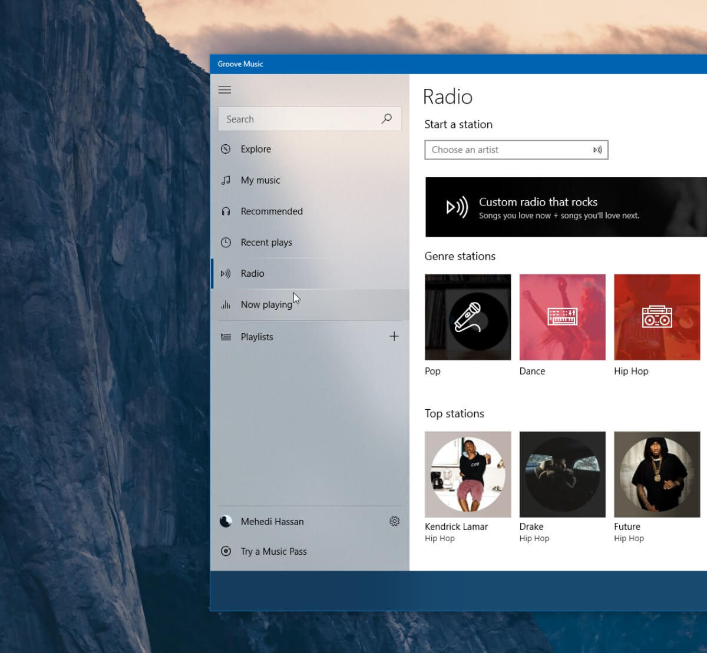

فيديو يوضح التصميم الجديد: https://youtu.be/vcBGj4R7Fo0

### 2- خدمة التخزين السحابي OneDrive تصبح اﻷفضل

حصلت خدمة OneDrive في هذا التحديث على التغيير اﻷكبر منذ إضافتها إلى الويندوز، حيث ستأتي بميزة جديدة هي Files on Demand، حيث ستظهر لك جميع ملفاتك المخزنة على OneDrive لكن سيتم تحميل ما تحتاجه منها، حتي لا تأخذ جميع الملفات مساحة كبيرة على القرص الصلب، فبمجرد أن تفتح أي ملف سيقوم الويندوز بتحميله، وكذلك إذا قام أي تطبيق بمحاولة الوصول إلى ملفات OneDrive.
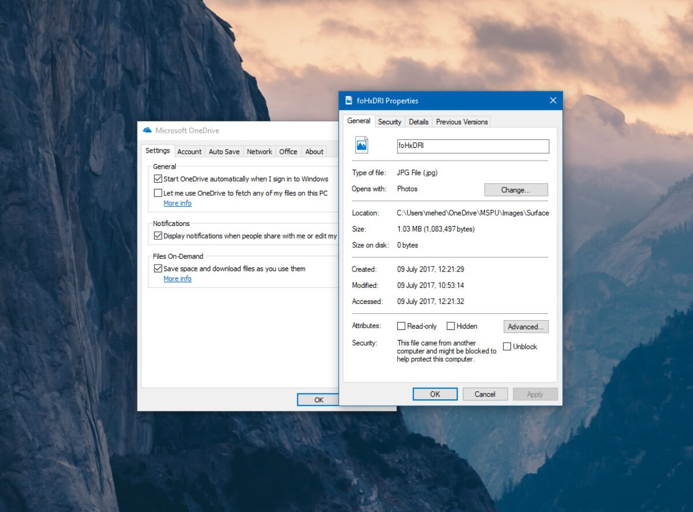

### 3- Microsoft Edge يحصل على ميزات جديدة:

تطمح مايكروسوفت بهذا التحديث الجديد لمتصفح Edge إلى زيادة عدد مستخدميه، فقد ركزت على إضافة مجموعة جديدة من المميزات أهمهما الدعم الكامل لصيغة PDF وعرض الفهرس واستخدام ال Marker بداخل الملف، كما تم تحسين دعم صيغة EPUB للكتب الإلكترونية، مع إضافة ميزة مزامنة مستوي التقدم في قراءة الكتاب بين أجهزتك.
من المميزات الجدية أيضا إمكانية تثبيت المواقع على شريط المهام لسهولة الوصول إليها، مع العديد من التحسينات الأخري على اﻷداء والتنقل بين التبويبات وتحسين وضع الشاشة الكاملة.

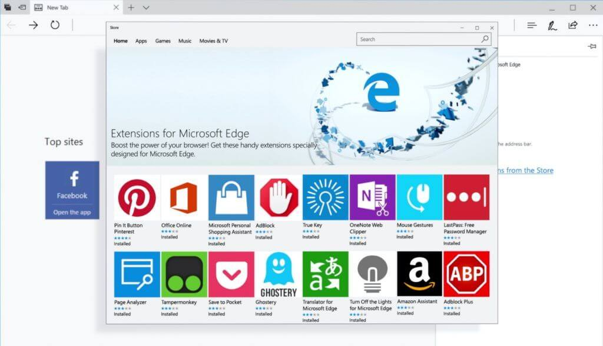

### 4- تغييرات جديدة في تطبيق اﻹعدادات Settings

تم إعادة تصميم القسم About ليظهر معلومات جديدة عن صحة النظام، كما تم إضافة العديد من الاختيارات اﻷخري مثل Storage Sense التي بإمكانها حذف الملفات المحملة تلقائيا بعد 30 يوم، كما بإمكانها مسح النسخة السابقة من الويندوز بعد عمل ترقية.
تم إضافة مجموعة جديدة من اﻹعدادات للوصول عن بعد Remote Desktop وإضافة مجموعة إعدادات خاصة ب Cortana واختيارات جديدة للتحكم في السعة المستخدمة من الإنترنت لتحميل التحديثات.

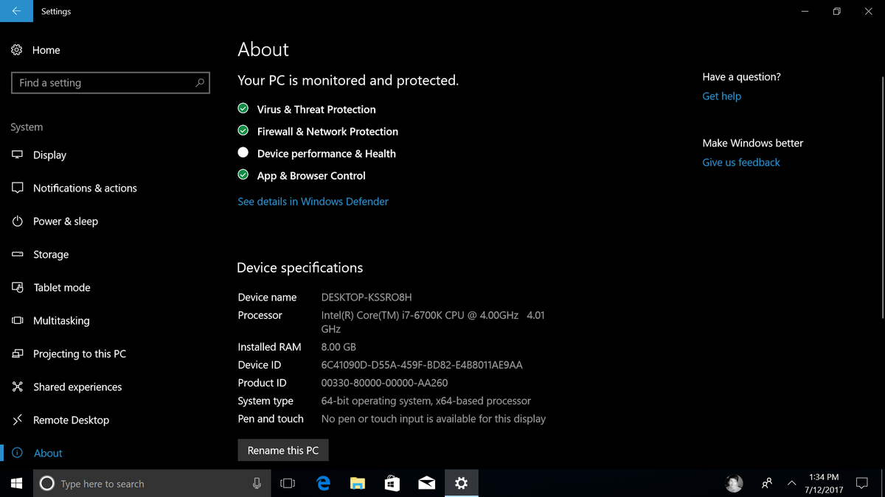

### 5- تصميم جديد لAction Center:

 تم تغيير التصميم السابق ل "مركز العمل"  إلى تصميم يتوافق مع Fluent Design ليعرض الإشعارات  بطريقة مختلفة بحيث تظهر منفصلة عن بعضها، مع إضافة بعض اﻷزرار الجديدة، لكنه ليس تغييرا كبيرا.

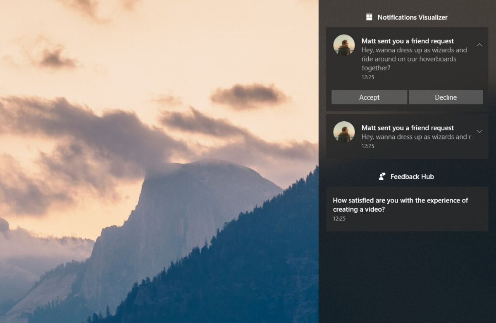

### 6-  شريط مهام محدث مع إضافة My People:

حصل شريط المهام على تحسينات عدة، منها تحسينات على مستوي المؤثرات، وتغييرات أخري مثل إضافة أيقونات جديدة للقوائم المختصرة، إلى الجانب التغيير اﻷكثر أهمية "إضافة My People“ وهي مساحة جديدة على شريط المهام تمكنك من الوصول السريع لأكثر ثلاث جهات اتصال تتواصل معهم عن طريق Skype، Outlook والعديد من البرامج اﻷخري.

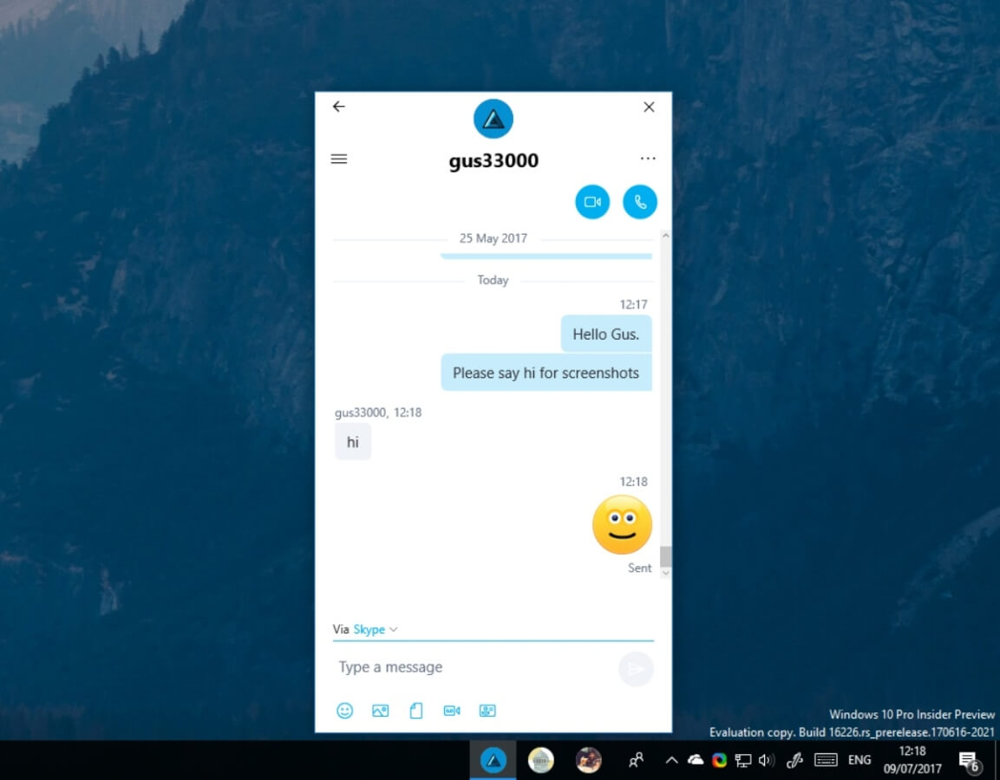

### 7- إضافات جديدة للتحكم في النظام عن طريق القلم اللمس Inking and Handwriting

من ضمن تغييرات واجهة Fluent Design هو الدعم الأفضل للشاشات التي تعمل باللمس، وأيضا اﻷقلام. فيمكنك في هذا التحديث استخدام القلم مع أغلب التطبيقات، بما في ذلك المتصفح ولوحة المفاتيح، لكن حتي اﻵن لا تدعم هذه الميزة برامج الويندوز العادية، في انتظار أن نراها قريبا.

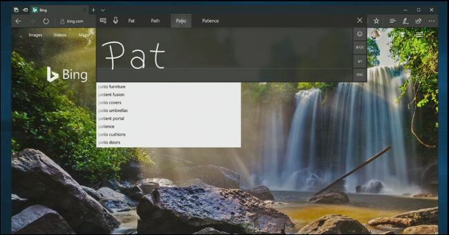

### 8- لوحة مفاتيح لمسية جديدة

هل تذكر عزيزي القارئ خبر استحواذ مايكروسوفت على لوحة مفاتيح أندرويد SwiftKey؟ يبدو أن هذه الصفقة قد آتت ثمارها، فمع هذا التحديث أصبح ممكنا استخدام لوحة مفاتيح الويندوز التي تعمل باللمس، مع دعم التنبؤات وأسلوب الكتابة بالسحب، بل ودعم حتي الرموز التعبيرية emoji.

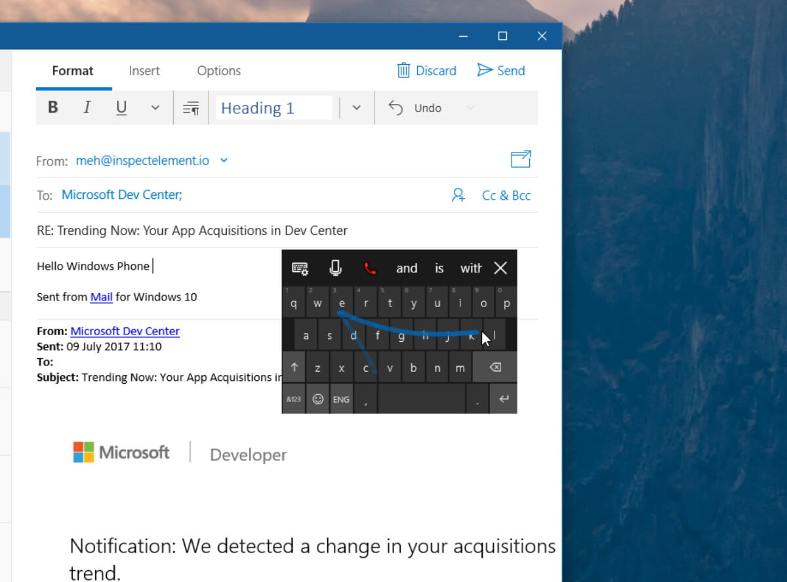

### 9- مدير المهام ُيظهر استخدام معالج الرسوميات GPU

دائما ما نلجأ لمدير المهام Task Manager لمعرفة المقدار المستخدم من موارد الجهاز، لكن قبل هذا التحديث لم يكن متاحا للمستخدم معرفة استخدام معالج الرسوميات GPU، لكن اﻵن كل ما عليك فعله هو فتح مدير المهام ثم التبويب performance لمشاهدة استخدام جميع موارد جهازك.

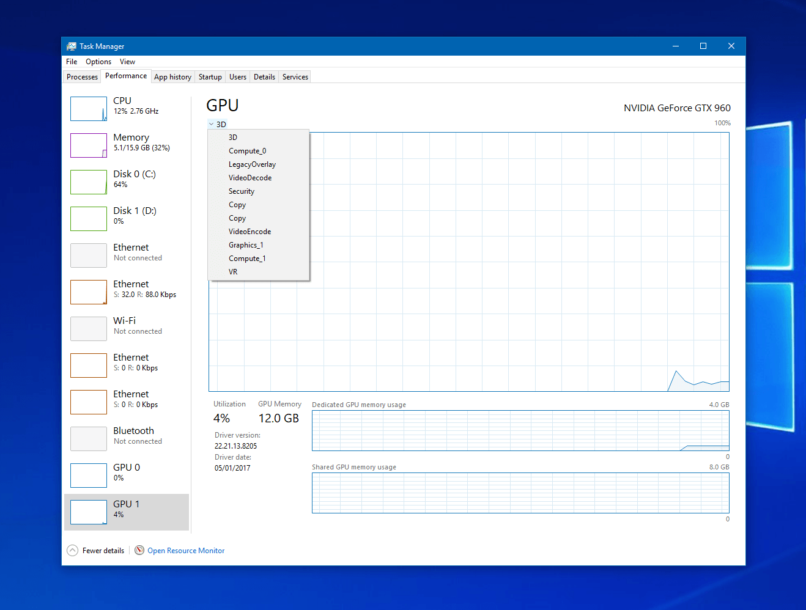

### 10- الويندوز يوفر مزيدا من الطاقة:

ميزة Power Throttling هي ميزة جديدة ظهرت ﻷول مرة في نسخ Windows Insider قبل تحديث Creators Updates السابق، لكن لم يتم إضافتها إلا في هذا التحديث، والغرض اﻷساسي منها توفير الطاقة بشكل كبير، بحيث سيقوم الويندوز بإعطاء اﻷولوية للتطبيقات التي تعمل في الواجهة، ويحد من التطبيقات التي تعمل في الخلفية حتي لا تستهلك موارد الجهاز.

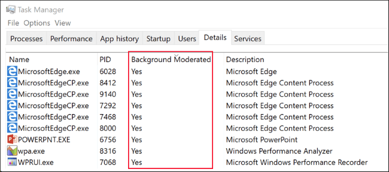

### 11- المشاركة عن طريق القائمة المختصرة:

قد يعتبرها البعض إضافة بسيطة، لكنها ذات قيمة كبيرة بالنسبة للمستخدم، فبدلا من المشاركة باستخدام التطبيقات كل ما عليك هو الضغط بزر الماوس اﻷيمن على الملف واختيار Share !

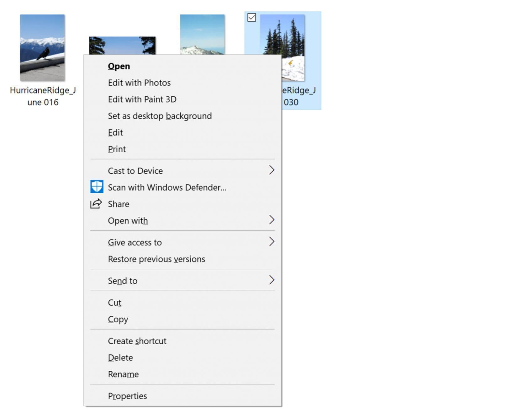

### 12- أزرار التحكم في الصوت لتطبيقات ويندوز الموحدة UWP:

أخيرا مع هذا التحديث أصبح بإمكان المستخدم التحكم في مستوي الصوت لكل تطبيق من تطبيقات الويندوز الموحدة بشكل منفصل بدون التأثير على مستوي صوت النظام.

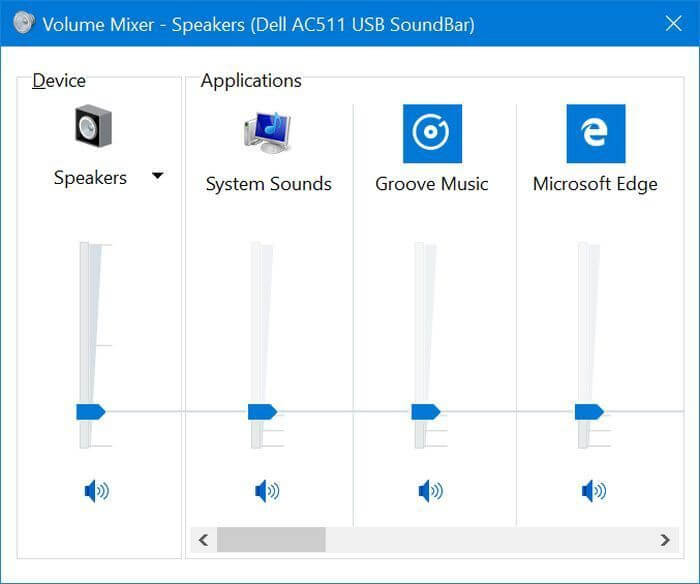

### 13- حماية أقوي ضد فيروسات الفدية

مع ازدياد عدد هجمات الفدية في اﻵونة اﻷخيرة، قامت مايكروسوفت في هذا التحديث بتقديم ميزة مدمجة في Windows Defender هي Controlled folder access والتي تمكنك من تحديد مجلدات معينة لحمايتها من التعديل بواسطة البرامج، وهي ميزة قوية لمحاربة فيروسات الفدية والبرمجيات الخبيثة.

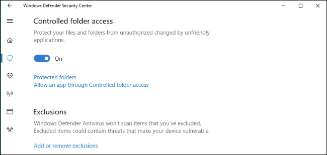

### 14- مزيد من الدعم لنظام لينكس

أضاف تحديث الذكري السنوية دعم نظام لينكس ﻷول مرة، فأصبح بإمكان المطورين استخدام الطرفية Bash وجميع أوامر لينكس، وحتي فترة قريبة كانت ميزة تجريبية، لكن اﻵن يمكن تثبيت نظام Ubuntu بكل سهولة من خلال متجر التطبيقات، وكذلك تم إضافة توزيعات Fedora و أوبن openSUSE، يمكنك أيضا تثبيت الثلاثة توزيعات معا بدون مشاكل.

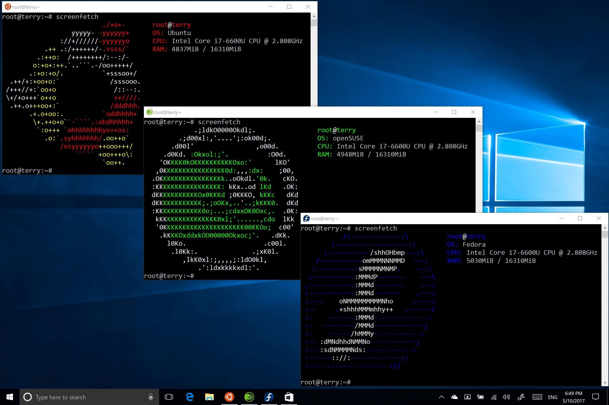

### 15- تطبيقات iTunes وSpotify متاحة عبر المتجر:

من المنتظر في هذا التحديث إضافة تطبيقات iTunes وSpotify إلى المتجر، مما سيجعل العديد من المستخدمين ينتقلون إليها بدلا من برامج سطح المكتب العادية.

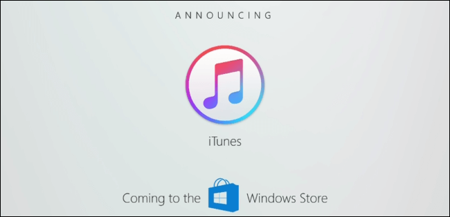

### 16- Cortana تصبح أكثر ذكاءا، مرة أخري:

نالت المساعدة الصوتية نصيبها من التحديثات، فستجد العديد من التغييرات في المؤثرات البصرية وسرعة الاستجابة، كما أصبح بإمكانك اﻵن تسجيل الخروج وقفل وإعادة تشغيل وإطفاء الكمبيوتر بواسطة الأوامر الصوتية.

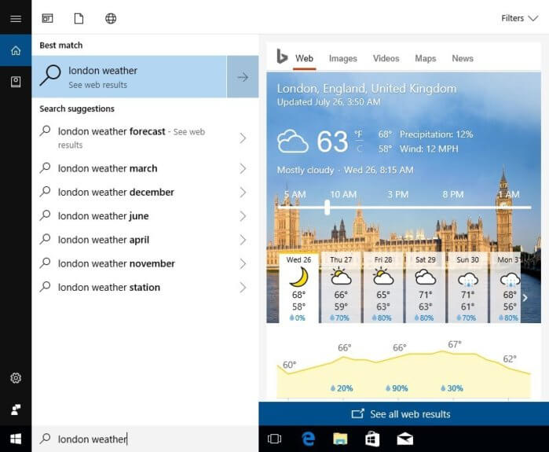

### 18- ميزة Pick up where you left off

التكامل بين الويندوز وهاتفك، هذا ما ستلاحظه بعد تثبيتك ل Cortana على هاتفك وتسجيل الدخول إلى حساب مايكروسوفت الخاص بك، فمع ميزة Pick up where you left off تستطيع استكمال ما كنت تقوم به على الويندوز من خلال الهاتف، كتصفح الإنترنت، كتابة رسالة أو العمل على مستند

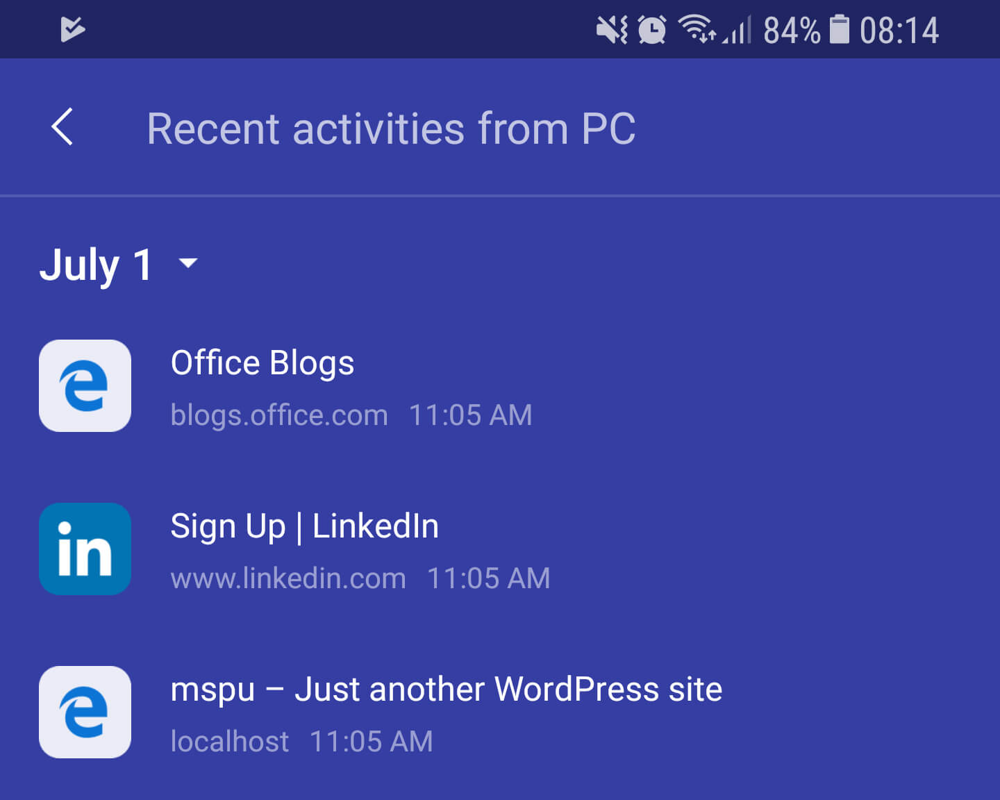

### 19- ميزة Picture-in-picture

قد تكون هذه الميزة وصلت متأخرة إلى الويندوز، فهي متاحة بالفعل في اﻷندرويد ونظام الماك، لكن أن تصل متأخرا خير من ألا تصل، فبواسطة Picture-in-picture تستطيع تشغيل فيديو مثلا ليظهر على الشاشة أثناء استخدامك للبرامج اﻷخري كما تشاهد في الصورة.

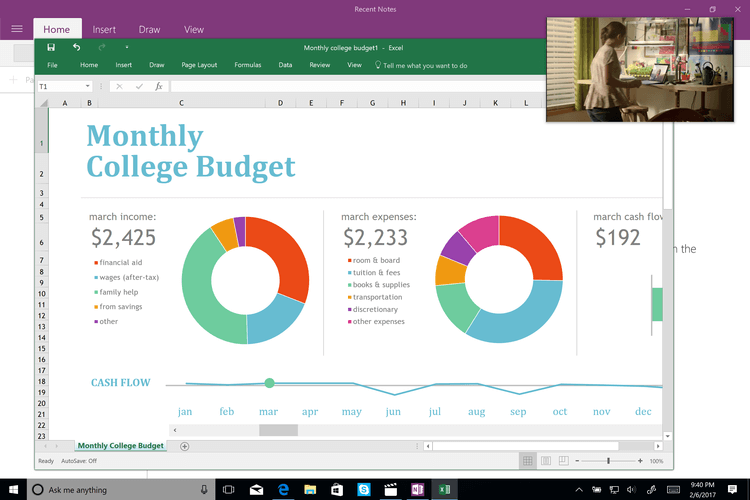

### 20- تحويل العملات باستخدام الآلة الحاسبة

تم إضافة ميزة حساب سعر العملات بواسطة تطبيق اﻵلة الحاسبة، كل ما عليك هو اختيار currency ثم كتابة المبلغ واختيار العملة المحول منها وإليها وترك الويندوز يقوم بالباقي، يجب عليك أن تعرف أن التطبيق يقوم بجلب أحدث أسعار العملات من على الإنترنت.

### باقي التغييرات

- إضافة لوحة الرموز التعبيرية التي يمكنك الوصول إليها عن طريق الضغط على ويندوز و زر النقطة.
- التعرف على المجلدات التي تحتوي على ملفات وسائط تلقائيا.
- إضافة خيارات جديدة للتحكم في شبكات الواي فاي، عن طريق الضغط بزر الماوس اﻷيمن على الشبكة بدون الدخول إلى تطبيق اﻹعدادات.
- إضافة إعدادات للتحكم في تشغيل الفيديو عن طريق تطبيق اﻹعدادات.
- تحسينات في وضع الألعاب G

## أهم المميزات التي تم إزالتها من الويندوز مع هذا التحديث

- Microsoft Paint
نعم، مع تحديث Fall Creators سنودع برنامج الرسام التقليدي، والذي استبدلته مايكروسوفت بتطبيق Paint 3D الجديد، ولحسن الحظ سيظل بإمكان المستخدم تثبيت النسخة القديمة من برنامج الرسام عن طريق متجر التطبيقات.

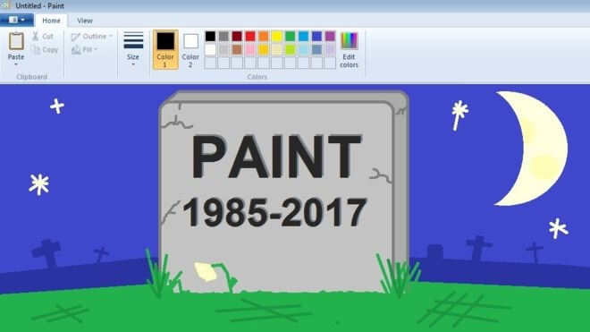

- 3D Builder App
أيضا سيتم حذف تطبيق 3D Builder نتيجة إضافة تطبيق الرسام الجديد والذي سيحل محله، وأيضا سيظل  3D Builder متاحا عن طريق المتجر.

- Outlook Express
هو برنامج عميل البريد الإلكتروني الذي أوفقته مايكروسوفت قبل أعوام، وبهذا سينتقل مستخدميه إلى البرامج اﻷخري المتاحة مثل Mail و Outlook.

- Screen Savers
من أقدم ميزات ويندوز التي نعرفها جميعا، والتي تم إزالتها من القسم Themes لكن تظل هناك بعض الحيل لاستخدامها عن طريق Group Policy.

- System Image Backups
وهي ميزة لعمل نسخ احتياطية من النظام، لكن مايكروسوفت فضلت أن يعتمد المستخدمين على برامج أخري للقيام بهذه المهمة.
- Reader App / Reading List وتم دمج كلاهما مع متصفح Edge.
- Windows PowerShell 2.0 وهي البديل الحالي لموجه اﻷوامر، وبالتالي يتوجب على المطورين الانتقال إلى إصدارات أحدث من Powershell.

---

هذا الموضوع نُشر باﻷصل في مجلة لغة العصر العدد 201 شهر 09-2017 ويمكن الإطلاع عليه [هنا](https://drive.google.com/file/d/152hJUFkTO6Egy7OVFwU2RbcNgwJq6r8N/view?usp=sharing).

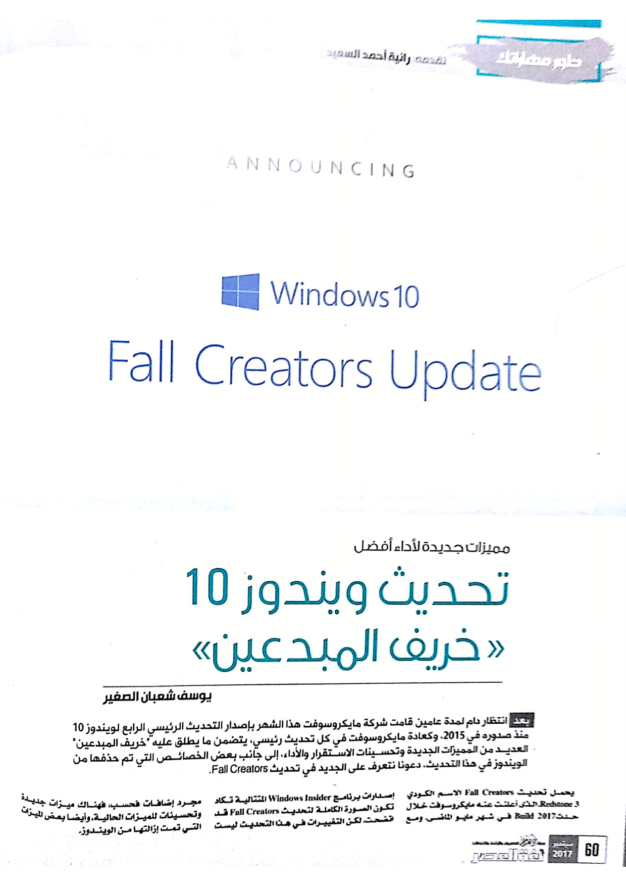

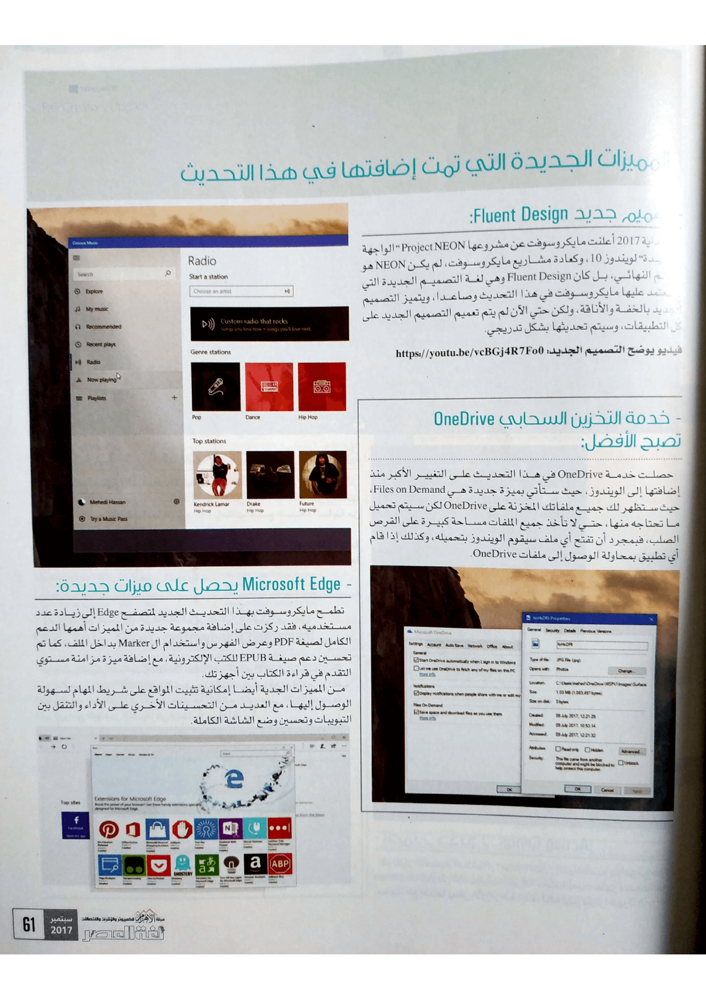

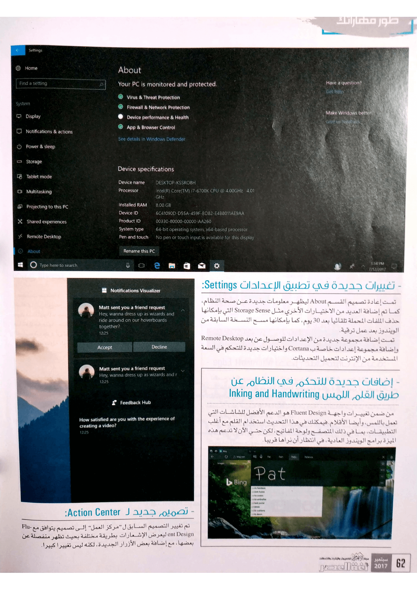

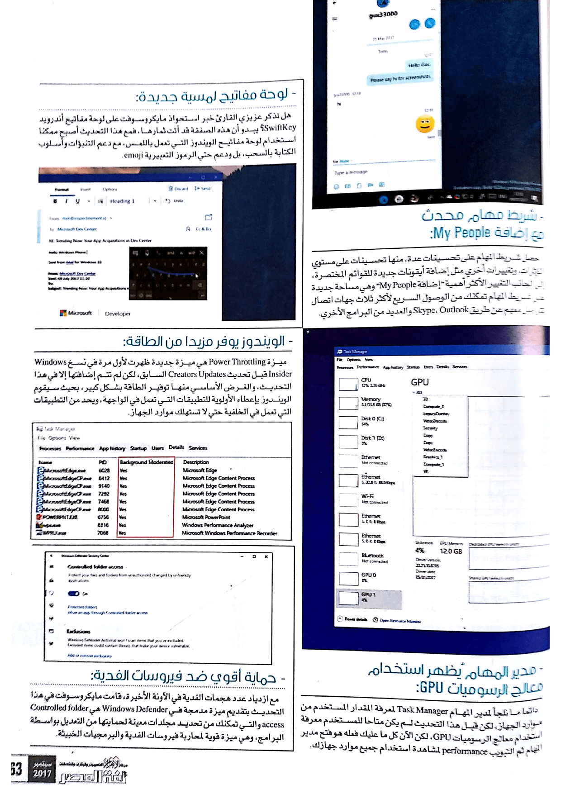

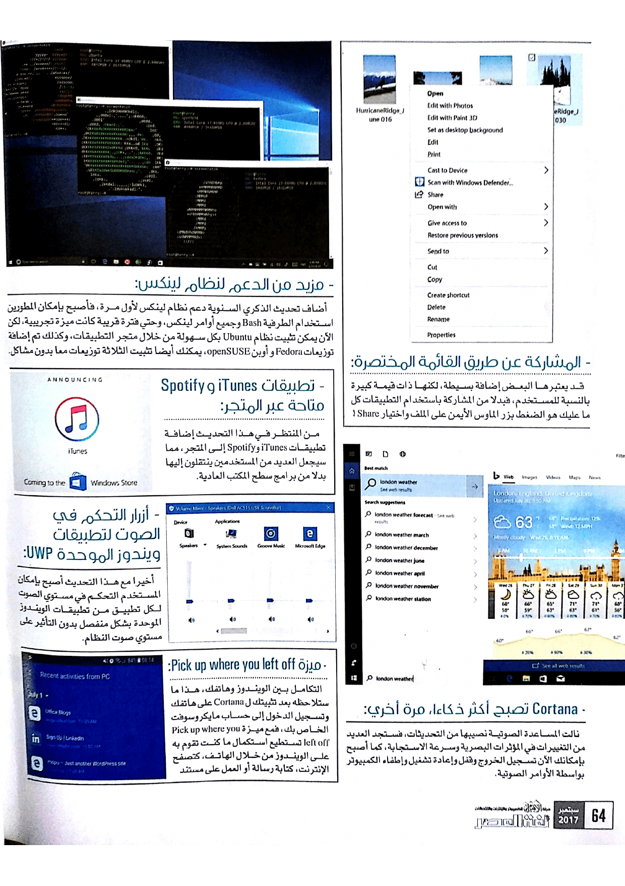

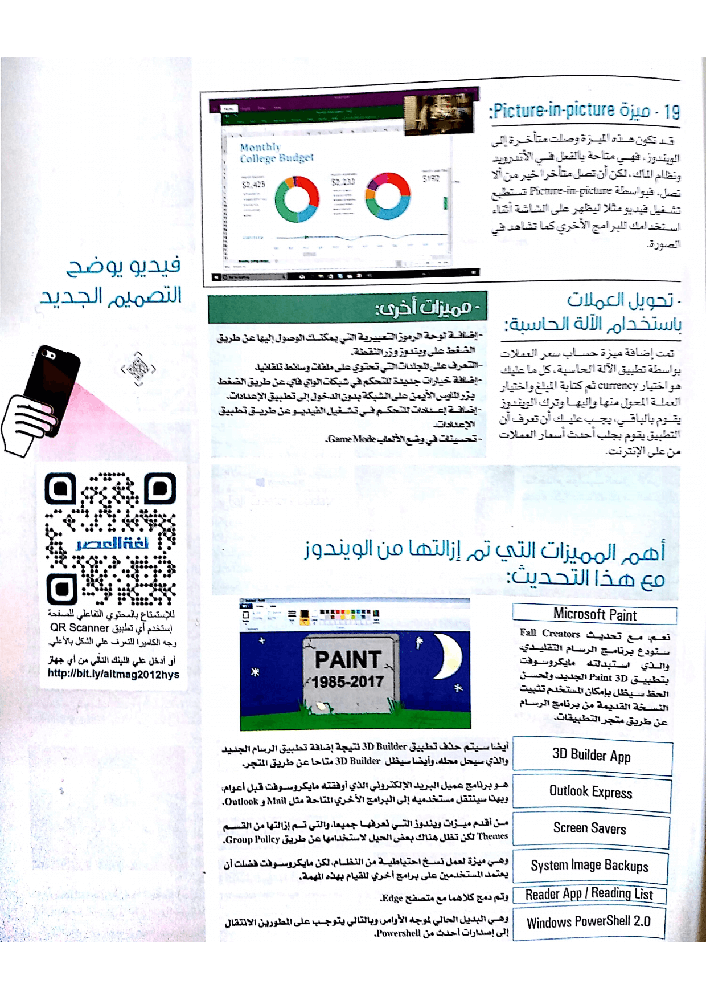
