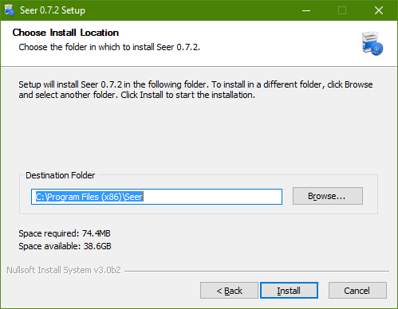

+++
title = "كيفية إضافة ميزة معاينة الملفات إلى ويندوز 10"
date = "2016-04-09"
description = "في نظام OS X تتوفر ميزة رائعة هي معاينة الملفات، من خلالها يستطيع المستخدم إلقاء نظرة سريعة على الملف دون فتحه، بالطبع لا تتوفر هذه الميزة بشكل افتراضي في ويندوز 10 لكن في درس اليوم ستتعرف عزيزي القارئ على طريقة إضافتها"
categories = ["ويندوز",]
series = ["ويندوز 10"]
tags = ["موقع لغة العصر"]
images = ["images/2016-635957857279841135-984_thumb705x335.png"]

+++

في نظام OS X تتوفر ميزة رائعة هي ميزة معاينة الملفات، من خلالها يستطيع المستخدم إلقاء نظرة سريعة على الملف دون فتحه، بالطبع لا تتوفر هذه الميزة بشكل افتراضي في ويندوز 10 ولكن في درس اليوم ستتعرف عزيزي القارئ على طريقة إضافتها.

يمكن إضافة ميزة معاينة الملفات File Preview إلى ويندوز 10 عن طريق برنامج صغير هو Seer، يقوم هذا البرنامج بعرض معاينة للصور بما فيها ملفات Photoshop – Illustrator، الملفات النصية والمستندات، الملفات المضغوطة، وأيضا المجلدات.

كل ما تحتاج اليه هو تحميل البرنامج [من هنا](https://sourceforge.net/projects/ccseer/?source=typ_redirect).
- قم بتثبيت البرنامج بالخطوات التقليدية.

- قم بالدخول إلى أي مجلد به صور مثلا، ثم قم بتحديد أي ملف واضغط زر المسافة Space bar.

  

- سيتم عرض المعاينة كما بالصورة، للخروج منها اضغط زر المسافة مرة أخرى.

---
هذا الموضوع نٌشر باﻷصل على موقع مجلة لغة العصر.

http://aitmag.ahram.org.eg/News/47639.aspx