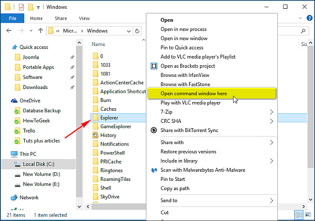
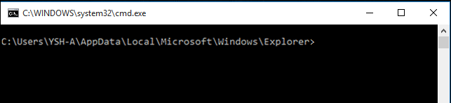
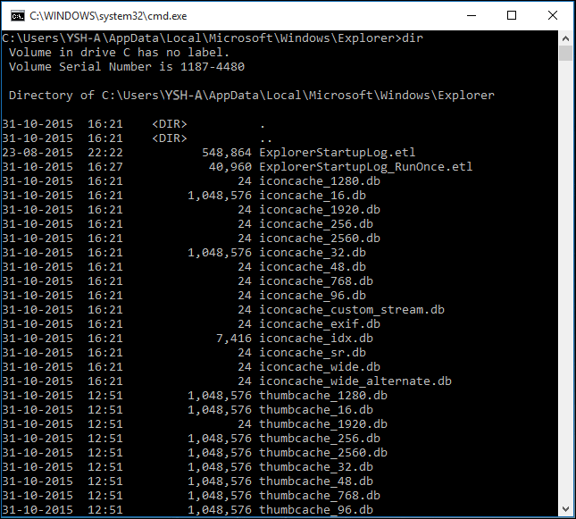
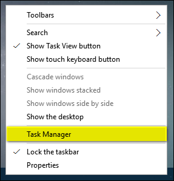
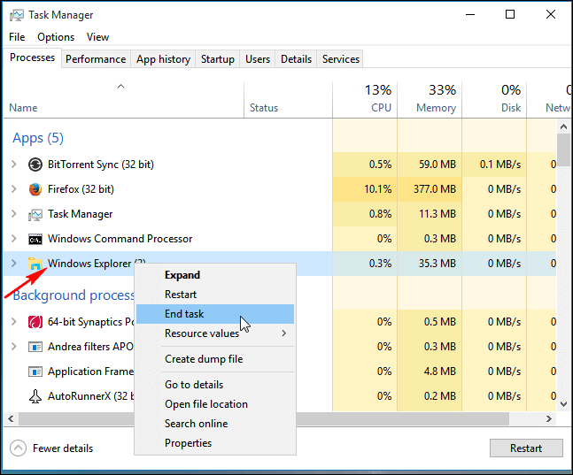
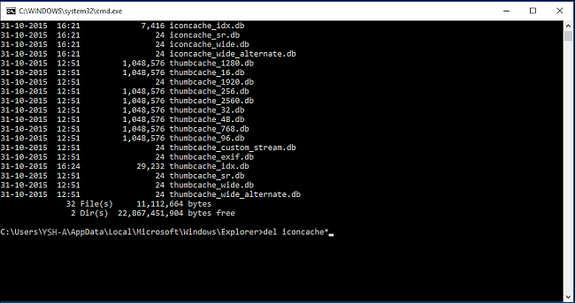
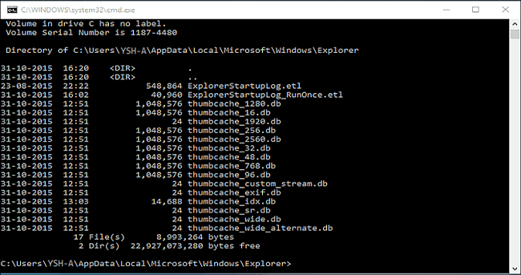

+++
title = "حل مشكلة عدم ظهور مصغرات الصور في ويندوز 10"
date = "2016-01-31"
description = "في بعض الأحيان وخصوصا مع الصور كبيرة الحجم في ويندوز 10 تحدث مشكلة وهي عدم ظهور المصغرات، وظهور أيقونة صورة فقط، في هذا الدرس سنتعرف على طريقة حل هذه المشكلة"
categories = ["ويندوز",]
series = ["ويندوز 10"]
tags = ["موقع لغة العصر"]

+++

في بعض الأحيان وخصوصا مع الصور كبيرة الحجم في ويندوز 10 تحدث مشكلة وهي عدم ظهور المصغرات، وظهور أيقونة صورة فقط، في هذا الدرس سنتعرف على طريقة حل هذه المشكلة.

1- قم بالدخول إلى هذا المسار:
`C:\Users\<your username>\AppData\Local\Microsoft\Windows\Explorer`
مع استبدال <your username> باسم المستخدم الخاص بك.

2- اضغط زر Shift مع الاستمرار ثم اضغط بزر الماوس الأيمن على مجلد Explorer واختر Open command window here.

3- سيتم فتح موجة الأوامر في هذا المسار.

4- تأكد من أنك في المسار الصحيح ثم اكتب الأمر dir لتظهر لك ملفات المصغرات كما بالصورة.

5- قم بفتح مدير المهام Task Manager بالضغط بزر الماوس الأيمن على شريط المهام واختيار Task Manager.

6- اضغط بزر الماوس الأيمن على Windows Explorer ثم اختر End task.

7- ارجع مرة اخري الي موجه الأوامر ثم اكتب الأمر التالي واضغط Enter:
del iconcache*

8- اكتب الأمر dir لتتحقق من مسح ملفات المصغرات، إذا وجدت أي ملفات أغلق جميع التطبيقات المفتوحة بالخلفية ثم أعد الخطوات السابقة.

9- اضغط Ctrl+Alt+Del ثم اختر Sign out وأعد تسجيل الدخول مرة أخري.

---
هذا الموضوع نٌشر باﻷصل على موقع مجلة لغة العصر.

http://aitmag.ahram.org.eg/News/42429.aspx