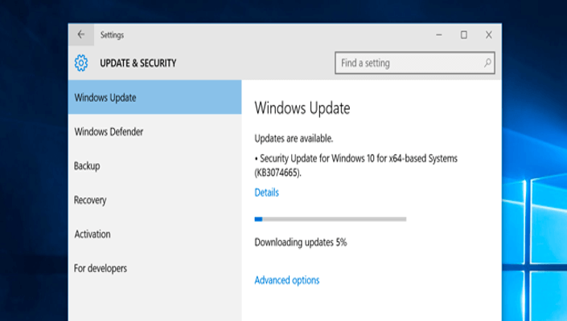
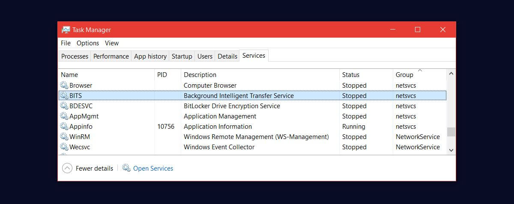
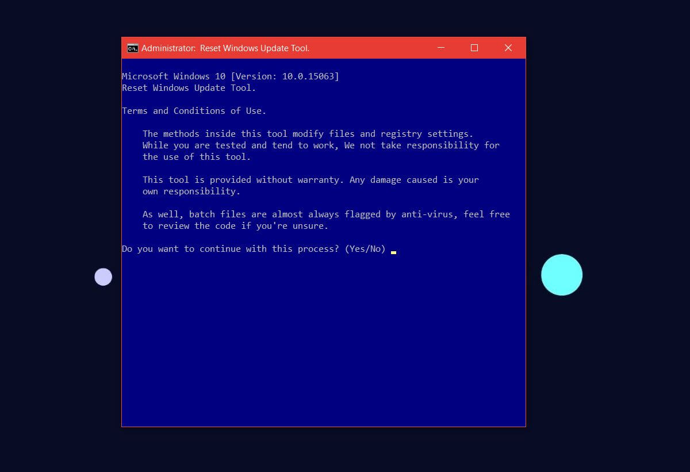
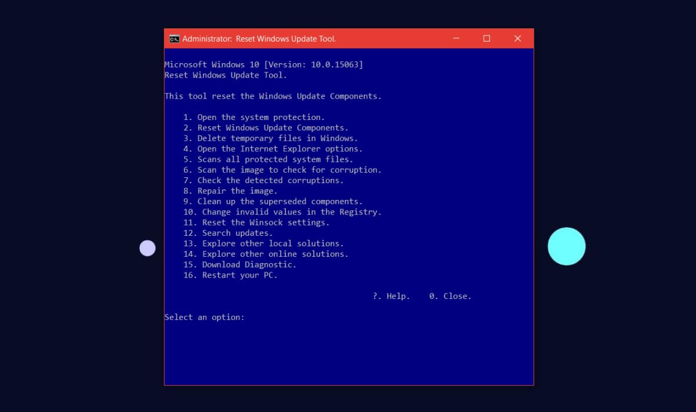

+++
title = "حل مشكلة عدم استكمال تحديثات ويندوز 10"
date = "2017-09-20"
description = "يتلقى ويندوز 10 التحديثات بشكل دوري من مايكروسوفت، لكن في بعض الأحيان يواجه المستخدم مشكلة ثبات مؤشر التحميل على نسبة معينة وعدم التقدم، إليك طريقة حل هذه المشكلة."
categories = ["ويندوز",]
series = ["ويندوز 10"]
tags = ["المدونة",]
+++
يتلقى ويندوز 10 التحديثات بشكل دوري من مايكروسوفت، لكن في بعض الأحيان يواجه المستخدم مشكلة ثبات مؤشر التحميل على نسبة معينة وعدم التقدم، إليك طريقة حل هذه المشكلة.

أولا: قم بالتأكد من التالي:
- الجهاز متصل بالإنترنت، والاتصال مستقر، يمكنك تحميل تطبيق صغير من المتجر للتأكد من الأمر.
- اتصال الواى فاى غير محدد كmetered connection، قم بالدخول إلى تطبيق الإعدادات ثم Network & Internet ثم التبويب Wi-Fi، بعد ذلك اضغط على الزر details وتأكد من أن الاختيار مغلق.
- تأكد من أن خدمة BITS تعمل، من خلال مدير المهام Task Manager ثم التبويب Services، إذا لم تكن تعمل قم بتشغيلها.
- أعد تشغيل الجهاز لمرة واحدة للتأكد أن المشكلة ما تزال موجودة.

إذا ظلت المشكلة موجودة قم بتطبيق الخطوات التالية:

1- قم بتحميل هذه الأداة من موقع مايكروسوفت لحل مشكلة التحديثات من هنـــا.

2- قم بفك الضغط عن الملف، ثم اضغط بزر الماوس الأيمن على الملف واختر  Run as administrator.

3- ستظهر لك النافذة كما بالصورة، قم بكتابة Y.

4-  سوف تسألك الأداة عما تريد فعله، قم بكتابة 2 لحل مشكلة التحديثات ثم اضغط Enter.

5- انتظر حتى تنتهي الأداة من عملها ثم قم بفتح تطبيق الإعدادات ثم تحقق من وجود تحديثات وسوف يقوم الويندوز بتحميلها ثم تثبيتها بدون مشاكل.

