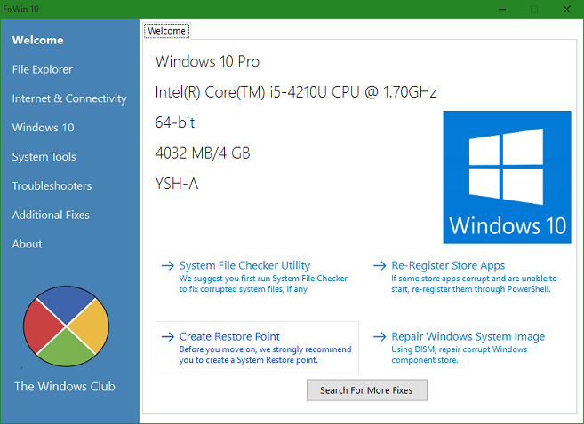
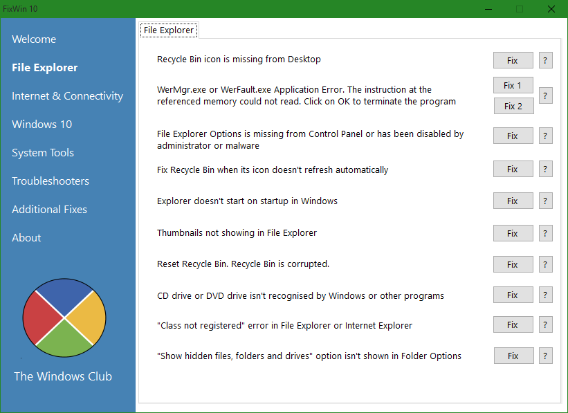
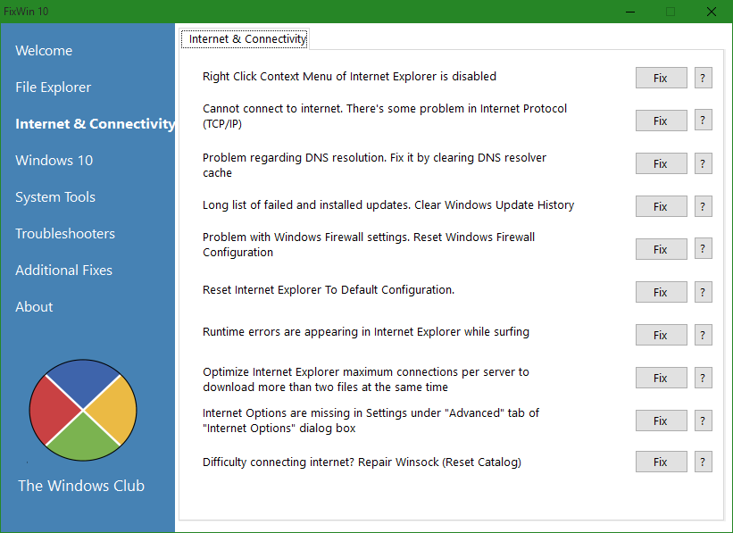
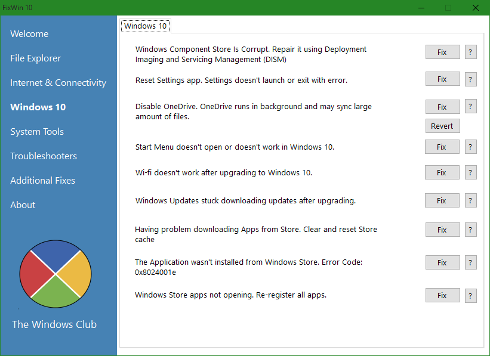
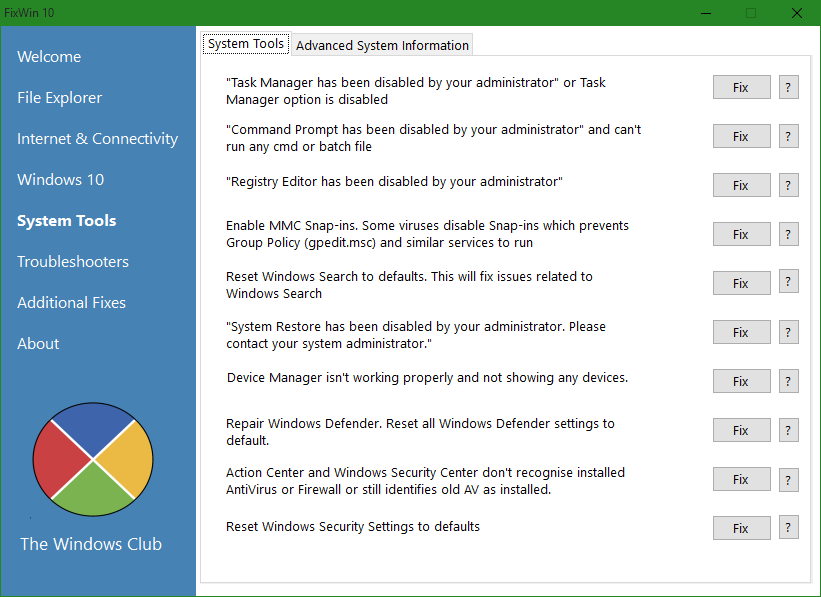
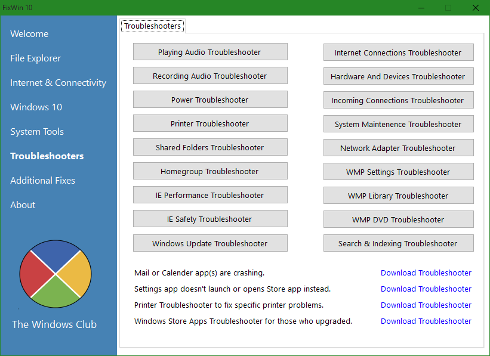
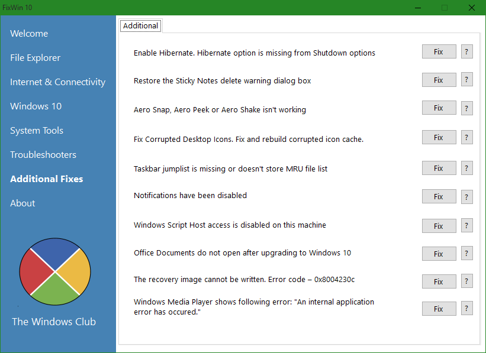

+++
title = "طريقة سحرية لمعالجة مشاكل الويندوز بضغطة واحدة"
date = "2015-11-02"
description = "أداة FixWin 10 هي أداة مجانية محمولة تمكن أي مستخدم للويندوز من تصليح كل مشاكل الويندوز الشهيرة والشائعة، بمجرد ضغطه بسيطة تحل المشكلة !، في درس اليوم نسلط الضوء على أداة FixWin 10 التي لا غني عنها"
categories = ["ويندوز",]
series = ["ويندوز 10"]
tags = ["موقع لغة العصر"]

+++

أداة FixWin 10 هي أداة مجانية محمولة تمكن أي مستخدم للويندوز من تصليح كل مشاكل الويندوز الشهيرة والشائعة، بمجرد ضغطه بسيطة تحل المشكلة !، في درس اليوم نسلط الضوء على أداة FixWin 10 التي لا غني عنها.

[لتحميل الأداة من هنا](http://www.thewindowsclub.com/downloading-fixwin-10)

تم تصميم الأداة من قبل فريق The Windows Club وتمت تجربتها على النسخ 32 و64 وهي تعمل بكفاءة على كلا النسختين.

عند تشغيل الأداة ستجد الواجهة كما بالصورة:

تحتوي الشاشة الرئيسية للأداة على معلومات عن الجهاز ونسخة الويندوز:

إصدار الويندوز، نوع المعالج وتردده، نوع معمارية النسخة 32/64، حجم الرام، واسم المستخدم.

في الجزء السفلي يوجد أربعة خيارات هي:

- System File Checker Utility: التحقق من ملفات النظام.
- Re-Register Store Apps: إعادة تسجيل تطبيقات المتجر.
- Create Restore Point: إنشاء نقطة استعادة للنظام.
- Repair Windows System Image: تصليح مكونات الويندوز التالفة.

تستطيع التنقل بين أقسام الأداة عن طريق الضغط على اسم القسم الموجود على يسار الأداة.

**القسم الأول:** **File Explorer** **مستعرض الملفات:**

يوفر حلول لجميع المشاكل المتعلقة بمستعرض الملفات في ويندوز 10.

**القسم الثاني:** **Internet & Connectivity** **الاتصالات والانترنت:**

من خلال هذا القسم تستطيع علاج المشاكل المتعلقة بالإنترنت، خاصة المشكلات التي تظهر بعد الترقية إلى ويندوز 10 (وليس التثبيت النظيف).

**القسم الثالث:** **Windows 10** **ويندوز 10:**

في هذا القسم يمكنك القيام بـ:

 - Reset Settings app عمل إعادة ضبط لتطبيق المتجر.
- Start Menu doesn’t work تصليح مشكلة عدم عمل قائمة البداية.
- Wi-Fi doesn’t work حل مشكلة عدم عمل الواي فاي.
- Windows Store apps not opening تصليح تطبيقات المتجر التي لا تعمل.

والعديد من الأمور الأخرى.

**القسم الرابع:** **System Tools** **أدوات النظام:**

يحتوي هذا القسم على أدوات متقدمة لحل بعض المشاكل.

كما يحتوي أيضا على قسم **System Information** **معلومات النظام**

ويعرض هذا القسم جميع المعلومات التي تحتاج معرفتها عن جهازك.

**القسم الخامس:** **Troubleshooters** **استكشاف الأخطاء وإصلاحها:**

يوفر هذا القسم اختصارات سريعة للوصول إلى 18 مستكشف أخطاء الخاص بالويندوز، أيضا يمكنك من تحميل 4 مستكشفات أخطاء الخاصة بمايكروسوفت.

**القسم السادس:** **Additional Fixes** **تصليحات إضافية:**

يحتوي هذا القسم على بعض التصليحات المتفرقة لباقي المشاكل التي قد يواجها المستخدم.

---
هذا الموضوع نٌشر باﻷصل على موقع مجلة لغة العصر.

http://aitmag.ahram.org.eg/News/36342.aspx