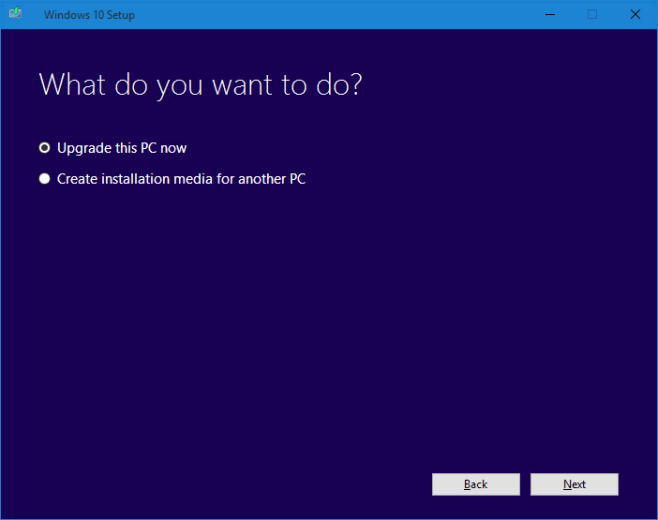
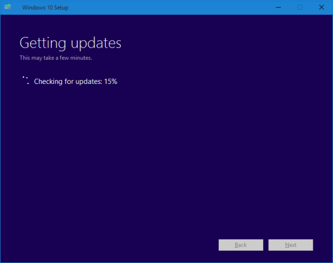

+++
title = "كيفية إجبار ويندوز 10 على الترقية إلى أحدث بناء"
date = "2016-04-15"
description = "في بعض الأحيان وخاصة عند صدور بناء جديد من ويندوز 10 تتأخر التحديثات في الوصول للمستخدمين، وفى حالة حدوث هذه المشكلة يمكننا إجبار ويندوز 10 على الترقية، إليكم الطريقة"
categories = ["ويندوز",]
series = ["ويندوز 10"]
tags = ["موقع لغة العصر"]
images = ["images/2016-635963397942036236-203_thumb705x335.png"]

+++

في بعض الأحيان وخاصة عند صدور بناء جديد من ويندوز 10 تتأخر التحديثات في الوصول للمستخدمين، وفى حالة حدوث هذه المشكلة يمكننا إجبار ويندوز 10 على الترقية، إليكم الطريقة.

1- قم بتحميل أداة Windows 10 Media Creation tool [من هنا](https://www.microsoft.com/en-gb/software-download/windows10).

2- قم بتشغيل الأداة ثم اختر Upgrade this PC now.

3- انتظر حتى تنتهي الأداة من البحث عن التحديثات ثم تحميل أحدث بناء.

4- بعد ذلك سوف تقوم الأداة بإعادة تشغيل جهازك وتثبيت البناء الجديد، قد يتم إعادة التشغيل أكثر من مرة، كما أن عملية الترقية قد تستغرق حوالي ساعة.

5- باستخدامك لهذه الطريقة عزيزي القارئ سوف تقوم بتحديث نسخة ويندوز 10 الموجودة على جهازك إلى أحدث بناء متوافر دون فقد أي بيانات، فعملية الترقية تقوم بالحفاظ على التطبيقات، الإعدادات، البيانات وحتى خلفية سطح المكتب.

---
هذا الموضوع نٌشر باﻷصل على موقع مجلة لغة العصر.

http://aitmag.ahram.org.eg/News/47965.aspx