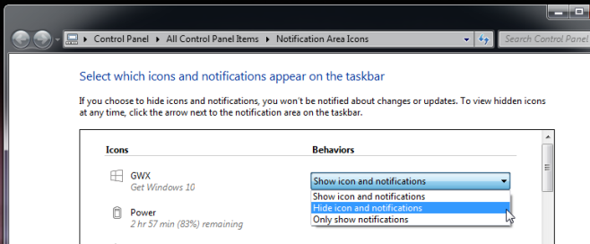
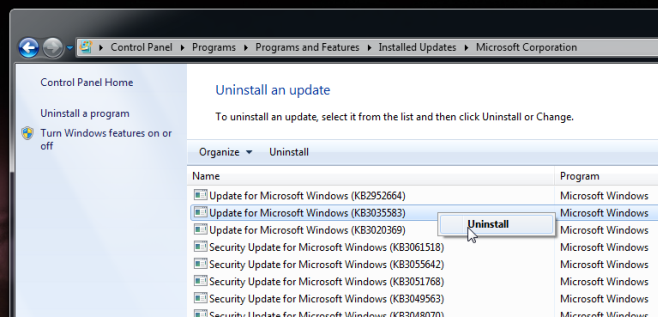

+++
title = "طريقة التخلص من اشعار الحصول على ويندوز 10"
date = "2015-06-14"
description = "استعدادا للترقية لويندوز 10 قامت مايكروسوفت بإطلاق تطبيق Get Windows 10 الذي يظهر بجوار الساعة ليقوم المستخدم من خلاله بحجر نسخته المجانية من ترقية ويندوز 10، ولكن ضايق هذا التطبيق العديد من المستخدمين لكونه لا يمكن اغلاقه ودائما ما يظهر، في درس اليوم أقدم لك عزيزي القارئ طريقة التخلص من اشعار الحصول على ويندوز 10."
categories = ["ويندوز",]

series = ["ويندوز 10"]

tags = ["موقع لغة العصر"]

+++

استعدادا للترقية لويندوز 10 قامت مايكروسوفت بإطلاق تطبيق Get Windows 10 الذي يظهر بجوار الساعة ليقوم المستخدم من خلاله بحجر نسخته المجانية من ترقية ويندوز 10، ولكن ضايق هذا التطبيق العديد من المستخدمين لكونه لا يمكن اغلاقه ودائما ما يظهر، في درس اليوم أقدم لك عزيزي القارئ طريقة التخلص من اشعار الحصول على ويندوز 10.

**الطريقة الأولي: إخفاء التطبيق بشكل مؤقت:**
قم بالدخول الى Control Panel\All Control Panel Items\Notification Area Icons ثم قم بالضغط على القائمة المنسدلة الموجودة أمام التطبيق واختر Hide icon and notifications.

**الطريقة الثانية: حذف التحديث** **KB3035583**:
كما سبق وأشرت في درس كيف تتحقق من توافق التعريفات والبرامج مع ويندوز 10؟ أن هذا التطبيق لن يظهر إلا بعد تحميل التحديث KB3035583، وبالتالي فإن إزالته تكون عن طريق حذف هذا التحديث.

-   قم بالدخول الى Control Panel\System and Security\Windows Update ثم قم بالبحث عن التحديث KB3035583 بمجرد أن تجده قم بالضغط عليه بزر الفأرة الأيمن ثم قم باختيار Uninstall، بعد ذلك قم بإعادة تشغيل الكمبيوتر.

-   بعد إعادة التشغيل قم بالدخول مرة أخرى الى Windows Update ثم قم بالتحقق من وجود تحديثات، سيظهر لك هذا التحديث قم بالضغط عليه بزر الفأرة الأيمن ثم اختر Hide Update.

**الطريقة الثالثة: عن طريق برنامج** **I don’t Want Windows 10**:
قام مطور بتصميم هذا البرنامج ليجعله أسهل طريقة للتخلص من اشعار الحصول على ويندوز 10، كما أن البرنامج مجانا ومفتوح المصدر.

-   قم بتحميل الأداة [من هنا](https://github.com/rn10950/I-Dont-Want-Windows-10/releases/tag/2.0) (قم باختيار الملف I_Dont_Want_Windows_10.zip)، بعد فك الضغط عن الملف قم بتشغيله ثم اضغط I Agree وانتظر حتى ينتهي البرنامج من إزالة تطبيق Get Windows 10.

---

هذا الموضوع نٌشر باﻷصل على موقع مجلة لغة العصر.

http://aitmag.ahram.org.eg/News/16855.aspx
