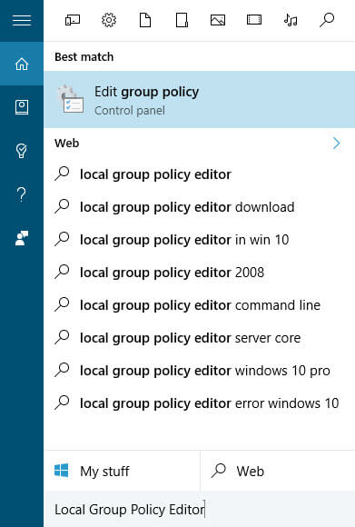
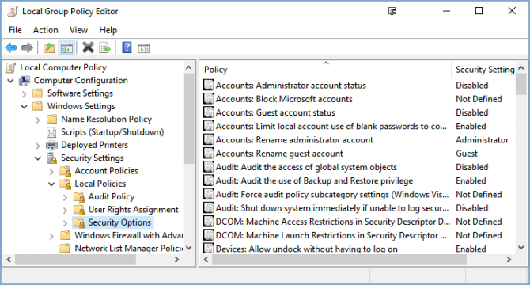
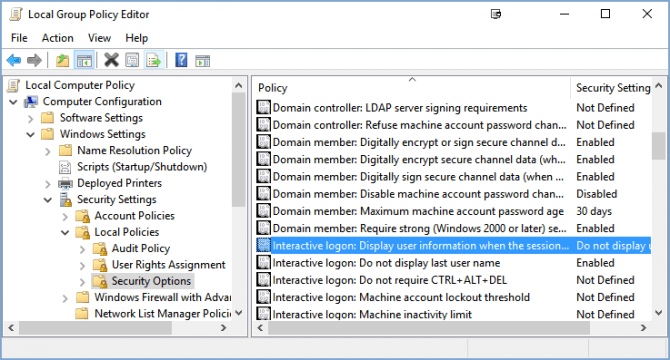
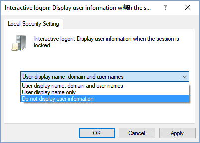
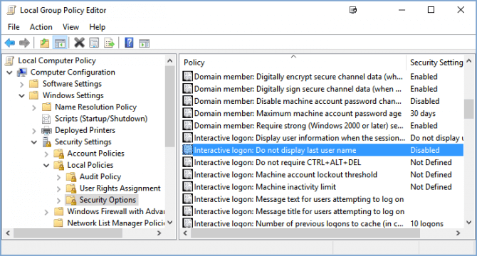
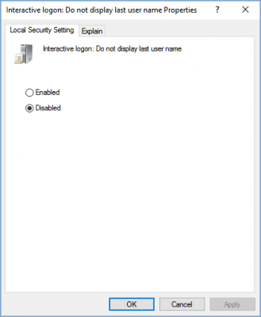

+++
title = "كيفية إخفاء بيانات المستخدم من شاشة تسجيل الدخول في ويندوز 10"
date = "2016-05-22"
description = "إذا كنت تستخدم حساب مايكروسوفت لتسجيل الدخول إلى جهازك فستجد أن الويندوز يقوم بعرض اسمك وبريدك الإلكتروني في شاشة تسجيل الدخول، في درس اليوم سنقوم بمنع عرض هذه البيانات"
categories = ["ويندوز",]
series = ["ويندوز 10"]
tags = ["موقع لغة العصر"]
+++

إذا كنت تستخدم حساب مايكروسوفت لتسجيل الدخول إلى جهازك فستجد أن الويندوز يقوم بعرض اسمك وبريدك الإلكتروني في شاشة تسجيل الدخول، في درس اليوم سنقوم بمنع عرض هذه البيانات.

1- قم بالدخول إلى Local Group Policy Editor.

2- انتقل إلى المسار Computer Configuration > Windows Settings > Security Settings > Local Policies > Security Options/

3- اضغط على Interactive logon: Display user information when the session is locked.

4- قم بتغييرها إلى الاختيار Do not display user information ثم اضغط OK.

5- بعد ذلك افتح الاختيار Interactive logon: Do not display last user name.

6- قم بتغييرها إلى الاختيار Disabled ثم اضغط OK.

---
هذا الموضوع نٌشر باﻷصل على موقع مجلة لغة العصر.

http://aitmag.ahram.org.eg/News/49747.aspx