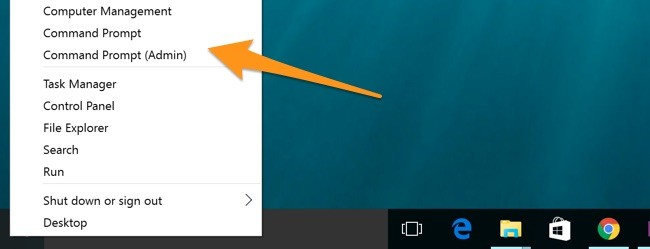
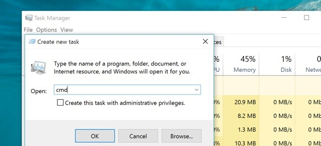
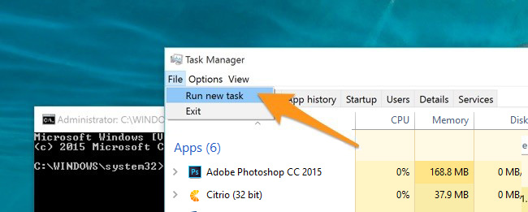
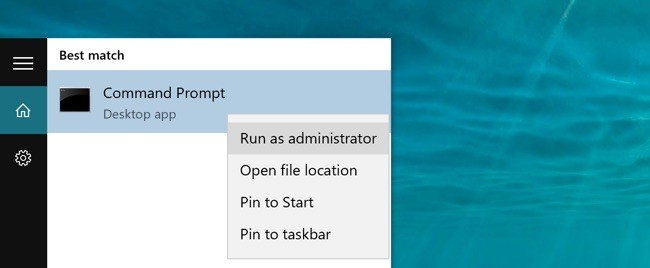
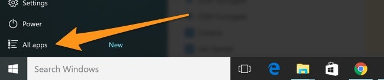
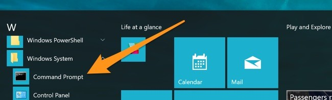
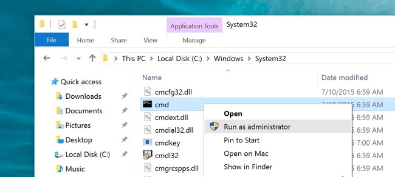
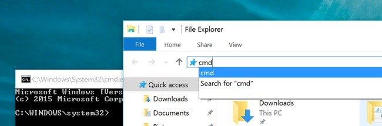
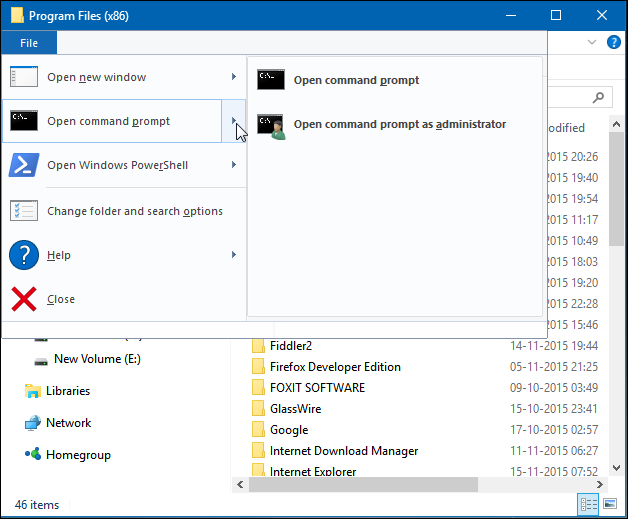
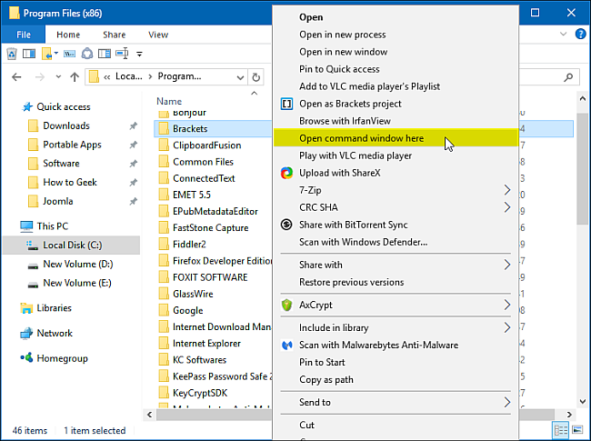

+++
title = "10 طرق لفتح موجه الأوامر في ويندوز 10"
date = "2016-01-19"
description = "من بداية نظام الويندوز وحتى اليوم كان موجه الأوامر كنزا يمكنه حل العديد من المشاكل وتنفيذ الأوامر المتقدمة، في درس اليوم أقدم لك عزيزي القارئ كل طرق فتح موجه الأوامر في ويندوز 10"
categories = ["ويندوز",]
series = ["ويندوز 10"]
tags = ["موقع لغة العصر"]

+++

من بداية نظام الويندوز وحتى اليوم كان موجه الأوامر كنزا يمكنه حل العديد من المشاكل وتنفيذ الأوامر المتقدمة، في درس اليوم أقدم لك عزيزي القارئ كل طرق فتح موجه الأوامر في ويندوز 10.

1- عن طريق قائمة Win+X:

اضغط Win+X من لوحة المفاتيح ثم اختر موجه الأوامر Command Prompt أو Command Prompt (Admin) لفتحه مع صلاحيات مدير النظام.

2- عن طريق مدير المهام Task Manager:

قم بفتح مدير المهام ثم من قائمة File اختر Run New Task واكتب cmd أو cmd.exe ثم اضغط OK.

3- عن طريق حيلة سرية في مدير المهام:

قم بفتح مدير المهام ثم من قائمة File استمر بالضغط على زر CTRL واختر Run New Task ستجد موجه الأوامر قد فتح تلقائيا مع صلاحيات مدير النظام.

4- عن طريق البحث:

قم بفتح مربع البحث من شريط المهام أو Win + S ثم اكتب cmd، يمكنك أيضا استخدام كورتانا لفتحه أيضا عن طريق الأمر الصوتي " Launch Command Prompt".

5- عن طريق قائمة البداية:

قم بفتح قائمة البداية ثم اضغط All apps.

قم بالدخول إلى مجلد Windows System ثم اختر Command Prompt.

6- عن طريق مستعرض الملفات File Explorer:

افتح مستعرض الملفات ثم انتقل إلى المسار C:\Windows\System32 وافتح ملف cmd.exe.

7- عن طريق مربع Run:

اضغط Win + R لفتح مربع Run ثم اكتب cmd واضغط OK.

8- عن طريق شريط عنوان مستعرض الملفات:

افتح مستعرض الملفات ثم اضغط على شريط العنوان أو Alt + D واكتب cmd.

9- عن طريق قائمة File:

افتح مستعرض الملفات ثم من قائمة File اختر Open command prompt.

10- عن طريق القائمة المختصرة:

لفتح موجه الأوامر في أي مجلد مباشرة اضغط مع الاستمرار على الزر SHIFT ثم اضغط بزر الماوس الأيمن ومن القائمة المختصرة اختر Open command window here.

---
هذا الموضوع نٌشر باﻷصل على [موقع مجلة لغة العصر](http://aitmag.ahram.org.eg/News/41664/%D8%AF%D8%B1%D9%88%D8%B3/%D8%B4%D8%B1%D8%AD-%D9%88%D8%AA%D8%B9%D9%84%D9%8A%D9%85/-%D8%B7%D8%B1%D9%82-%D9%84%D9%81%D8%AA%D8%AD-%D9%85%D9%88%D8%AC%D9%87-%D8%A7%D9%84%D8%A3%D9%88%D8%A7%D9%85%D8%B1-CMD-%D9%81%D9%8A-%D9%88%D9%8A%D9%86%D8%AF%D9%88%D8%B2-.aspx).