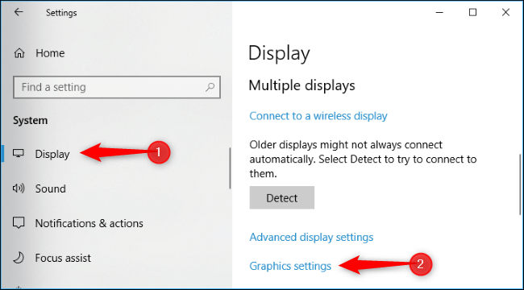

+++
title = "10 خطوات لتحسين أداء الألعاب على ويندوز 10"
date = "2018-07-01"
description = "كثير منا يمضي بعض وقت فراغه في ممارسة الألعاب، لكن مع تقدم مستويات الجرافيك تحتاج الألعاب إلى مواصفات مرتفعة لتشغيلها، وحتي مع ذلك قد تحدث العديد من المشاكل التي تعيق اللعبة من تقديم الأداء الأمثل، إليك مجموعة من الخطوات التي ستعيد أداء الألعاب إلى أفضل حالاته."
categories = [",ويندوز",]
tags = ["مجلة لغة العصر"]
series = ["ويندوز 10"]

+++

كثير منا يمضي بعض وقت فراغه في ممارسة الألعاب، لكن مع تقدم مستويات الجرافيك تحتاج الألعاب إلى مواصفات مرتفعة لتشغيلها، وحتي مع ذلك قد تحدث العديد من المشاكل التي تعيق اللعبة من تقديم الأداء الأمثل، إليك مجموعة من الخطوات التي ستعيد أداء الألعاب إلى أفضل حالاته.

كثير منا يمضي بعض وقت فراغه في ممارسة الألعاب، لكن مع تقدم مستويات الجرافيك تحتاج الألعاب إلى مواصفات مرتفعة لتشغيلها، وحتي مع ذلك قد تحدث العديد من المشاكل التي تعيق اللعبة من تقديم الأداء الأمثل، إليك مجموعة من الخطوات التي ستعيد أداء الألعاب إلى أفضل حالاته.

## 1- استخدم وضع الألعاب على ويندوز 10

قدمت مايكروسوفت مع تحديثات الويندوز الأخيرة وضع الألعاب، الذي يعمل على توجيه موارد الجهاز ليتم الاستفادة منها بالكامل في حالة تشغيل لعبة، وعلى الرغم من أن الاختبارات قد أوضحت أنه تشغيل هذا الوضع لا ينتج عنه تأثير كبير في حالة امتلاك جهاز عالى المواصفات، إلا أنه يعمل وبتأثير واضح في حالة وجود العديد من البرامج في الخلفية أو فتح أكثر من برنامج بجانب اللعبة.

### كيفية تفعيل وضع الألعاب؟

-   في حالة شراء الألعاب من متجر مايكروسوفت فإن الويندوز يتعرف عليها تلقائيا ويقوم بتشغيل وضع الألعاب فور فتحها، أما في حالة الألعاب العادية أو عن طريق الخدمات المخصصة مثل Steam و Origin يحتاج المستخدم لتفعيل الوضع بالطريقة اليدوية.
-   بمجرد أن تفتح اللعبة قم بالضغط على Windows + G سيظهر شريط التحكم في الألعاب، قم بالضغط على أيقونة التفعيل كما بالصورة.

-   بعد ذلك قم بالضغط على ESC للعودة إلى اللعبة.

## 2- اختر معالج الجرافيك الصحيح لتشغيل الألعاب

العديد من أجهزة اللاب توب الحالية تأتي بمعالجين للرسوميات، أحدها من نوع NVIDIA أو GPU، وأغلب الألعاب تقوم باختيار معالج الجرافيك الأقوى افتراضيا، لكن بعضها أيضا قد يختار المعالج الأضعف، لذلك يجب عليك التأكد من أن اللعبة تعمل على المعالج الخارجي للحصول على أفضل أداء ممكن.

قم بالدخول إلى تطبيق الإعدادات ثم إعدادات العرض Display ثم Graphics settings.

اختر من القائمة Classic App ثم اضغط Browse واختر اللعبة التي تريد تعديل إعداداتها.
بعد ذلك اضغط زر Options ثم غير الإعداد من System default إلىHigh performance.

## 3- قم بإيقاف التحديثات التلقائية

في كثير من الأحيان يقوم الويندوز باختيار وقت غير مناسب لتحميل وتثبيت التعريفات، لذلك إذا كنت ممن يستخدم الألعاب لفترات طويلة أو ممن يلعب في وضع online، قم بإغلاق التحديثات التلقائية، لكن هذا لا يعني أن تتجاهل التحديثات تمام فهي لها دور هام في تحسين أداء الجهاز.
ويمكنك فعل ذلك عن طريق أحد الطرق التالية:

-   تعطيل خدمة تحديثات الويندوز:
    قم بفتح قائمة Start ثم ابحث عن Services، بعد ذلك قم بإيجاد خدمة Windows Update وفتحها.
    من القائمة Startup type اختر Disabled ثم Apply.

-   تحديد الشبكة الحالية كإتصال محدود:
    من تطبيق الإعدادات قم بالدخول إلى Network & Internet ثم Wi-Fi ثم Advanced Options وقم بتفعيل Set as metered connection.

## 4- قم بمسح الملفات المؤقتة

مع الاستمرار في استخدام البرامج والألعاب تتراكم الملفات المؤقتة، مما يؤدي إلى تقليل أداء الجهاز إلى جانب إهدار بعض مساحة التخزين، ولحسن الحظ أضاف تحديث أبريل 2018 لويندوز 10 أداة داخل تطبيق الإعدادات للتخلص من كل الملفات العالقة بضغطة زر.
قم بالدخول إلى تطبيق الإعدادات ثم القسم System ثم التبويب Storage، ستجد الاختيار Free Up Space Now اضغط عليه.

سيقوم الويندوز بفحص الجهاز تلقائيا واخبارك بكل الملفات الغير ضرورية الموجودة، وبعد الانتهاء من الفحص قم باختيار ما تريد حذفه ثم اضغط Remove files.

## 5- تعديل إعدادات الطاقة

افتراضيا، يقوم الويندوز بالموازنة بين الأداء والبطارية حتي يتم أداء كل المهام بشكل صحيح دون استنزاف الطاقة، لكن إذا رغبت بتجاهل توفير البطارية واستخدام كل الموارد المتاحة يمكنك تفعيل وضع الأداء العالي High performance من الإعدادات.
بداخل تطبيق الإعدادات ثم System ثم التبويب Power and sleep اضغط على Additional power settings. سيتم نقلك إلى لوحة المهام لاختيار أو تعديل خطة الطاقة الحالية، قم باختيارHigh performance.

## 6- إلغاء تجزئة وتحسين القرص الصلب

عملية إلغاء تجزئة القرص الصلب لها دور كبير في تحسين أداء الجهاز بشكل عام والألعاب بشكل خاص، وذلك لأن البيانات يتم تخزينها في مقاطع متفرقة عن بعضها داخل القرص الصلب، لكن بعد عملية إلغاء التجزئة يتم تنظيمها بجانب بعضها مما يجعل الفرق واضحا في الأداء.
من قائمة Start قم بالبحث عن Defragment and Optimize Drives ثم اختر القرص الذي تريده بعد ذلك الزر Analyze.

إذا ظهر لك أن أقل من 10% فقط مجزأة fragmented فأنت لا تحتاج للقيام بهذه العملية.
بعد ذلك اضغط على Optimize، بعد انتهاء العملية يجب أن يظهر"0% fragmented" أمام قسم القرص الصلب.

## 7- قم بتعطيل البرامج التي تعمل مع بدء التشغيل

مزيد من البرامج التي تعمل عند بدء تشغيل الويندوز يعني مزيدا من الموارد المهدرة، مما يؤدي لاختناق الأداء عن تشغيل الألعاب ذات الجرافيك العالي، ولذلك يفضل أن تقوم بمنع كل هذه البرامج باستثناء ما تحتاجه فقط.
قم بفتح مدير المهام Task Manager عن طريق CTRL + SHIFT + ESC أو الضغط بزر الماوس الأيمن على قائمة Start واختياره.
ستجد التبويب Startup يحتوي على قائمة برامج بدء التشغيل، قم بتحديد ما ترغب في تعطيله ثم اضغط Disable.

## 8- تعطيل التطبيقات التي تعمل في الخلفية

كما هو الحال مع تطبيق بدء التشغيل، تعمل العديد من التطبيقات في الخلفية، وخاصة تطبيقات الويندوز الموحدة، وبالطبع يوفر الويندوز اختيارا سهلا لتعطيل كل هذه التطبيق.
من تطبيق الإعدادات قم بالدخول إلى القسم Privacy ثم التبويب Background Apps.

بعد ذلك قم بتغيير كل هذه التطبيقات من On إلى Off باستثناء التطبيقات التي تريد تركها تعمل في الخلفية.

## 9- ابق تعريفات جهازك محدثة دائما

كما أوضحت في النقطة الخاصة بالتحديثات بالأعلى، لا بد من الحرص بشكل دائم على تحديث الجهاز سواء على مستوي الويندوز، أو على مستوي تعريفات كارت الجرافيك. وذلك لأن العديد من التحسينات وتصليح المشاكل تكون مدمجة مع التحديثات، وخاصة توافق كارت الجرافيك مع الألعاب الحديثة.

-   يمكنك استخدام بعض البرامج الخاصة مثل Driver Booster أو DriverPack Solution.
-   أو التحديث يدويا عن طريق الموقع الخاص بنوع كارت الجرافيك الخاص بك:
    NVIDIA: https://www.geforce.com/drivers
    AMD: https://support.amd.com/en-us/download

## 10- كسر سرعة المعالجات

هي الخطوة الأخيرة لزيادة أداء الألعاب، ولكن تحتاج استعدادات خاصة بالنسبة للتبريد، حيث أن كسر السرعة يقلل من عمر الهاردوير. ويمكنك تطبيق هذه الخطوة على كل من معالج الجهاز وكارت الجرافيك، لكن نظرا لتشعب هذا الموضوع واختلاف طرقه باختلاف الأنواع فلن نتطرق إليه هنا، لكن بالطبع يمكنك إيجاد العديد من الشروحات مكتوبة أو على اليوتيوب، لكن تذكر أن تنتبه لاختيار الطريقة الخاصة بنوع الهاردوير الذي تملكه.

---

هذا الموضوع نُشر باﻷصل في مجلة لغة العصر العدد 211 شهر 07-2018 ويمكن الإطلاع عليه [هنا](https://drive.google.com/file/d/1vmF-hD2aGDQQBhYRMpr1V5Z6Zc7Pe_B_/view?usp=sharing).

