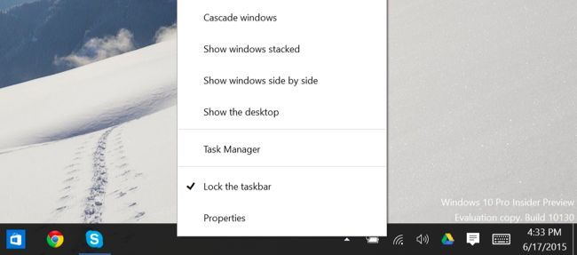
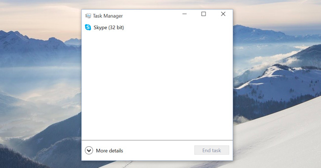
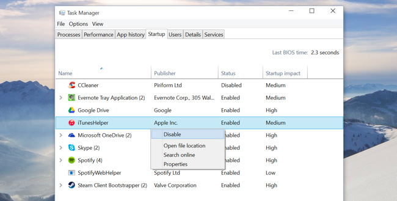

+++
title = "طريقة زيادة سرعة الإقلاع في ويندوز 10"
date = "2015-07-11"
description = "مما لا شك فيه أنه ابتداء من ويندوز 8 قامت مايكروسوفت بزيادة سرعة إقلاع النظام مقارنة بالإصدارات السابقة، وفى ويندوز 10 أيضا زادت سرعة بدء التشغيل، كما أضافت مايكروسوفت مدير بدء التشغيل إلى الويندوز لتتحكم في البرامج التي تعمل مع بداية تشغيل الويندوز، اليكم طريقة زيادة سرعة الإقلاع في ويندوز 10"
categories = ["ويندوز",]
series = ["ويندوز 10"]
tags = ["موقع لغة العصر"]

+++

مما لا شك فيه أنه ابتداء من ويندوز 8 قامت مايكروسوفت بزيادة سرعة إقلاع النظام مقارنة بالإصدارات السابقة، وفى ويندوز 10 أيضا زادت سرعة بدء التشغيل، كما أضافت مايكروسوفت مدير بدء التشغيل إلى الويندوز لتتحكم في البرامج التي تعمل مع بداية تشغيل الويندوز، اليكم طريقة زيادة سرعة الإقلاع في ويندوز 10.

بالتأكيد كلما زاد عدد البرامج التي تعمل مع بداية تشغيل الويندوز كلما زادت الفترة التي يستغرقها الويندوز في الإقلاع لذلك يجب عليك أن تقلل من عدد البرامج التي تعمل مع الويندوز.

هذا ما تستطيع فعله من خلال مدير بدء التشغيل فهو يمكنك من تفعيل أو تعطيل أي من البرامج التي تضع اختصاراتها في ال Startup الخاص بالويندوز.

1. ستجد مدير بدء التشغيل Startup Manager بداخل مدير المهام Task Manager، للدخول إلى مدير المهام اضغط بزر الفأرة الأيمن على شريط المهام taskbar ثم اختر Task Manager.

تستطيع أيضا الضغط على Ctrl + Shift + Escape لفتح مدير المهام مباشرة، أو عن طريق الضغط على Ctrl + Alt + Delete ثم اختر Task Manager.

2. عند تشغيل مدير المهام لأول مرة سيفتح في الواجهة البسيطة، والتي يعرض فيها فقط البرامج المفتوحة، ستحتاج الى الضغط على More details ليقوم بالدخول الى الواجهة المتقدمة.

3. قم بالدخول إلى التبويب Startup ستجد جميع البرامج التي تعمل مع بدء التشغيل، وستكون مقسمة إلى 4 أقسام حسب الأهمية: Low، Medium، High، Not measured.

4. لتعطيل أي برنامج ومنعه من العمل مع بداية تشغيل الويندوز قم بتحديد البرنامج ثم اضغط على الزر Disable.

---

هذا الموضوع نٌشر باﻷصل على موقع مجلة لغة العصر.

http://aitmag.ahram.org.eg/News/19826.aspx
