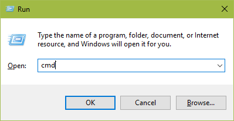
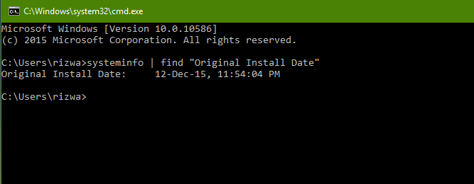
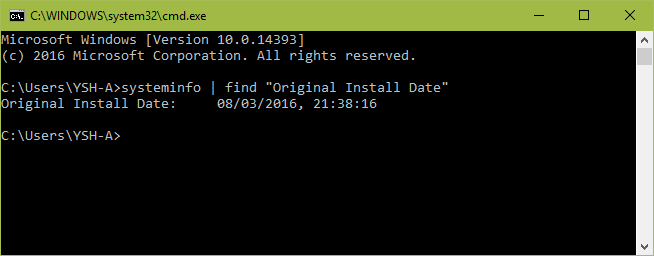

+++
title = "حيلة بسيطة للتعرف على تاريخ تثبيتك لويندوز 10"
date = "2016-10-10"
description = "إذا كنت من مستخدمي ويندوز 10 القدامى الذين قد اجتازوا السنة، أو كنت من المستخدمين الجدد، هل تذكر متى قمت بتثبيت ويندوز 10 على جهازك؟ دع الويندوز يخبرك بهذه الحيلة البسيطة."
categories = ["ويندوز",]
series = ["ويندوز 10"]
tags = ["موقع لغة العصر"]
+++

إذا كنت من مستخدمي ويندوز 10 القدامى الذين قد اجتازوا السنة، أو كنت من المستخدمين الجدد، هل تذكر متى قمت بتثبيت ويندوز 10 على جهازك؟ دع الويندوز يخبرك بهذه الحيلة البسيطة.

قم بفتح موجه الأوامر Command Prompt عن طريقة مربع Run (Windows Key + R) ثم كتابة cmd.

الآن قم بنسخ ولصق هذا الأمر

**systeminfo | find "Original Install Date"**

بعد لحظة سيظهر لك تاريخ تثبيتك لويندوز 10.

لاحظ أنه إذا قمت بتنفيذ هذا الأمر بعد تحديث الذكري السنوية سيظهر لك تاريخ الترقية وليس تاريخ التثبيت الأصلي.

---
هذا الموضوع نٌشر باﻷصل على موقع مجلة لغة العصر.

http://aitmag.ahram.org.eg/News/65661.aspx