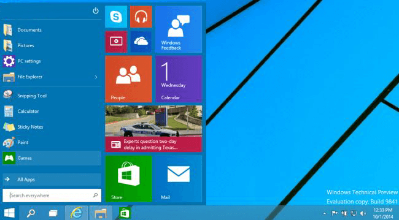
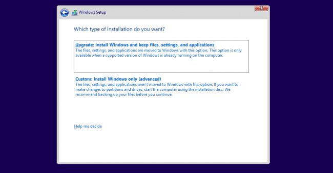
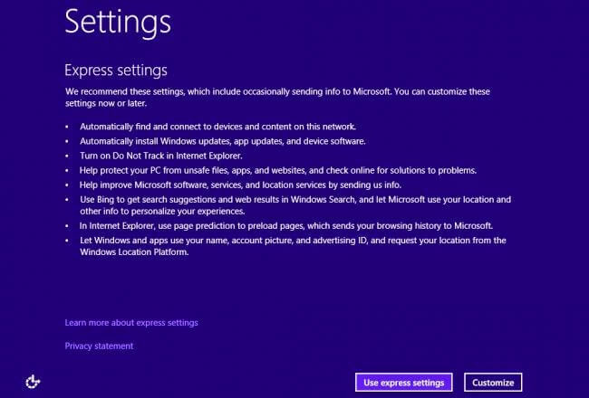
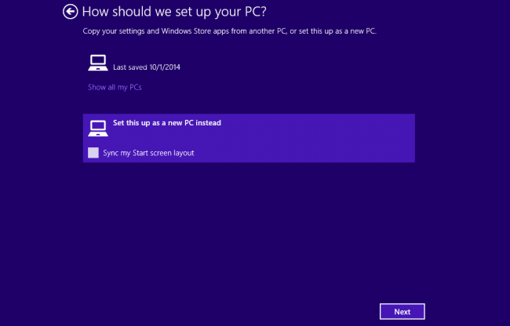
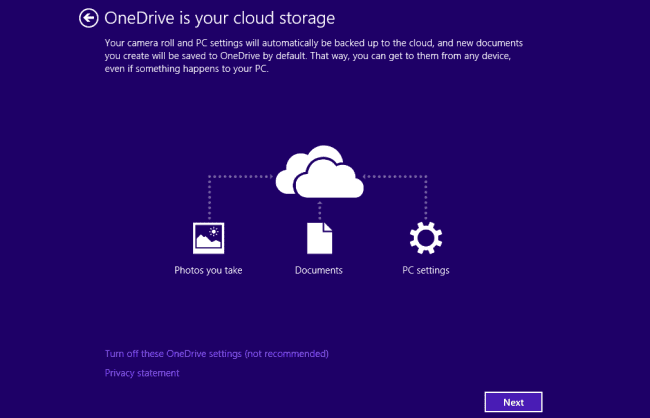

+++
title = "كيفية تثبيت ويندوز 10"
date = "2014-10-01"
description = "كيف تقوم بتثبيت الويندوز؟ سؤال يطرحه كثير من المبتدئين والجواب عليه هو مجموعة من الخطوات البسيطة التي سنتعرف عليها في هذه التدوينة."
categories = ["ويندوز",]
tags = ["افهم تكنولوجيا"]
series = ["ويندوز 10"]

+++

أزاحت شركة مايكروسوفت رسميا الستار عن الإصدار الجديد من نظام تشغيل الحواسيب خاصتها، ويندوز، وهو الإصدار الذي أطلقت عليه اسم "ويندوز 10″ Windows 10، مع شعار "عائلة منتجات واحدة، ونظام تشغيل واحد، ومتجر واحد".

وسيكون نظام تشغيل "ويندوز 10″ الجديد ملائماً للعمل مع منصات التشغيل المختلفة، سواء على الحواسيب المحمولة والمكتبية واللوحية، أو الهواتف الذكية بمختلف قياس شاشاتها، أو منصة الألعاب إكس بوكس.

وأوضح مايرسون أن نظام "ويندوز 10″ سوف يملك متجرا واحدا يساعد المستخدمين على العمل على أي تطبيق قاموا بشراءه منه، وذلك على أي من مختلف الأجهزة العاملة بالنظام.

وسيضم نظام التشغيل كذلك شريط المهام التقليدي، إضافة إلى قائمة إبدأ، وهي القائمة التي ستتيح للمستخدمين الخيارات التقليدية مثل تثبيت أيقونات تشغيل التطبيقات الهامة لسهولة الوصول إليها.

وبجانب الخيارات التقليدية في قائمة إبدأ، فقد قامت مايكروسوفت بدمج واجهة المربعات التي ظهرت مع "ويندوز 8″ في القائمة، مع توفير إمكانية كاملة للمستخدم للتحكم بحجم تلك الواجهة.

وحسنت مايكروسوفت كذلك من خيارات البحث عبر قائمة إبدا، حيث أصبح بالإمكان البحث عبر الإنترنت من خلال صندوق البحث بها، والحصول على نتائج البحث بداخل نفس القائمة.

هذا، وأضافت مايكروسوفت للنظام زر جديد، يحمل اسم Task View، يسهل من عملية التنقل بين النوافذ والتطبيقات العاملة، وهو الزر الذي أكدت الشركة أن يعزز من مميزات تعدد المهام في نظام "ويندوز 10″.

وخصصت مايكروسوفت تحسينات كثيرة في نظام "ويندوز 10″ لضمان سهولة العمل على أكثر من تطبيق، حيث أصبح بإمكان المستخدم تقسيم الشاشة بسهولة لتشغيل تطبيق واستدعاء أخر دون الحاجة لغلق أو الإخفاء المؤقت لأي منهما.

**والآن ننتقل الى صلب الموضوع:**

بعد [تحميل الويندوز](ar/posts/windows-and-office-download/) قم بفك الISO وتثبيته من على الويندوز الحالى، أو قم بحرق الISO على اسطوانة أو فلاشة، أو يمكنك تشغيل الأيزو كويندوز وهمي.

**مرحلة التثبيت:**

1. بعد أن ينتهى الكمبيوتر من الاقلاع تظهر هذه النافذة:

    

    قم باختيار دولتك ولغة الكتابة ثم اضغط Next.

2. بعد ذلك قم بالضغط على Install Now لبدء التثبيت.

    

3. قم باختيار اذا ما كنت ستثبت النسخة وتحتفظ ببيانات الويندوز القديم أو أنك ستقوم بعمل فورمات وتثبيت الويندوز من جديد.

    

4. مثلا سأقوم أنا بتثبيت الويندوز على هارد فارغ.

5. اضغط Next ليبدأ التثبيت.

    

6. بعد أن ينتهى الويندوز من التثبيت وتثبيت التحديثات (لا يمكن غلقها فى نسخة الPreview) تظهر لك هذه النافذة يفضل أن تضغط use express settings إلا إذا كنت تعرف ما الإعدادات التي تقوم بتعديلها.

    

7. فى النافذة التالية يمكنك تسجيل الدخول إلى حساب مايكروسوفت إن أردت.

    

8. بعد ذلك سيسألك الويندوز اذا كان هذا كمبيوتر جديد أم أنه كمبيوتر قد تم تسجيله من قبل. قم باختيار Set this up as a new PC instead.

    

9. فى الخطوة الأخيرة يعرض لك الويندوز One Drive قم بالضغط Next.

    

10. وأخيرا يقوم الويندوز بتثبيت التطبيقات كما فى ويندوز 8/8.1.

    

11. وها هو سطح المكتب ومبروك عليك ويندوز 10.

    

---

هذا المقال نشر باﻷصل على مدونة افهم تكنولوجيا ويمكن الإطلاع عليه [هنا](https://efhamtechnology.blogspot.com/2014/10/windows10.html).
