+++
title = "كيفية تثبيت ويندوز 10 على أجهزة ماك"
date = "2019-11-01"
description = "يمتلئ الإنترنت بالمقارنات بين أنظمة التشغيل المختلفة وخصوصا ويندوز وماك، حيث أنهما أكثر أنظمة التشغيل انتشارا على أجهزة الكمبيوتر المكتبية والمحمولة، ولحسن الحظ يمكن لمستخدمي أجهزة ماك الاستمتاع بكلا النظامين عن طريق تثبيت ويندوز بجانب ماك والتبديل بينهما بكل سلاسة، وهذا على عكس تثبيت نظام ماك على أجهزة ويندوز الذي تم استعراضه بالعدد السابق من المجلة، لذلك دعونا نلقي نظرة مفصلة على تثبيت واستخدام نظام ويندوز على أجهزة ماك."
categories = ["ويندوز",]
tags = ["مجلة لغة العصر"]
series = ["ويندوز 10"]

+++
يمتلئ الإنترنت بالمقارنات بين أنظمة التشغيل المختلفة وخصوصا ويندوز وماك، حيث أنهما أكثر أنظمة التشغيل انتشارا على أجهزة الكمبيوتر المكتبية والمحمولة، ولحسن الحظ يمكن لمستخدمي أجهزة ماك الاستمتاع بكلا النظامين عن طريق تثبيت ويندوز بجانب ماك والتبديل بينهما بكل سلاسة، وهذا على عكس تثبيت نظام ماك على أجهزة ويندوز الذي تم استعراضه بالعدد السابق من المجلة، لذلك دعونا نلقي نظرة مفصلة على تثبيت واستخدام نظام ويندوز على أجهزة ماك.

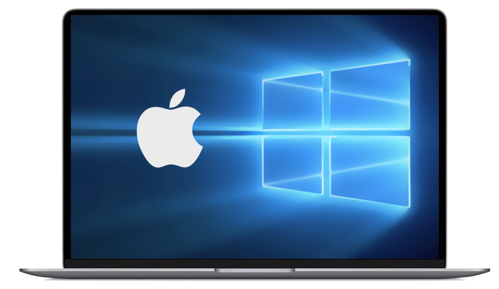

توفر أبل لمستخدمي أجهزة ماك أداة تسمي Boot Camp تتيح تثبيت ويندوز 10 على الجهاز والتبديل بينه وبين نظام ماك بكل سهولة وقت الإقلاع. فباستخدام هذه الطريقة ستحصل على أداء أفضل مما إذا قمت بتشغيل ويندوز داخل جهاز وهمي حين تحتاج إلى استخدام برنامج يعمل على ويندوز فقط، أو عندما ترغب في الاستمتاع ببعض الألعاب الإلكترونية على جهازك.

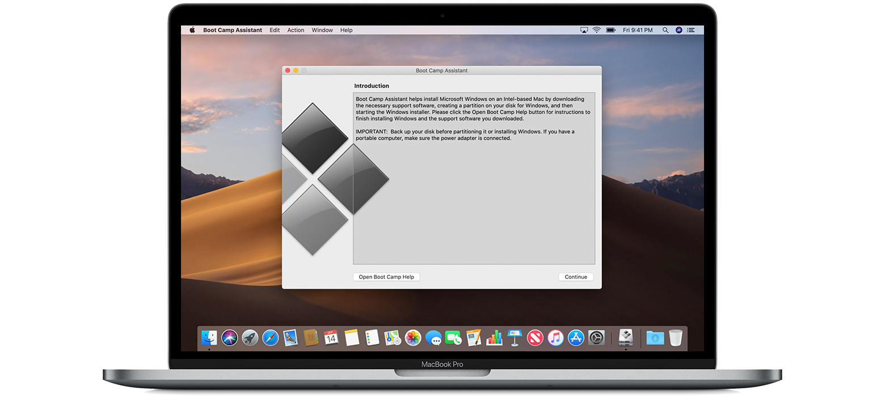

## قبل البدء

- تأكد من توافق جهاز ماك الخاص بك. تستطيع تثبيت الويندوز على الموديلات الآتية:
    • MacBook 2015 أو أحدث
    • MacBook Air 2012 أو أحدث
    • MacBook Pro 2012 أو أحدث
    • Mac mini 2012 أو أحدث
    • iMac 2012 أو أحدث
    • iMac Pro (كل الموديلات)
    • Mac Pro 2013
- تأكد من تحديث النظام على جهازك إلى نسخة macOS Mojave على الأقل.
- تأكد من وجود 64 جيجا بايت مساحة فارغة على القرص الصلب على الأقل، ويفضل 128 جيجا بايت لتجربة أفضل.
- ستحتاج إلى مفتاح USB خارجي لتثبيت الويندوز عن طريقه إذا كان جهازك لا يدعم التثبيت عن طريق ملف ISO (فقط الأجهزة التي تعمل بنسخة أقل من الإصدار 10.11).
- قم بتحميل نسخة من ويندوز 10 من خلال موقع مايكروسوفت http://www.microsoft.com/en-us/software-download/windows10ISO يمكنك الاختيار الإصدار Home أو Pro، إما في حالة كنت تمتلك نسخة من الويندوز على DVD تحتاج لعمل ملف ISO منها حتى تستطيع استخدامها في التثبيت.
- قم بعمل نسخة احتياطية كاملة من جهازك للرجوع إليها في حالة حدوث مشاكل.

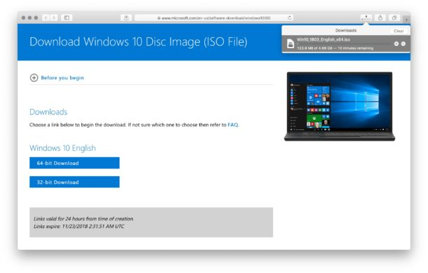

## كيفية التثبيت

- أولا قم بإغلاق كافة البرامج المفتوحة وأزل جميع الملحقات الغير ضرورية قبل بدء عملية التثبيت.
- لفتح برنامج Boot Camp Assistant توجه إلى مجلد Applications ثم Utilities واختر البرنامج.

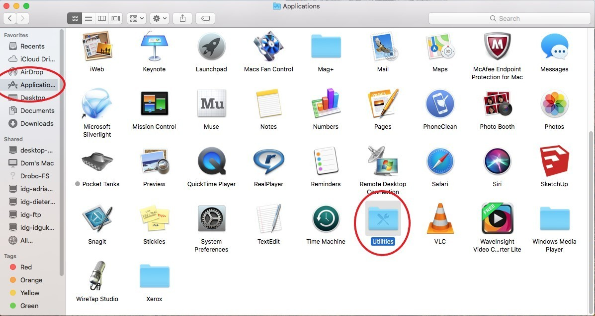

- ستظهر لك شاشة البداية الخاصة بالبرنامج والتي تعرض ملخصا لما يمكن للبرنامج عمله، اضغط الزر Continue الموجود بالأسفل.

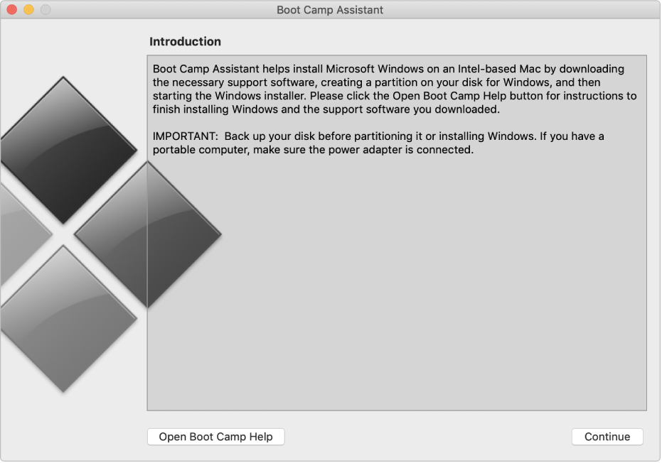

- تحتاج الآن إلى الضغط على الزر Choose واختيار ملف ISO الخاص بالويندوز والذي قمت بتحميله سابقا. بعد ذلك قم بتحديد حجم القسم الذي سيثبت عليه الويندوز من القسم الصلب، والذي يفضل أن يكون 128 جيجا بايت كما أشرت سابقا.

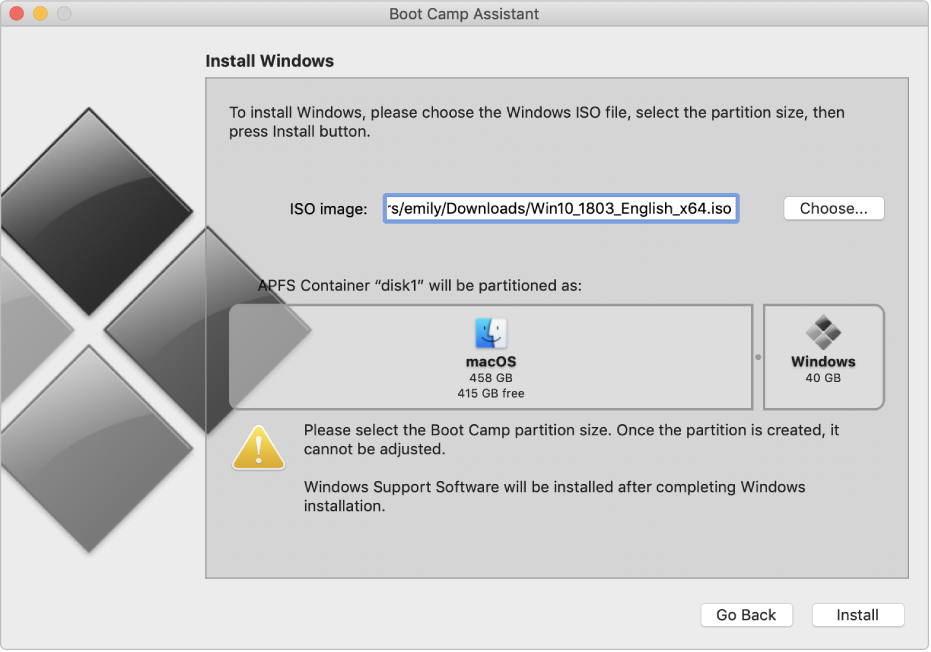

- بالضغط على Install سيطلب الجهاز إدخال كلمة السر الخاصة بك ومن ثم سيقوم بإعادة التشغيل والدخول إلى تثبيت الويندوز.
- الآن تحتاج لتثبيت الويندوز بالطريقة التقليدية، قم بالضغط على زر Install واختر النسخة التي تود تثبيتها ثم وافق على اتفاقية الاستخدام وابدأ التثبيت.
- بعد إعادة التشغيل عدة مرات وإكمال تهيئة ويندوز 10 ستصل أخيرا إلى شاشة سطح المكتب.

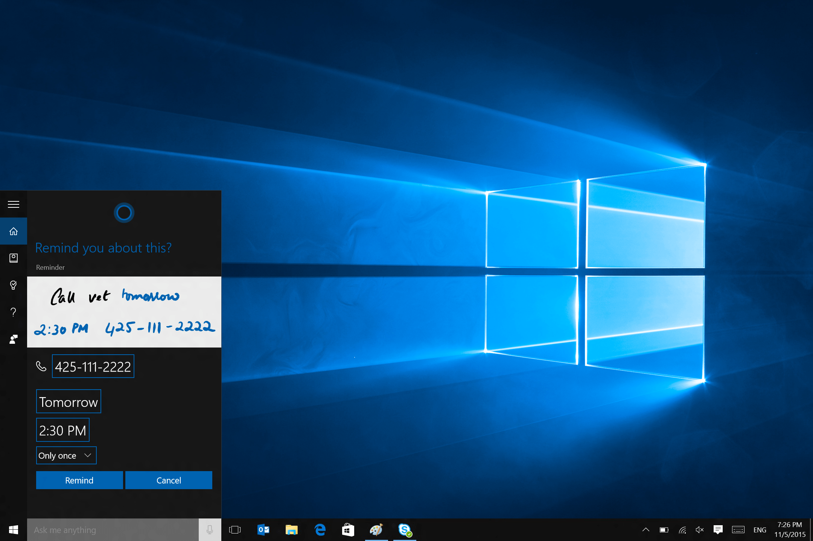

- ستجد نافذة تثبيت برنامج Boot Camp على الويندوز قد فتحت تلقائيا من أجل تثبيت تعريفات الجهاز وإكمال الضبط. قم بالضغط على Next واختر تثبيت التعريفات، كما يمكنك تثبيت بعض البرامج الخاصة ب Apple مثل iCloud، وبعد اكتمال التثبيت سيتم إعادة تشغيل الجهاز لمرة أخيرة.

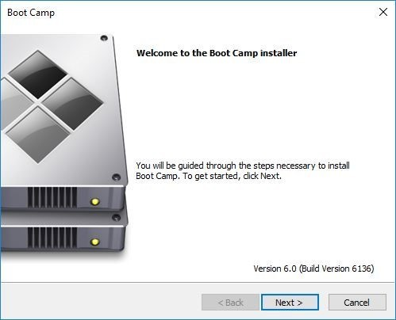

## كيفية التبديل بين نظامي التشغيل

والآن بعدما أصبح لديك نظام ويندوز يعمل بكفاءة على جهازك لعل أول ما سيخطر ببالك هو كيفية التبديل بينه وبين نظام الماك. هناك عدة طرق لذلك:

- التبديل وقت الإقلاع عن طريق الضغط على زر Options من لوحة المفاتيح لتظهر شاشة اختيار نظام التشغيل.

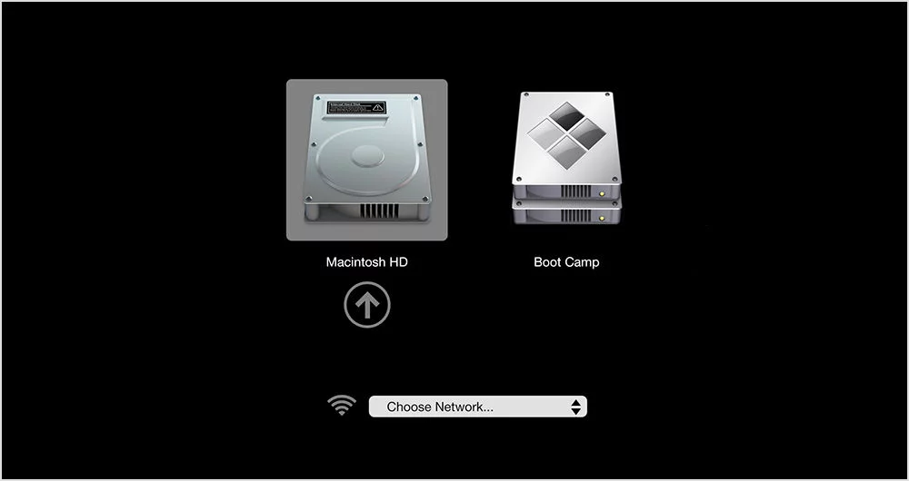

- إعادة التشغيل من ويندوز إلى ماك عن طريق أيقونة برنامج Boot Camp الموجودة بيمين شريط المهام.

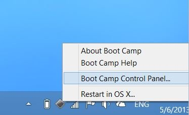

- إعادة التشغيل من الماك إلى ويندوز عن طريق إعدادات بدء التشغيل Startup Disk.

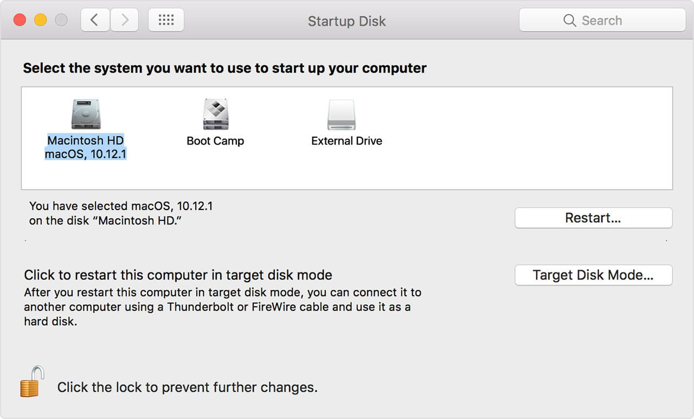

## إلغاء تثبيت الويندوز

في حالة أردت إلغاء تثبيت الويندوز من على جهاز الماك الخاص بك، يمكنك القيام بذلك عن طريق Boot Camp Assistant من نظام ماك. فبعد فتح البرنامج والضغط على Continue قم بتحديد القرص الصلب الموجود عليه الويندوز واضغط Restore لإلغاء تثبيت الويندوز وإعادة القرص الصلب إلى قسم واحد. انتبه إلى أن حذف الويندوز سيقوم بحذف كل الملفات والبرامج الموجودة على قسم الويندوز بالقرص الصلب أيضا بينما لن يقوم بحذف أي شيء من نظام ماك، لذلك لا تنس أخذ نسخة احتياطية من ملفاتك المهمة الموجودة على ويندوز قبل إلغاء تثبيته.

---

هذا الموضوع نُشر باﻷصل في مجلة لغة العصر العدد 227 شهر 11-2019 ويمكن الإطلاع عليه [هنا](https://drive.google.com/file/d/10_uUXDTX1psx9R0idHxg1uwsmOxVrQ5R/view?usp=sharing).

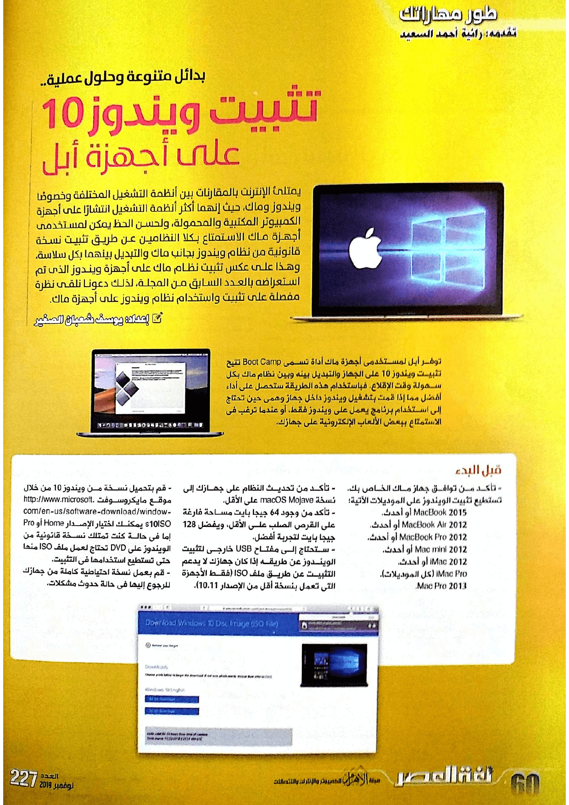

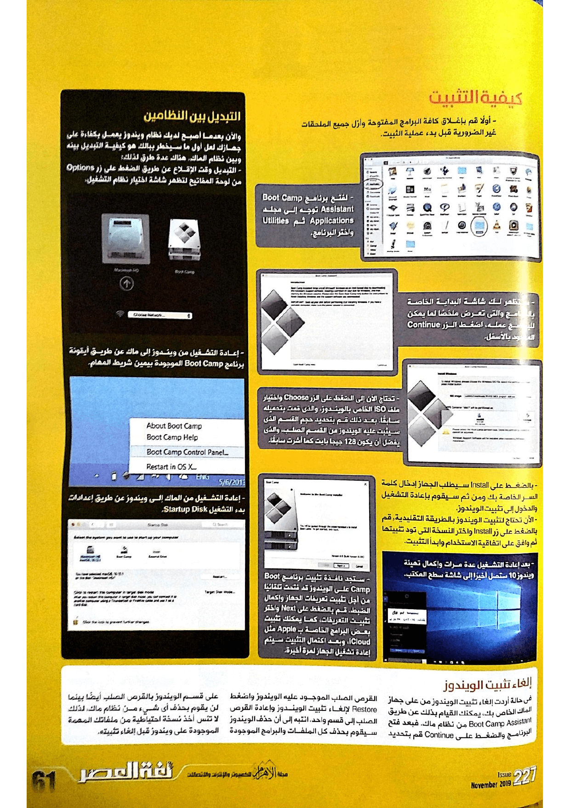

