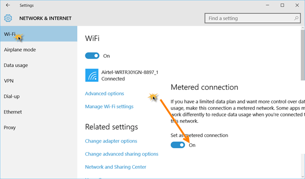

+++
title = "كيف تتعرف على مقدار استخدامك للإنترنت في ويندوز 10"
date = "2016-02-02"
description = "الكثير منا ليس لديه خطة استخدام انترنت غير محدودة، وفي ويندوز 10 يمكنك عزيزي القارئ أن تراقب استخدامك للإنترنت بطريقة بسيطة لتجنب التكاليف الإضافية للخدمة، إليك الطريقة"
categories = ["ويندوز",]
series = ["ويندوز 10"]
tags = ["موقع لغة العصر"]
+++

كثير منا ليس لديه خطة استخدام انترنت غير محدودة، وفي ويندوز 10 يمكنك عزيزي القارئ أن تراقب استخدامك للإنترنت بطريقة بسيطة لتجنب التكاليف الإضافية للخدمة، إليك الطريقة.

**أولا: كيف تحافظ على مقدار استخدام الانترنت في ويندوز 10:**

سبق أن تحدثنا عن هذه النقطة في درس طريقة منع التحديثات التلقائية، ولكن لا مانع من ذكرها مرة أخري:
قم بالدخول إلى تطبيق الإعدادات ثم القسم Network & Internet بعد ذلك من التبويب Wi-Fi اضغط على Advanced options وقم بتشغيل الاختيار Set as metered connection.

بهذه الطريقة تكون قد منعت الويندوز من زيادة استخدام الانترنت لديك.

**ثانيا: مراقبة استخدام الانترنت في ويندوز 10:**

قم بالدخول إلى تطبيق الإعدادات ثم القسم Network & Internet بعد ذلك التبويب Usage details.

يعرض لنا هذا التبويب كمية البيانات المستخدمة خلال شهر ماضي، كما يعرض التفاصيل الدقيقة لكل برنامج ومقدار ما استهلكه عند الضغط على Usage details.

وهكذا يمكنك عزيزي القارئ معرفة أكثر البرامج استخداما للإنترنت على جهازك والتحكم فيه.

---

هذا الموضوع نٌشر باﻷصل على موقع مجلة لغة العصر.

http://aitmag.ahram.org.eg/News/41926.aspx
