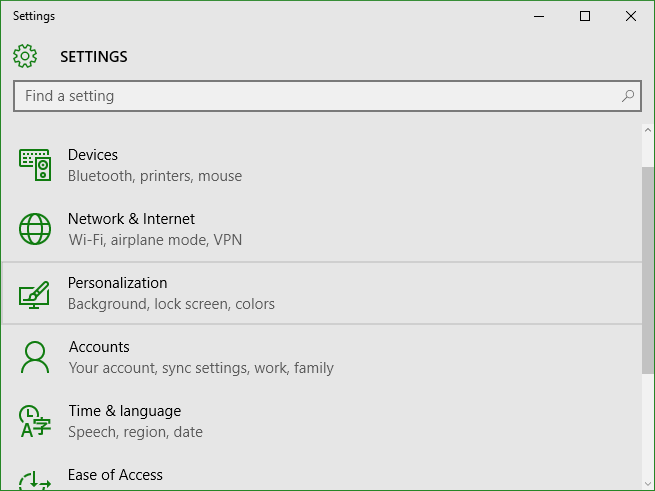
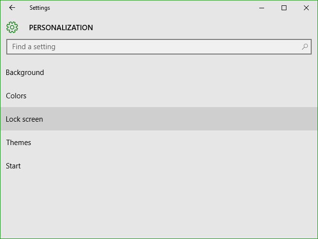
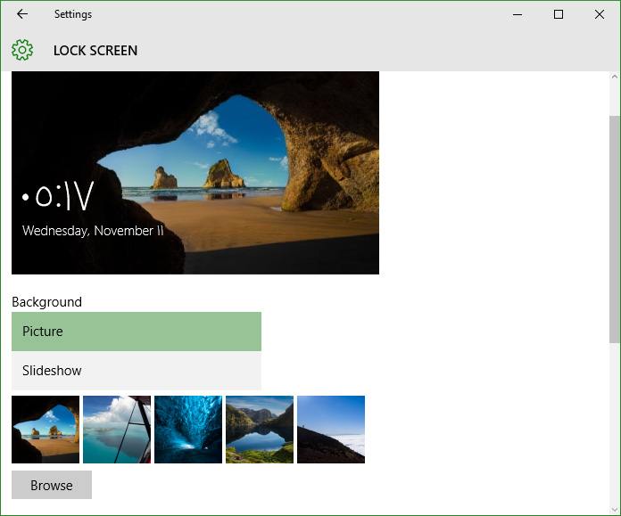
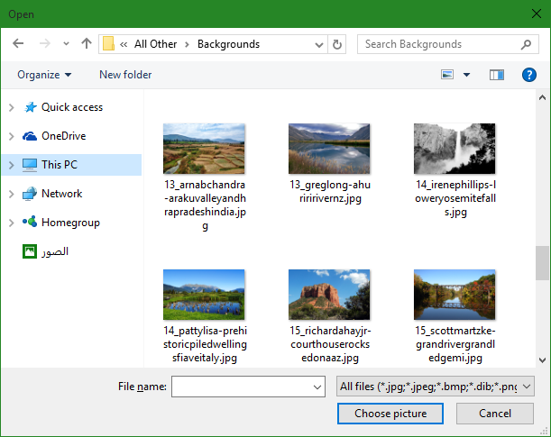

+++
title = "طريقة تغيير خلفية شاشة القفل في ويندوز 10"
date = "2015-11-11"
description = "يوفر ويندوز 10 لمستخدميه عدة أنواع من الخلفيات، خلفية سطح المكتب، خلفية شاشة تسجيل الدخول، وخلفية شاشة القفل، في درس اليوم ستتعرف عزيزي القارئ على طريقة تغيير خلفية شاشة القفل بطريقة بسيطة."
categories = ["ويندوز",]
series = ["ويندوز 10"]
tags = ["موقع لغة العصر"]

+++

يوفر ويندوز 10 لمستخدميه عدة أنواع من الخلفيات، خلفية سطح المكتب، خلفية شاشة تسجيل الدخول، وخلفية شاشة القفل، في درس اليوم ستتعرف عزيزي القارئ على طريقة تغيير خلفية شاشة القفل بطريقة بسيطة.

1. قم بفتح تطبيق الإعدادات (يمكنك مراجعة درس " تعلم ويندوز 10 ..كل طرق تشغيل تطبيق الإعدادات") ثم اضغط على القسم " Personalization".

2. انتقل الى التبويب " Lock screen".

3. ستجد الإعدادات كما بالصورة:

- Preview: معاينة لصورة خلفية شاشة القفل.
- القائمة المنسدلة Background: يمكنك من خلالها اختيار نوع الخلفية (picture/Sideshow).
- Choose your picture: تستطيع الاختيار من بين الصور المعروضة (المستخدمة مؤخرا) أو الضغط على Browse للاختيار من الصور الموجودة على جهازك.

---
هذا الموضوع نٌشر باﻷصل على موقع مجلة لغة العصر.

http://aitmag.ahram.org.eg/News/36977.aspx