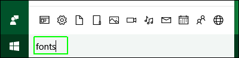
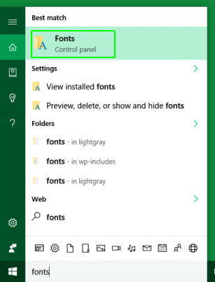
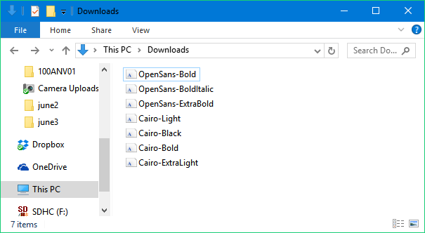
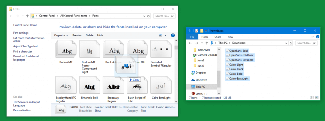
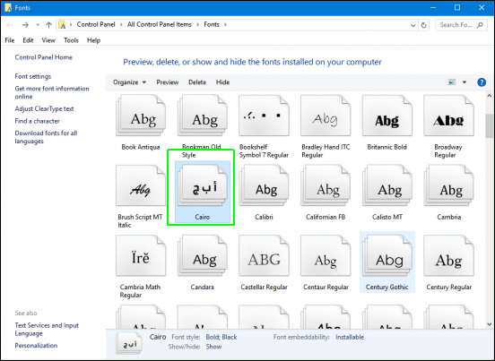
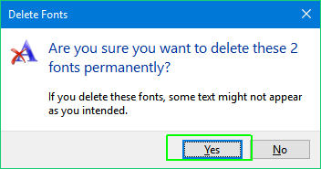

+++
title = "كيفية تثبيت وحذف الخطوط في ويندوز 10"
date = "2016-06-18"
description = "يأتي نظام الويندوز مع مجموعة محدودة من الخطوط، وبعض البرامج الأخرى تقوم بتثبيت خطوطها الخاصة، ولكن إذا كنت تريد مزيدا من الاحترافية في الكتابة والتصميم، إليك طريقة تثبيت وحذف وإيجاد خطوط جديدة في ويندوز 10."
categories = ["ويندوز",]
series = ["ويندوز 10"]
tags = ["موقع لغة العصر"]
images = ["images/0.png"]
+++

يأتي نظام الويندوز مع مجموعة محدودة من الخطوط، وبعض البرامج الأخرى تقوم بتثبيت خطوطها الخاصة، ولكن إذا كنت تريد مزيدا من الاحترافية في الكتابة والتصميم، إليك طريقة تثبيت وحذف وإيجاد خطوط جديدة في ويندوز 10.

**أين يمكنك إيجاد مزيد من الخطوط؟**

يمكن لويندوز 10 العمل مع ثلاثة أنواع من الخطوط هي TrueType، OpenType، وPostScript.

وهناك العديد من المواقع التي تقدم لك مجموعات كبيرة من الخطوط لتحميلها واستخدامها، ومن أفضل هذه المواقع [Google Fonts](https://fonts.google.com/) و [Microsoft's typography site](https://www.microsoft.com/typography/fonts/default.aspx) وأيضا [Fonts.com](http://www.fonts.com/)، كما يوجد مواقع أخرى متخصصة بالخطوط العربية مثل [arfonts.net](http://arfonts.net/) و [arafonts.com](http://arafonts.com/).

**كيفية تثبيت الخطوط:**

1. قم بتحميل الخط من أي من المواقع السابقة ثم قم بفك الضغط عنه إذا كان مضغوطا.

2. قم بالبحث عن fonts.

3. اختر Fonts control panel من نتائج البحث.

4. قم بنسخ الخط من المجلد الموجود به.

5. ثم قم بلصقه في مجلد Fonts كما بالصورة.

**كيفية حذف الخطوط:**

قم بحذف الخط بالطريقة العادية Delete من مجلد Fonts.

ثم وافق على الحذف (اضغط Yes)

---
هذا الموضوع نٌشر باﻷصل على موقع مجلة لغة العصر.