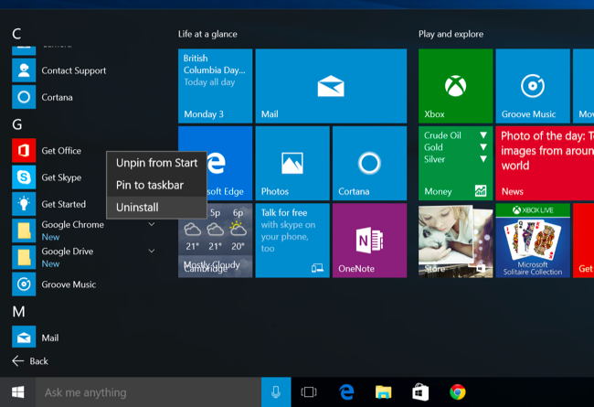
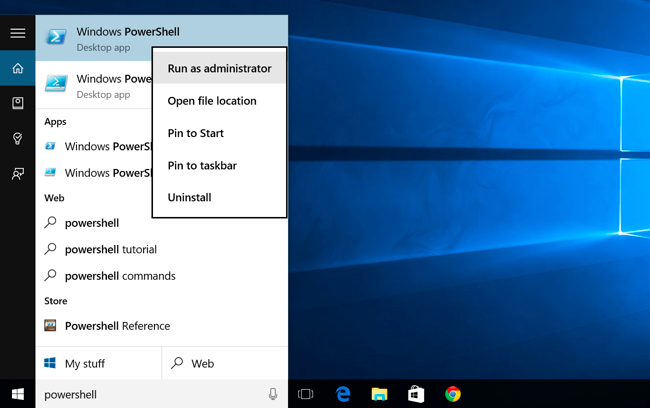
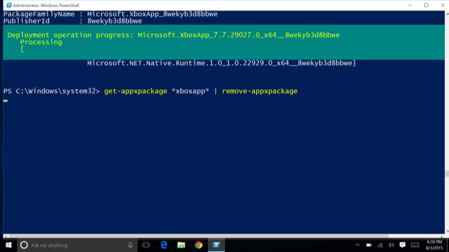

+++
title = "طريقة إزالة التطبيقات المدمجة في ويندوز 10 وإعادة تثبيتهم"
date = "2015-08-16"
description = "يحتوي ويندوز 10 على العديد من التطبيقات الموحدة Universal apps مثل البريد والتقويم، ولا توجد طريقة لإلغاء تثبيتهم بشكل طبيعي مثل باقي التطبيقات، في درس اليوم أقدم لك عزيزي القارئ طريقة إزالة التطبيقات المدمجة في ويندوز 10 وإعادة تثبيتهم مرة أخرى."
categories = ["ويندوز",]
series = ["ويندوز 10"]
tags = ["موقع لغة العصر"]
+++

يحتوي ويندوز 10 على العديد من التطبيقات الموحدة Universal apps مثل البريد والتقويم، ولا توجد طريقة لإلغاء تثبيتهم بشكل طبيعي مثل باقي التطبيقات، في درس اليوم أقدم لك عزيزي القارئ طريقة إزالة التطبيقات المدمجة في ويندوز 10 وإعادة تثبيتهم مرة أخرى.

**أولا: إزالة بعض التطبيقات بالطريقة التقليدية:**
تعمل هذه الطريقة على التطبيقات: Get Office, Get Skype, Get Started, Microsoft Solitaire Collection, Money, News, Phone Companion, و Sport.
من قائمة البداية اضغط يزر الفأرة الأيمن على التطبيق الذي تريد إلغاء تثبيته ثم اختر Uninstall.

1

**ثانيا: إزالة التطبيقات الأخرى باستخدام** **Windows PowerShell:**
1. قم بكتابة PowerShell في البحث ثم اضغط بزر الفأرة الأيمن واختر Run as administrator ثم اضغط Yes.

2. هذه قائمة أوامر لإزالة أي تطبيق من التطبيق الموجودة في ويندوز 10:

| التطبيق | أمر اﻹزالة |
| :-----: | :---------: |
| 3D Builder | Get-AppxPackage *3dbuilder* \| Remove-AppxPackage |
| Alarms and Clock | Get-AppxPackage *windowsalarms* \| Remove-AppxPackage |
| Calculator | Get-AppxPackage *windowscalculator* \| Remove-AppxPackage |
| Calendar and Mail | Get-AppxPackage *windowscommunicationsapps* \| Remove-AppxPackage |
| Camera | Get-AppxPackage *windowscamera* \| Remove-AppxPackage |
| Contact Support | غير مسموح بإزالته ||
| Cortana | غير مسموح بإزالته ||
| Get Office | Get-AppxPackage *officehub* \| Remove-AppxPackage |
| Get Skype | Get-AppxPackage *skypeapp* \| Remove-AppxPackage |
| Get Started | Get-AppxPackage *getstarted* \| Remove-AppxPackage |
| Groove Music | Get-AppxPackage *zunemusic* \| Remove-AppxPackage |
| Maps | Get-AppxPackage *windowsmaps* \| Remove-AppxPackage |
| Microsoft Edge | غير مسموح بإزالته ||
| Microsoft Solitaire Collection | Get-AppxPackage *solitairecollection* \| Remove-AppxPackage |
| Money | Get-AppxPackage *bingfinance* \| Remove-AppxPackage |
| Movies & TV | Get-AppxPackage *zunevideo* \| Remove-AppxPackage |
| News | Get-AppxPackage *bingnews* \| Remove-AppxPackage |
| OneNote | Get-AppxPackage *onenote* \| Remove-AppxPackage |
| People | Get-AppxPackage *people* \| Remove-AppxPackage |
| Phone Companion | Get-AppxPackage *windowsphone* \| Remove-AppxPackage |
| Photos | Get-AppxPackage *photos* \| Remove-AppxPackage |
| Store | Get-AppxPackage *windowsstore* \| Remove-AppxPackage |
| Sports | Get-AppxPackage *bingsports* \| Remove-AppxPackage |
| Voice Recorder | Get-AppxPackage *soundrecorder* \| Remove-AppxPackage |
| Weather | Get-AppxPackage *bingweather* \| Remove-AppxPackage |
| Windows Feedback | غير مسموح بإزالته ||
| Xbox | Get-AppxPackage *xboxapp* \| Remove-AppxPackage |

3. قم بنسخ أي أمر من الأوامر السابقة ثم قم بلصقه في PowerShell واضغط Enter.

**ثانيا: إعادة تثبيت جميع تطبيقات الويندوز مرة أخرى باستخدام** **Windows PowerShell:**
1. قم بكتابة PowerShell في البحث ثم اضغط بزر الفأرة الأيمن واختر Run as administrator ثم اضغط Yes.
2. قم بنسخ هذا الأمر ثم قم بلصقه في PowerShell واضغط Enter.
`Get-AppxPackage -AllUsers| Foreach {Add-AppxPackage -DisableDevelopmentMode -Register “$($\_.InstallLocation)\AppXManifest.xml”}`

3. سيأخذ تنفيذ الأوامر بعض الوقت للانتهاء من التثبيت.

---
هذا الموضوع نٌشر باﻷصل على موقع مجلة لغة العصر.