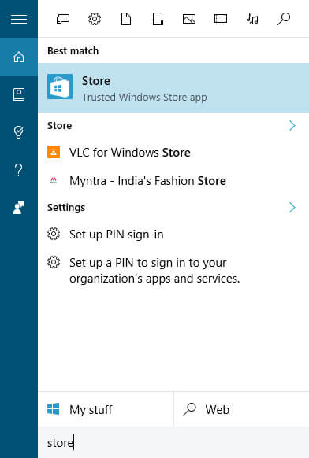
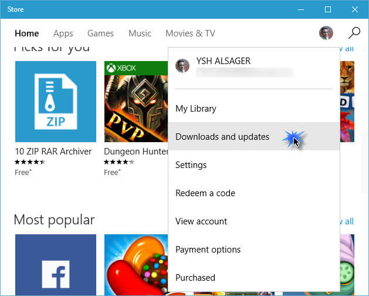
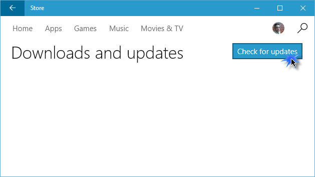

+++
title = "كيفية التحقق من تحديثات تطبيقات ويندوز 10 يدويا"
date = "2016-05-29"
description = "في بعض الأحيان نحتاج إلى التحقق من وجود تحديثات جديدة للتطبيقات، وخاصة إذا كان التحديث التلقائي لتطبيقات متجر ويندوز 10 معطلا، في درس اليوم ستتعرف عزيزي القارئ على طريقة التحقق اليدوي من تحديثات التطبيقات"
categories = ["ويندوز",]
series = ["ويندوز 10"]
tags = ["موقع لغة العصر"]
+++

في بعض الأحيان نحتاج إلى التحقق من وجود تحديثات جديدة للتطبيقات، وخاصة إذا كان التحديث التلقائي لتطبيقات متجر ويندوز 10 معطلا، في درس اليوم ستتعرف عزيزي القارئ على طريقة التحقق اليدوي من تحديثات التطبيقات.

1- قم بالدخول إلى متجر التطبيقات Store App عن طريق قائمة البداية أو البحث عنه.

2- ستجد المتجر كما بالصورة، اضغط على صورة المستخدم لفتح القائمة، ثم اختر Download and updates.

3- ستجد زر Check for updates قم بالضغط عليه، ثم انتظر حتى ينتهي التحقق من وجود تحديثات.

---
هذا الموضوع نٌشر باﻷصل على موقع مجلة لغة العصر.

http://aitmag.ahram.org.eg/News/50150.aspx