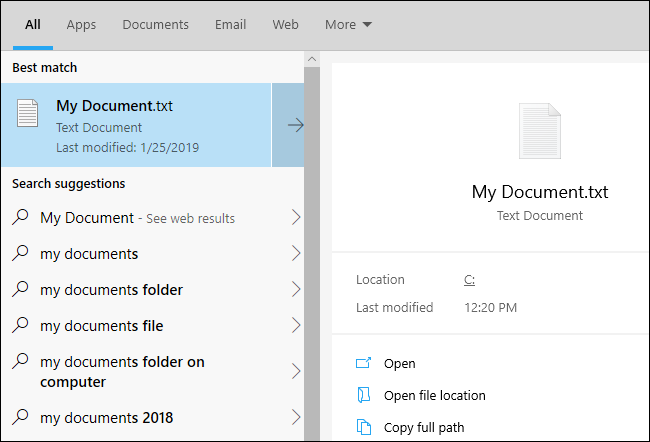

+++
title = "أهم مميزات تحديث ويندوز 10 مايو 2019"
date = "2019-05-01"
description = "من المنتظر إطلاق تحديث جديد لويندوز 10 يحمل الاسم \"مايو 2019\" خلال هذا الشهر، وذلك على عكس الجدول المعتاد للتحديثات الذي عودتنا عليه مايكروسوفت منذ إصدار ويندوز 10 والذي كان يعتمد إصدار تحديثين رئيسيين كل عام مرة في شهري أبريل وأكتوبر. وبينما كانت التحديثات السابقة تأتي بأسماء خاصة مثل \"خريف المبدعين\"، فإن التحديث الجديد سيحمل الاسم الرمزي 19H1، ويأتي التحديث الجديد بعدد من التحسينات على مستوي السرعة والميزات الحالية."
categories = ["ويندوز",]
tags = ["مجلة لغة العصر"]
series = ["ويندوز 10"]
+++
من المنتظر إطلاق تحديث جديد لويندوز 10 يحمل الاسم "مايو 2019" خلال هذا الشهر، وذلك على عكس الجدول المعتاد للتحديثات الذي عودتنا عليه مايكروسوفت منذ إصدار ويندوز 10 والذي كان يعتمد إصدار تحديثين رئيسيين كل عام مرة في شهري أبريل وأكتوبر. وبينما كانت التحديثات السابقة تأتي بأسماء خاصة مثل "خريف المبدعين"، فإن التحديث الجديد سيحمل الاسم الرمزي 19H1، ويأتي التحديث الجديد بعدد من التحسينات على مستوي السرعة والميزات الحالية.

## أهم التغييرات

### تغييرات كبيرة على آلية التحديث

أعلنت مايكروسوفت عن تغييرات جذرية في آلية تحديث ويندوز 10، تعطي المستخدم مزيدا من الحرية والتحكم في تثبيت التحديثات الجديدة.
فبداية من هذا التحديث لن يقوم الويندوز بتثبيت التحديثات الجديدة النصف سنوية إجباريا كما كان الوضع مع تحديث أكتوبر 2018، وسيظهر لك إشعار لتنبيهك بوصول التحديث.

وإذا لم ترغب بتثبيت التحديث الجديد فلا مشكلة! يمكنك الاستمرار في استخدام النسخة الأقدم طالما تستمر مايكروسوفت بإصدار التحديثات الأمنية لها، وهذا يعنى مدة 18 شهر من تاريخ إصدار التحديث النصف سنوي، وهي مدة أكثر من كافية لأغلب المستخدمين. لكن سيتوجب عليك تثبيت التحديث الجديد مرة كل 18 شهر، وبالتأكيد هذا الوضع يوفر مزيدا من الحرية للمستخدم بخلاف التحديثات الإجبارية.

وإضافة إلى ذلك، يمكن لمستخدمي النسخة المنزلية من ويندوز 10 إيقاف التحديثات لمدة تصل إلى 35 يوم، تماما مثل مستخدمي النسخة الاحترافية، ويمكن تكرار هذه العملية خمس مرات، وحتى بعد التحقق من وجود تحديثات لن يقوم الويندوز بالتثبيت التلقائي لها.

### تحسينات السرعة

عندما اكتُشفت ثغرة Spectre التي تتيح للبرامج تجاوز التقييدات المفروضة والوصول إلى مساحات الذاكرة المستخدمة بواسطة البرامج الأخرى في معالجات أنتل مع بداية 2018، أسرعت مايكروسوفت بإرسال تحديث أمنى يسد الثغرة، لكن هذا الحل تسبب في تقليل أداء الأجهزة التي تعمل بويندوز 10، وخاصة المصنعة عام 2015 أو أحدث.

وسيأتي تحديث مايو 2019 مع حل لهذه المشكلة، ودون الخوص في تفاصيل تقنية دقيقة أو تغييرات يحتاج المستخدم للقيام بها، فبمجرد الترقية إلى النسخة الأحدث ستبدأ بملاحظة الفرق في أداء الجهاز.

### حجز جزء من مساحة جهازك للتحديثات

تفشل عملية تثبيت تحديثات الويندوز إذا لم يكن بجهازك مساحة فارغة كافية. هذه المشكلة تحدث بكثرة على الأجهزة ذات المساحة المحدودة نسبيا.

الحل الذي تراه مايكروسوفت مناسبا هو حجز 7 جيجا بايت تقريبا من مساحة القرص الصلب لتكون مخصصة لتحديثات الويندوز. وبالرغم من أنها مخصصة لذلك فيمكن للبرامج استخدامها بشكل مؤقت عند الحاجة لها، حتى لا تكون هذه المساحة مهدرة بالكامل. فعندما سيحتاج الويندوز المزيد من المساحة للتحديث سيقوم بمسح الملفات المؤقتة وبدأ العملية.

أما بالنسبة للحجم الدقيق لهذه المساحة المحجوزة، فهو يعتمد على الميزات الاختيارية واللغات التي قمت بتثبيتها، لكن بشكل عام فهو يبدأ من 7 جيجا.

### سمة مضيئة لسطح المكتب

يتضمن ويندوز 10 الآن سمة جديدة لسطح المكتب، تتميز بالألوان المضيئة البراقة. فكل من قائمة البداية وشريط المهام والإشعارات وشريط مركز التحكم، والنوافذ الأخرى، وكل عناصر الواجهة سيستطيع المستخدم التحكم في السمة التي تظهر بها، سواء مضيئة أو داكنة. كما سيأتي التحديث الجديد بخلفية جديدة لسطح المكتب تلائم السمة الجديدة.

وتقنيا، يحتوي ويندوز بعد التحديث الأخير على اختيارين منفصلين للتحكم في السمات، هما "وضع الويندوز" و "وضع التطبيق". فالسمة الافتراضية القديمة التي كانت مزيجا من شريط المهام الداكن والوضع المضيء للتطبيقات لا تزال متاحة، وذلك عن طريق اختيارات التحكم في السمات. ويمكنك اختيار المزيج الذي تريده من هذين الاختيارين، ليصبح لدينا إجمالا أربع أنماط.

كما تم تعديل أيقونة مستكشف الملفات، وأصبحت تظهر بألوان زاهية مناسبة للسمة الجديدة.

### عزل البرامج

من الميزات الرائعة في التحديث الجديد هي إضافة Windows Sandbox مدمج، يمكنك من خلاله تشغيل البرامج في حاوية منفصلة بشكل معزول عن نظام التشغيل والملفات. وبمجرد إغلاق هذه الحاوية يتم حذف كل الملفات والبرامج التي بداخلها. وتعتمد هذه الميزة على عمل جهاز افتراضي بشكل مشابه ل Microsoft’s Hyper-V.

ميزة الحاويات متاحة فقط في النسخ الاحترافية والتجارية والتعليمية من ويندوز 10، بينما سيحتاج مستخدمي النسخة المنزلية إلى الترقية لاستخدام الميزة الجديدة.

### قائمة بداية أكثر تركيزا

قامت مايكروسوفت بعدد من التعديلات على قائمة البداية في التحديث الجديد. فتظهر الآن بشكل مبسط على هيئة عمود واحد فقط.

لكن لن تلاحظ هذه التحديثات بشكل مباشر بمجرد الترقية، لأن الويندوز سيحتفظ بإعداداتك القديمة لقائمة المهام قبل الترقية، أما إذا قمت بالتثبيت بشكل مباشر أو قمت بعمل حساب جديد ستظهر قائمة المهام بالشكل الجديد.

### يمكنك الآن حذف مزيد من التطبيقات المدمجة

على الرغم من أن هذا التغيير قد تأخر كثيرا، يتيح الويندوز الآن إمكانية إلغاء تثبيت أي تطبيقات مدمجة لا تريدها، مثل Solitaire - My Office - Skype - 3D Viewer - Groove Music - Mail - Paint 3D، والعديد من التطبيقات الأخرى.

لكن لا يزال من غير الممكن إلغاء تثبيت متصفح Edge أو متجر التطبيقات.

### فصل كورتانا عن شريط البحث

منذ إضافة كورتانا إلى ويندوز 10 وهي مدمجة بشريط البحث الموجود على شريط المهام، لكن مع التحديث الجديد سيتم فصلهما عن بعض، ويمكنك التحكم في إخفاء أو إظهار أي منهما على شريط المهام.

كما حصلت واجهة شريط البحث على تغييرات في الواجهة، فيظهر الآن تبويبات لكل تصنيف مثل "الكل - التطبيقات - المستندات - البريد الإلكتروني - الإنترنت". وذلك على عكس النسخ القديمة من الويندوز التي تعرض كورتانا بمجرد الضغط على أيقونة البحث على شريط المهام ثم الانتظار وكتابة ما تود البحث عنه.

لكن على الرغم من هذا التغيير، فإن شريط البحث لا يزال يعرض النتائج من محرك بحث مايكروسوفت Bing إذا كنت متصلا بالإنترنت.

### البحث في كافة ملفات جهازك

أصبح البحث عن طريق قائمة البداية أكثر قوة وفائدة بعد إضافة إمكانية البحث عن الملفات الموجودة على جهازك مباشرة بواسطته. ففي النسخ القديمة من ويندوز 10 انحصر البحث عن الملفات في أماكن محددة مثل سطح المكتب والمستندات والصور والفيديو والتحميلات.

ولتفعيل هذا التغيير تحتاج إلى الدخول إلى الإعدادات ثم البحث، ثم البحث في الويندوز وتمكين الاختيار "Enhanced (Recommended)".

### تسجيل الدخول بدون كلمة مرور

تسعي مايكروسوفت ل "عالم بدون كلمات مرور"، فحاليا يمكنك إنشاء حساب مايكروسوفت جديد بدون كلمة مرور، وهذا الحساب يكون مرتبطا برقم هاتفك، وعند تسجيل الدخول ترسل لك مايكروسوفت رقم أمان لإدخاله وقت التسجيل.
وهذا التغيير قد وصل تحديث مايو 2019، فبإمكان المستخدم الآن تسجيل الدخول إلى الحسابات التي بدون كلمة سر، وإعداد رقم تعريفي PIN، أو أي طريقة أخري لتسجيل الدخول.

وبالطبع هذا التغيير ليس إلزاميا، فهو فقط مجرد طريقة اختيارية لاستخدامها في حالة كان الحساب الخاص بك بلا كلمة مرور.

### استكشاف الأخطاء وإصلاحها بشكل تلقائي

اشتمل الويندوز بإصداراته المختلفة على مستكشفات للأخطاء منذ زمن، لكن المستخدم احتاج دوما إلى معرفة ما نوع المشكلة التي تواجهه حتى يشغل مستكشف الأخطاء المناسب. أما الآن، فيمكنك فقط عن طريق الدخول إلى تطبيق الإعدادات ثم قسم التحديث والحماية ثم تبويب استكشاف وإصلاح الأخطاء تشغيل عدد من العمليات المقترحة التي ربما تقوم بحل مشكلتك.

والذي يحدث هنا هو أن الويندوز يقوم بتجربة عدد من مستكشفات الأخطاء تلقائيا في الخلفية، وتوضح ذلك مايكروسوفت قائلة:

"تستطيع مايكروسوفت حل بعض المشاكل الحرجة بشكل تلقائي على جهازك حتى يعمل بشكل سلس. فعلى سبيل المثال، يمكن أن نقوم بإعادة ضبط الإعدادات الافتراضية لبعض الخدمات، أو ضبط إعدادات بعض الميزات لتوافق تهيئة قطع الهاردوير لديك، أو إجراء أي تغييرات أخري محددة يتطلبها الويندوز ليعمل بشكل طبيعي. ويعمل اكتشاف وإصلاح الأخطاء الحرجة بشكل تلقائي لا يمكن إغلاقه".

كما يستطيع الويندوز القيام بهذه العملية في الخلفية، لكن يمكنك التحكم في ذلك عن طريق الإعدادات داخل قسم الخصوصية. وافتراضيا، سيقوم الويندوز بسؤالك قبل القيام بالعملية.

### وصول أسهل لملفات نظام لينكس الفرعي

حصل نظام لينكس الفرعي الموجود بويندوز 10 على عدد من التغييرات، أبرزها هو إمكانية الوصول للملفات الموجودة بداخله بشكل أبسط. وذلك عن طريق كتابة الأمر "explorer.exe" داخل أي نافذة طرفية، ليقوم الويندوز بفتح هذا المسار في نافذة جديدة.

### مزيد من المزايا تصل إلى برنامج المفكرة

لا تزال مايكروسوفت تعمل على إضافة مزيد من المزايا إلى برنامج المفكرة، حتى بعد التغييرات الكبيرة التي حصل عليها في تحديث أكتوبر الماضي. فمع تحديث مايو 2019، يمكن للمفكرة الاحتفاظ بالنصوص التي لم تحفظ إلى ملف بعد، حتى في حالة الخروج من البرنامج عن غير قصد أو بسبب إعادة تشغيل الويندوز.

كما تغيرت الطريقة التي يتعامل بها برنامج المفكرة مع تشفير النصوص، فخلافا لإصداراته القديمة، يقوم البرنامج الآن بحفظ الملفات في تشفير Unicode بدلا من ASCII.

وأصبح شريط العنوان يعرض علامة نجمة "*" بجانب اسم الملف في حالة وجود تغييرات غير محفوظة مثل أغلب محررات النصوص. أيضا تم إضافة اختصارات جديدة مثل Ctrl+Shift+N لفتح نافذة جديدة، وCtrl+Shift+S لحفظ الملف باسم.

## باقي التغييرات

- معلومات المستخدم تظهر الآن في شريط علوي بتطبيق الإعدادات.
- إضافة دعم Emoji 12 الذي صدر في شهر مارس الماضي.
- إضافة تكامل Spotify إلى شريط الألعاب، وكذلك معرض مدمج للقطات الشاشة.
- تغيير طريقة عرض التاريخ في مستكشف الملفات إلى طريقة أكثر سهولة.
- إعادة تصميم قسم إعدادات التخزين داخل تطبيق الإعدادات.
- إضافة زر مزامنة الوقت والتاريخ مع ساعة الإنترنت إلى إعدادات الوقت والتاريخ.
- إمكانية تغيير إعدادات ال IP لاتصالات الإنترنت السلكية من داخل تطبيق الإعدادات مباشرة.
- إمكانية تفعيل ضبط "ساعات النشاط" بشكل ديناميكي لمنع الويندوز من إعادة التشغيل لتثبيت التحديثات أثناء عملك على الجهاز.
- تغيير شكل علامة عدم وجود اتصال بالإنترنت إلى شكل الكرة الأرضية.
- إضافة أيقونة خاصة بالميكروفون تظهر على شريط المهام بجانب أيقونة الصوت.
- إمكانية تغيير التبويب الافتراضي لمدير المهام Task Manager.
- إضافة مزيد من التغييرات في تصميم شاشة القفل وقائمة البداية لتتلاءم مع أسلوب التصميم الجديد "Fluent Design".
- إضافة شريط للتحكم في مستوى سطوع الشاشة إلى مدير المهام.
- إمكانية تغيير شكل وحجم مؤشر الماوس.
- إعادة تصميم سجل حافظة النصوص.

كما يوجد العديد من التغييرات الصغيرة الأخرى الموجودة هنا وهناك في العديد من الأماكن داخل الويندوز، والتي لا يتسع المجال لذكرها، فأتركك أيها القارئ الكريم لاستكشافها.

---

هذا الموضوع نُشر باﻷصل في مجلة لغة العصر العدد 1 شهر 05-2019 ويمكن الإطلاع عليه [هنا](https://drive.google.com/file/d/1E0uRmStg8UYkd5Aodh8sDOmq005M62SD/view?usp=sharing).

