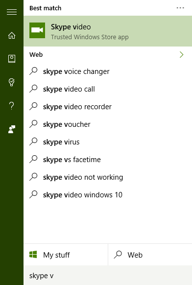
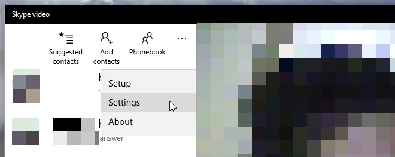
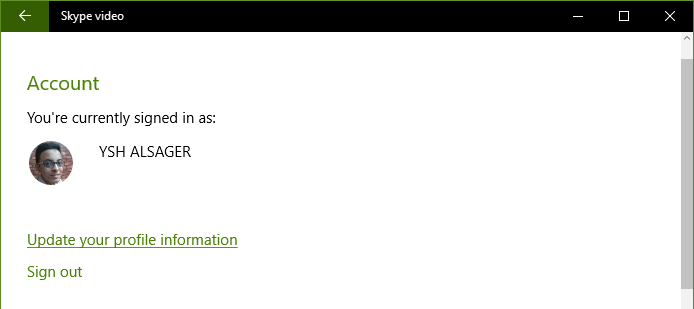

+++
title = "كيفية تسجيل الخروج من تطبيق الرسائل في ويندوز 10"
date = "2016-03-15"
description = "بمجرد أن يقوم المستخدم بإدخال حساب مايكروسوفت على ويندوز 10 فإنه يقوم بتسجيل الدخول تلقائيا بهذا الحساب على جميع الخدمات المدمجة معه إليك عزيزي القارئ طريقة تسجيل الخروج من تطبيق الرسائل في ويندوز 10"
categories = ["ويندوز",]
series = ["ويندوز 10"]
tags = ["موقع لغة العصر"]
+++

بمجرد أن يقوم المستخدم بإدخال حساب مايكروسوفت الخاص به على ويندوز 10 فإن الويندوز يقوم بتسجيل الدخول تلقائيا بهذا الحساب على جميع الخدمات المدمجة مع الويندوز، مثل البريد والأشخاص، إليك عزيزي القارئ طريقة تسجيل الخروج من تطبيق الرسائل في ويندوز 10.

كما هو معروف بين مستخدمي ويندوز 10، فإن تطبيق الرسائل هو المسئول عن إدارة الرسائل النصية ورسائل برنامج Skype، كما انه مرتبط مع تطبيق Skype Video ولكن قد نرغب في تسجيل الخروج منه والتسجيل بحساب اخر، لفعل ذلك قم بالخطوات التالية:

1- قم بفتح تطبيق Skype Video من قائمة البداية.

2- اضغط على زر القائمة الموجود أعلى النافذة كما بالصورة.

3- اختر Settings الإعدادات.

4- ستجد معلومات حسابك كما بالصورة.

5- لتسجيل الخروج اضغط على Signout.

---
هذا الموضوع نٌشر باﻷصل على موقع مجلة لغة العصر.

http://aitmag.ahram.org.eg/News/46215.aspx