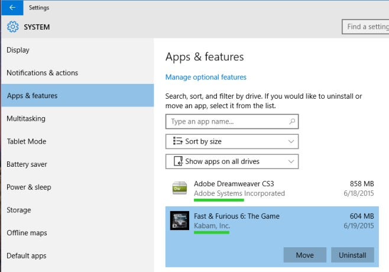

+++
title = "نقل تطبيق مثبت في ويندوز 10 إلى قسم مختلف من الهارد"
date = "2015-07-01"
description = "بشكل افتراضي فإن متجر التطبيقات في ويندوز 10 يقوم بتثبيت التطبيقات على القسم C من القرص الصلب، بالتأكيد هذه مشكلة إذا كان القسم المثبت عليه الويندوز صغير الحجم، لذلك يوفر لك الويندوز طريقة بسيطة لنقل التطبيقات الى أي قسم من الهارد."
categories = ["ويندوز",]
series = ["ويندوز 10"]
tags = ["موقع لغة العصر"]

+++

بشكل افتراضي فإن متجر التطبيقات في ويندوز 10 يقوم بتثبيت التطبيقات على القسم C من القرص الصلب، بالتأكيد هذه مشكلة إذا كان القسم المثبت عليه الويندوز صغير الحجم، لذلك يوفر لك الويندوز طريقة بسيطة لنقل التطبيقات الى أي قسم من الهارد.

1. قم بفتح تطبيق الإعدادات، ثم قم بالدخول الى قسم System ثم تبويب App & Features.
2. انتظر حتى تظهر كل التطبيقات المثبتة.
3. قم بالضغط على التطبيق الذي تريد نقله ثم اضغط Move ليبدأ النقل.

4. اختر المكان الذي تريد نقل التطبيق اليه ثم اضغط Move مرة أخرى.

5. ستأخذ عملية النقل فترة من الوقت اعتمادا على حجم التطبيق.

---

هذا الموضوع نٌشر باﻷصل على موقع مجلة لغة العصر.

http://aitmag.ahram.org.eg/News/18486.aspx
