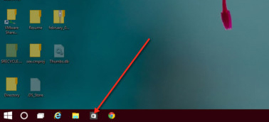
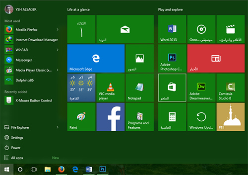
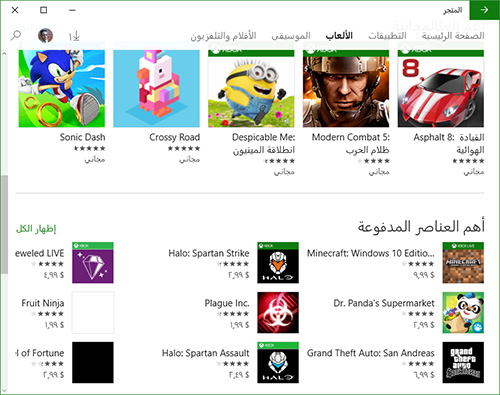
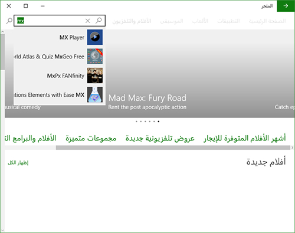

+++
title = "تعرف على متجر التطبيقات الجديد في ويندوز 10"
date = "2015-09-01"
description = "كما هو الحال في باقي أنظمة التشغيل، أضافت مايكروسوفت متجرا للتطبيقات في ويندوز 10، ولا يزال التطوير مستمر فمتجر تطبيقات الويندوز في صعود دائم وتحسينات مميزة، في درس اليوم ستتعرف عزيزي القارئ على متجر تطبيقات ويندوز 10 وطريقه استخدامه."
categories = ["ويندوز",]
series = ["ويندوز 10"]
tags = ["موقع لغة العصر"]
+++

كما هو الحال في باقي أنظمة التشغيل، أضافت مايكروسوفت متجرا للتطبيقات في ويندوز 10، وقد اعتبرها البعض خطوة متأخرة جدا، حيث أن الأندرويد أو الماك بهما متاجرهما الخاصة التي تفوق متجر الويندوز بمراحل، ولكن متجر تطبيقات الويندوز في صعود مستمر وتحسينات مميزة، في درس اليوم ستتعرف عزيزي القارئ على متجر تطبيقات ويندوز 10 وطريقه استخدامه.

**أولا: طرق الوصول إلى تطبيق المتجر:**

قامت مايكروسوفت بتسهيل عملية الوصول لمتجر التطبيقات فيمكنك عزيز القارئ الوصول إليه بأكثر من طريقة:

1. فتح المتجر عن طريق شريط المهام.

2. فتح المتجر عن طريق قائمة البداية.

3. فتح المتجر عن طريق البحث عن "المتجر/Store"

**ثانيا: التعامل مع متجر التطبيقات:**

1. عند فتحك للمتجر تظهر الشاشة الرئيسية كما بالصورة.

2. يمكنك تصفح أقسام المتجر بالضغط على أي من تبويبات "التطبيقات-الألعاب-الموسيقى-الأفلام والتليفيزيون".
3. لتثبيت أي تطبيق اضغط على التطبيق ثم اختر الزر "تثبيت/Install".
4. بالنسبة للتطبيقات والألعاب المدفوعة يمكنك شرائها حسب طريقة الدفع التي سبق وقمت بإعدادها في حساب مايكروسوفت الخاص بك.

5. يمكنك أيضا استخدام ميزة البحث في المتجر للوصول إلى ما تريد بسرعة.

---

هذا الموضوع نٌشر باﻷصل على موقع مجلة لغة العصر.

http://aitmag.ahram.org.eg/News/24094.aspx
