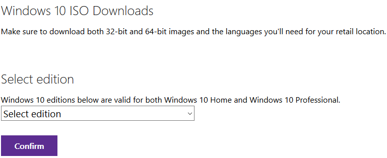
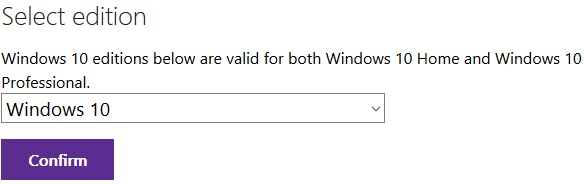
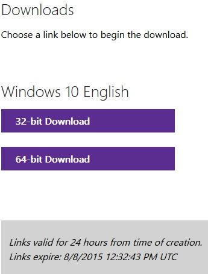
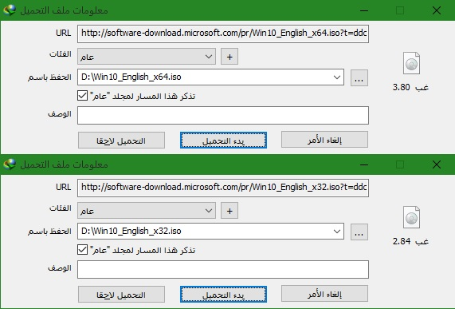

+++
title = "طريقة جديدة من مايكروسوفت لتحميل ISO ويندوز 10"
date = "2015-08-07"
description = "ما زالت مايكروسوفت تحاول جذب جميع المستخدمين إلى نظامها الجديد ويندوز 10، وها هي اليوم تعلن عن طريقة رسمية جديدة لتحميل ويندوز 10، ولكن هذه المرة بصيغة ISO وروابط مباشرة وسريعة."
categories = ["ويندوز",]
series = ["ويندوز 10"]
tags = ["موقع لغة العصر"]

+++

ما زالت مايكروسوفت تحاول جذب جميع المستخدمين إلى نظامها الجديد ويندوز 10، وها هي اليوم تعلن عن طريقة رسمية جديدة لتحميل ويندوز 10، ولكن هذه المرة بصيغة ISO وروابط مباشرة وسريعة.

1. قم بالدخول إلى صفحة التحميل [من هنا](https://www.microsoft.com/en-us/software-download/techbench).
2. قم بالنزول إلى أسفل الصفحة إلى أن تجد Windows 10 ISO Downloads.

3. قم بالضغط على القائمة المنسدلة Select edition ثم اختر ويندوز 10.
4. اضغط على Confirm.

5. ستسجل مايكروسوفت طلبك كما بالصورة:

6. من القائمة المنسدلة Select the product language اختر اللغة التي تريدها، ثم اضغط Confirm.

7. سيظهر لك روابط النسختين X32/X64 قم باختيار النسخة التي تريدها، وبهذا تكون قد حصلت على رابط لمدة 24 ساعة تستطيع تحميل الويندوز من خلاله.

8. سيبدأ التحميل كما بالصورة:

---
هذا الموضوع نٌشر باﻷصل على موقع مجلة لغة العصر.

http://aitmag.ahram.org.eg/News/22148.aspx

