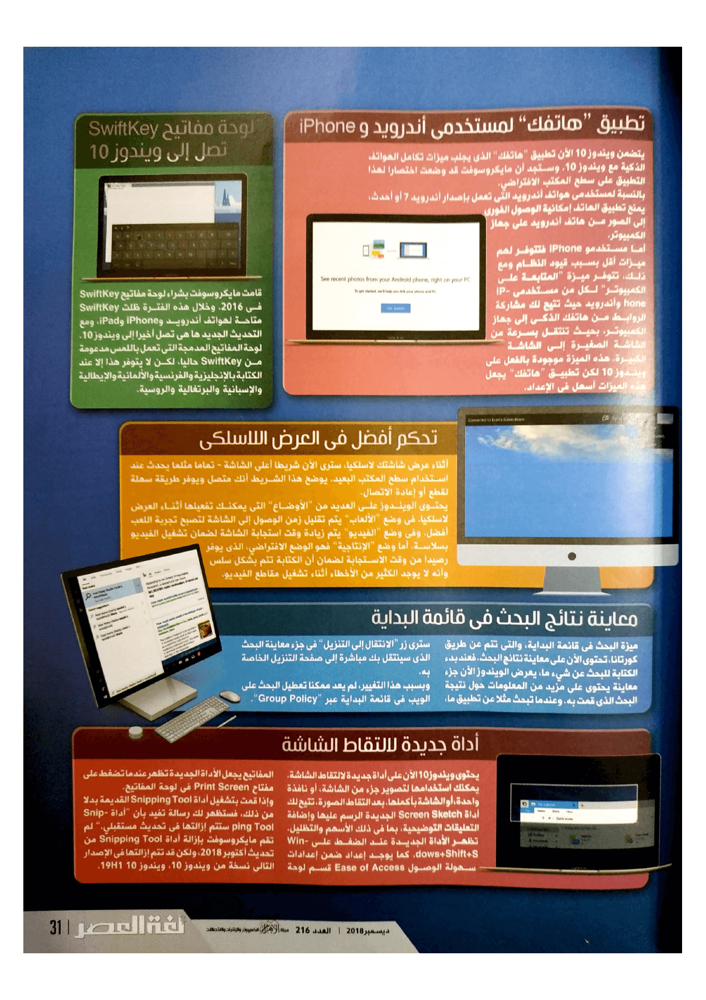

+++
title = "ما الجديد في تحديث ويندوز 10 أكتوبر 2018؟"
date = "2018-12-02"
description = "كما عودتنا مايكروسوفت خلال الأعوام الماضية، صدرت النسخة الجديدة من ويندوز 10 والتي تحمل الاسم \"تحديث أكتوبر 2018\" خلافا لتسميات التحديثات السابقة لهذا العام. وتضمن هذا التحديث الرئيسي عددا من المميزات الجديدة، مثلا سجل الحافظة والذي يتم مزامنته بين أجهزتك المختلفة، والمظهر الداكن الذي طال انتظاره لمستعرض الملفات، والعديد من التغييرات الأخرى التي سنستعرضها بمزيد من التفاصيل في الصفحات القادمة."
categories = ["ويندوز",]
tags = ["مجلة لغة العصر"]
series = ["ويندوز 10"]
+++
كما عودتنا مايكروسوفت خلال الأعوام الماضية، صدرت النسخة الجديدة من ويندوز 10 والتي تحمل الاسم "تحديث أكتوبر 2018" خلافا لتسميات التحديثات السابقة لهذا العام. وتضمن هذا التحديث الرئيسي عددا من المميزات الجديدة، مثلا سجل الحافظة والذي يتم مزامنته بين أجهزتك المختلفة، والمظهر الداكن الذي طال انتظاره لمستعرض الملفات، والعديد من التغييرات الأخرى التي سنستعرضها بمزيد من التفاصيل في الصفحات القادمة.

كما عودتنا مايكروسوفت خلال الأعوام الماضية، صدرت النسخة الجديدة من ويندوز 10 والتي تحمل الاسم "تحديث أكتوبر 2018" خلافا لتسميات التحديثات السابقة لهذا العام. وتضمن هذا التحديث الرئيسي عددا من المميزات الجديدة، مثلا سجل الحافظة والذي يتم مزامنته بين أجهزتك المختلفة، والمظهر الداكن الذي طال انتظاره لمستعرض الملفات، والعديد من التغييرات الأخرى التي سنستعرضها بمزيد من التفاصيل في الصفحات القادمة.

يحمل تحديث أكتوبر 2018 رقم الإصدار 1809 والاسم الرمزي Redstone 5، وبالفعل حصل مستخدمي نسخة Insider على أغلب المميزات الخاصة بالتحديث الجديد مع النسخة 17551 التي صدرت في أول سبتمبر. لكن لسوء الحظ، يبدو أن مايكروسوفت قد قررت تأجيل عدد من الميزات الجديدة، أهمها ميزة "المجموعات" Sets التي تتيح للمستخدم تجميع النوافذ المختلفة لبرنامج ما في تبويبات بشكل مشابه للمتصفحات.

## التغييرات الجديدة

### سجل الحافظة والمزامنة

يأتي تحديث أكتوبر 2018 مع مجموعة من الميزات الجديدة تم إضافتها إلى الحافظة. فيوجد الآن سجل للحافظة يمكنك الوصول إليه عن طريق الضغط على Windows + V كما يمكنك مزامنة سجل الحافظة بين أجهزتك، مما يتيح لك الوصول إلى ما قمت بنسخه عبر الأجهزة المختلفة بكل سهولة. إضافة إلى أنه يمكنك أيضًا المزامنة يدويًا حتى تمنع الويندوز من مزامنة بعض البيانات الحساسة مثل كلمات المرور وأرقام بطاقات الائتمان.

وفي المستقبل قد تضيف مايكروسوفت دعم الحافظة السحابية إلى لوحة مفاتيح SwiftKey الخاصة بها على أجهزة أندرويد وiPhone وحينها ستتمكن من النسخ واللصق بين هاتفك أو جهازك اللوحي وجهاز الكمبيوتر الذي يعمل بويندوز 10 مما يوفر تكامل مميز بين الأجهزة.

### مظهر داكن جديد لمستعرض الملفات

يتضمن ويندوز 10 الآن سمة داكنة لمستعرض الملفات، ويتم تمكينه تلقائيًا إذا كنت تستخدم السمة داكنة على مستوى النظام من الإعدادات ثم التخصيص الألوان.
كما يصل تأثير المظهر الجديد إلى قوائم مستعرض الملفات، بما في ذلك القائمة المختصرة التي تظهر عند النقر بزر الماوس الأيمن فوق سطح المكتب. وهناك أيضًا مظهر داكن جديد لنوافذ فتح وحفظ الملفات.

### لوحة مفاتيح SwiftKey تصل إلى ويندوز 10

قامت مايكروسوفت بشراء لوحة مفاتيح SwiftKey في 2016. وخلال هذه الفترة ظلت SwiftKey متاحة لهواتف أندرويد وiPhone وiPad، ومع التحديث الجديد ها هي تصل أخيرا إلى ويندوز 10.
لوحة المفاتيح المدمجة التي تعمل باللمس مدعومة من SwiftKey حاليًا، لكن لا يتوفر هذا إلا عند الكتابة بالإنجليزية والفرنسية والألمانية والإيطالية والإسبانية والبرتغالية والروسية.

وكما تقول شركة مايكروسوفت، فإن SwiftKey تمنحك تصحيح تلقائي وتوقعات أوتوماتيكية أكثر دقة من خلال تعلم أسلوب الكتابة الخاص بك. كما أنها تدعم الكتابة بالسحب، مما يتيح لك الكتابة عن طريق تمرير إصبعك من حرف إلى آخر بدلاً من النقر على كل حرف من لوحة المفاتيح.

### تطبيق "هاتفك" لمستخدمي أندرويد وiPhone

يتضمن ويندوز 10 الآن تطبيق "هاتفك" الذي يجلب ميزات تكامل الهواتف الذكية مع ويندوز 10. وستجد أن مايكروسوفت قد وضعت اختصارًا لهذا التطبيق على سطح المكتب الافتراضي.
بالنسبة لمستخدمي هواتف أندرويد التي تعمل بإصدار أندرويد 7 أو أحدث، يمنح تطبيق الهاتف إمكانية الوصول الفوري إلى الصور من هاتف أندرويد على جهاز الكمبيوتر. وفي المستقبل تخطط مايكروسوفت لإضافة ميزات لمزامنة الإشعارات والرسائل النصية من هاتف أندرويد. وذلك على الرغم من وجود ميزات المزامنة هذه حاليًا في تطبيق Cortana ولكن مايكروسوفت تريد تسهيل اكتشافها.

أما مستخدمي iPhone فيتوفر لهم ميزات أقل بسبب قيود النظام ومع ذلك، تتوفر ميزة "المتابعة على الكمبيوتر" لكل من مستخدمي iPhone وأندرويد حيث تتيح لك مشاركة الروابط من هاتفك الذكي إلى جهاز الكمبيوتر، بحيث تنتقل بسرعة من الشاشة الصغيرة إلى الشاشة الكبيرة. هذه الميزة موجودة بالفعل على ويندوز 10 لكن تطبيق "هاتفك" يجعل هذه الميزات أسهل في الإعداد.

### معاينة نتائج البحث في قائمة البداية

ميزة البحث في قائمة البداية، والتي تتم عن طريق كورتانا، تحتوي الآن على معاينة نتائج البحث. فعند بدء الكتابة للبحث عن شيء ما، يعرض الويندوز الآن جزء معاينة يحتوي على مزيد من المعلومات حول نتيجة البحث الذي قمت به. وعندما تبحث مثلا عن تطبيق ما، سترى زر "الانتقال إلى التنزيل" في جزء معاينة البحث الذي سينتقل بك مباشرة إلى صفحة التنزيل الخاصة به.
وبسبب هذا التغيير، لم يعد ممكنًا تعطيل البحث على الويب في قائمة البداية عبر "Group Policy".

### أداة جديدة لالتقاط الشاشة

يحتوي ويندوز 10 الآن على أداة جديدة لالتقاط الشاشة. يمكنك استخدامها لتصوير جزء من الشاشة، أو نافذة واحدة، أو الشاشة بأكملها. بعد التقاط الصورة، تتيح لك أداة Screen Sketch الجديدة الرسم عليها وإضافة التعليقات التوضيحية، بما في ذلك الأسهم والتظليل.

تظهر الأداة الجديدة عند الضغط على Windows+Shift+S. كما يوجد إعداد ضمن إعدادات سهولة الوصول Ease of Access قسم لوحة المفاتيح يجعل الأداة الجديدة تظهر عندما تضغط على مفتاح Print Screen في لوحة المفاتيح.
وإذا قمت بتشغيل أداة Snipping Tool القديمة بدلاً من ذلك، فستظهر لك رسالة تفيد بأن "أداة Snipping Tool ستتم إزالتها في تحديث مستقبلي." لم تقم مايكروسوفت بإزالة أداة Snipping Tool من تحديث أكتوبر 2018، ولكن قد تتم إزالتها في الإصدار التالي نسخة من ويندوز 10، ويندوز 10 19H1.

### تحديثات جديدة لمتصفح مايكروسوفت Edge

قامت مايكروسوفت بمجموعة من التغييرات على متصفحEdge، فتم إعادة تصميم القائمة والإعدادات. توفر القائمة الجديدة الأوامر الشائعة مثل "علامة تبويب جديدة" و"نافذة جديدة" في شكل أزرار كبيرة، وتم تقسيم صفحة الإعدادات الجديدة إلى فئات بحيث يكون من الأسهل العثور على إعدادات محددة.

كما يدعم الإصدار الجديد من Edge حاليًا "التشغيل التلقائي للوسائط" ضمن الإعدادات المتقدمة. فيمكنك التحكم في المواقع التي يُسمح لها بتشغيل مقاطع الفيديو تلقائيًا. وحتى لا تحدث مشاكل، "السماح" بالتشغيل في الخلفية هو الإعداد الافتراضي.
هناك أيضًا طريقة للتحكم في التشغيل التلقائي للوسائط على أساس كل موقع. وذلك بالضغط على القفل أو رمز "i" على يسار عنوان موقع الويب في شريط الموقع، ثم على "إدارة الأذونات". يمكنك اختيار ما إذا كان موقع الويب يمكنه تشغيل الوسائط تلقائيًا.

أيضا توفر واجهة متصفح Edge بعض الميزات المفيدة الأخرى. فيمكنك الآن رؤية أفضل مواقعك في "قائمة الانتقال" التي تظهر عند الضغط بزر الماوس الأيمن فوق اختصار المتصفح على شريط المهام أو في قائمة البداية. وفي نافذة "التبويبات المجمعة" الموجودة أعلى يمين المتصفح، يمكنك الآن تسمية مجموعات من التبويبات المحفوظة. وفي جزء التحميلات، يمكنك الضغط بزر الماوس الأيمن على أي تحميل للوصول إلى خيارات مثل "العرض في المجلد" و "نسخ الرابط".
كما وصل دعم مصادقة الويب إلى Edge أخيرا، مما يسمح باستخدام مفاتيح الأمان FIDO U2F وأجهزة المصادقة الأخرى أثناء تسجيل الدخول إلى مواقع الويب.
ومن التغييرات الجديرة بالذكر أيضا، حصول المتصفح على العديد من التغييرات في التصميم عن طريق مزيد من لمسات "التصميم السلسfluent design “، وعندما تستخدم Edge كعارض افتراضي لملفاتPDF سترى رمزًا جديدًا لملفات PDF في مستعرض الملفات، يحتوي الرمز الجديد على شعار "PDF" باللون الأحمر فقط ولا يتضمن شعار المتصفح الأزرق، كما كان الحال مع الإصدار السابق.

أثناء وجودك في وضع القراءة أو عارض PDF، يمكنك الآن تحديد كلمة وسيقوم Edge بعرض تعريف الكلمة من القاموس تلقائيًا. ويمكنك أيضًا الضغط على رمز مكبر الصوت لسماع نطق الكلمة بشكل صحيح.
وفي وضع القراءة، يمكنك الآن تعيين ألوان مختلفة للصفحات واختيار الألوان التي تحبها عينيك. هناك أيضًا أداة جديدة تسمى " خط التركيز" تقوم بتظليل مجموعات من سطر واحد أو ثلاثة أو خمسة أسطر حتى تساعدك على التركيز أثناء القراءة.
كما تم تحسين شريط الأدوات في عارض ملفات PDF أيضًا. فيحتوي الآن على وصف نصي لكل الأدوات لتسهيل فهمها، ويتضمن خيارات جديدة مثل "إضافة ملاحظات" على شريط الأدوات. وأثناء عرض ملفات PDF يمكنك التمرير لأعلى الصفحة لفتح شريط أدوات PDF. وبينما يكون شريط الأدوات مفتوحًا، يمكنك الضغط على رمز الدبوس على الجانب الأيمن من الشريط لتثبيته أعلى الشاشة ومنع إخفاءه تلقائيًا.
وأخيرًا، أصبح لدى متصفح Edge الآن شعار "تجريبي" جديد في إصدارات المعاينة من ويندوز 10، مما يلفت انتباه المستخدم إلى أنه يستخدم إصدار غير مستقر من Edge.

### إعداد أسهل لـ HDR

تم إضافة صفحة جديدة إلى تطبيق الإعدادات " Windows HD Color" في قسم النظام ثم تبويب العرض. تخبرك هذه الصفحة ما إذا كان جهازك متوافقًا مع النطاق الديناميكي العالي (HDR) ومحتوى التدرج اللوني الواسع (WCG). حيث أن هذه الميزات أصبحت أكثر شيوعًا في شاشات 4K الراقية.

وبالإضافة إلى توفير معلومات حول إمكانيات HDR وWCG لنظامك، تتيح لك هذه الصفحة التحكم في ميزات HDR على نظامك. كما تعرض لك أيضًا محتوى HDR، مثل الصور ومقاطع الفيديو والألعاب والتطبيقات الموجود على نظامك.
وبالطبع يمكن استخدام هذه الميزات فقط إذا كان لديك شاشة HDR متصلة بالكمبيوتر.

### دعم أفضل لشبكات المحمول

قامت مايكروسوفت بالانتقال إلى إطار برنامج تشغيل جديد "Net Adapter" في الويندوز، ويؤدي ذلك إلى تحسين قابلية الاتصال لأجهزة اللاب توب التي تدعم شبكات(LTE)، سواء كانت تستخدم بطاقة SIM أو مودم USB. حيث تم تطبيق هذا التغيير اعتبارًا من الإصدار 17677.

### مزيد من التحسينات في التصميم

يتبع ويندوز 10 الآن نهج جديد في التصميم ابتداء من التحديث السابق، والآن بدلاً من حدود النوافذ الملونة، سترى حدود رمادية تتلاشى برشاقة مع ظلال كل نافذة. ومع ذلك، لا يزال بإمكانك إعادة تفعيل حدود النوافذ الملونة إذا كنت تريد ذلك. وتحتوي العديد من القوائم المنبثقة، مثل القائمة المختصرة على ظلال حولها لإضافة عمق إلى التصميم. كما سترى المزيد من التغييرات في التصميم عبر أجزاء النظام المختلفة، بما في ذلك تطبيق الأمان وفي المخطط الزمني، والمزيد.

### Windows Defender يصبح Windows Security

تم إعادة تسمية تطبيق Windows Defender Security Center إلى " Windows Security" وستجد أسفل Virus & Threat Protection قسم "التهديدات الحالية" الذي يعرض جميع التهديدات المحتملة التي تحتاج إلى اتخاذ إجراءات.

وأسفل اختيار إدارة الإعدادات، يمكنك تمكين خيار "حظر السلوكيات المشبوهة" الذي تقول مايكروسوفت أنه سيمكن تقنية "الحد من سطح الهجوم" التي يوفرها درع Windows Defender والتي ستساعد على حماية جهاز الكمبيوتر الخاص بك من الثغرات.
كما أصبح الآن من السهل تمكين "حارس التطبيقات"، الذي يقوم بتشغيل متصفح Edge في حاوية معزولة لتجربة تصفح أكثر أمانًا. وذلك عن طريق Windows Security ثم التطبيقات والتحكم في المتصفح " App & Browser Control " ثم اضغط على " Install Windows Defender Application Guard" الموجودة أسفل التصفُّح المعزول " Isolated Browsing". 

وإذا كنت تستخدم ميزة التحكم في الوصول إلى المجلدات لحماية ملفاتك من برامج الفدية، أصبح من السهل الآن السماح للتطبيقات المحظورة مؤخرًا بالوصول إلى بياناتك. عن طريق Windows Security ثم الحماية ضد الفيروسات والتهديدات ثم إدارة الإعدادات ثم الحماية ضد برمجيات الفدية.
هناك أيضًا صفحة جديدة تعرض لك برامج الحماية الموجودة على جهازك. وذلك عن طريق Windows Security ثم Settings ثم Manage Providers.

### تثبيت الخطوط على مستوي النظام

تسمح الإصدارات القديمة من ويندوز للمستخدمين الذين لديهم امتيازات إدارية فقط بتثبيت الخطوط على مستوى النظام. يحسّن تحديث أكتوبر 2018 هذا الأمر ويعطي الجميع القدرة على تثبيت الخطوط. وذلك بمجرد الضغط بزر الماوس الأيمن على ملف خط ما، يمكنك تحديد إما "تثبيت" لتثبيته فقط لحساب المستخدم الخاص بك أو "التثبيت لكل المستخدمين" لتثبيته لكافة المستخدمين على النظام. وبالطبع يتطلب الخيار الأخير صلاحيات المسؤول.
لكن أثناء عرض معاينة ملف خط ما، سيعمل الزر "تثبيت" الآن على تثبيت الخط فقط للمستخدم الحالي.

### تفاصيل استخدام الطاقة تظهر في مدير المهام

يتضمن مدير المهام Task Manager الآن عمودين جديدين في تبويب العمليات الرئيسية. تم تصميم هذه الأعمدة لمساعدتك على معرفة التطبيقات والخدمات على النظام التي تستهلك أقصى قدر من الطاقة. كما تأخذ بعين الاعتبار وحدة المعالجة المركزية ووحدة معالجة الرسومات (GPU) ونشاط استخدام القرص لتقدير كمية الطاقة التي تستخدمها كل عملية، والتي ستوضح لك مدى سوء كل عملية في التأثير على عمر البطارية.
يعرض عمود "استخدام الطاقة" عملية استخدام الطاقة الحالية في هذه اللحظة. بينما يعرض عمود "اتجاه استخدام الطاقة" استخدام الطاقة خلال الدقيقتين الأخيرتين حتى تتمكن من رؤية كل العمليات التي تستخدم الكثير من الطاقة حتى إذا لم تكن تستخدمها في الوقت الحالي. كما يمكنك الترتيب حسب كل عمود للاطلاع على أكثر العمليات المستهلكة للطاقة.

### تغيير حجم النص

يتيح لك التحديث الجديد لويندوز 10 زيادة حجم النص عبر النظام بأكمله، بما في ذلك في قائمة البداية ومستعرض الملفات وتطبيق الإعدادات.
وللقيام بذلك، توجه إلى الإعدادات ثم القسم سهولة الوصول ثم التبويب العرض. بعد ذلك اضبط شريط التمرير "جعل كل شيء أكبر" لزيادة النص إلى الحجم المطلوب.

### تحديث الويندوز سوف يتوقع أفضل وقت لإعادة التشغيل

يستخدم ويندوز 10 الآن التعلم الآلي لتجنب إعادة تشغيل جهاز الكمبيوتر أثناء استخدامه، وذلك عن طريق التنبؤ بالوقت المناسب لإعادة تشغيل الكمبيوتر عند عدم استخدامه بشكل نشط. بعبارة أخرى، سيحاول النظام التنبؤ بما إذا كنت لا تستخدم جهاز الكمبيوتر الخاص بك لفترة من الوقت فعلا، أم أنك ذهبت لإعداد فنجان من القهوة وستعود مباشرةً، وذلك بخلاف الإصدارات القديمة من ويندوز 10.
بالتأكيد هذه الميزة مفيدة، لكن يمكنك بالفعل منع الويندوز من إعادة تشغيل جهاز الكمبيوتر الخاص بك أثناء استخدامه عن طريق ساعات العمل النشطة التي تتيح لك إعداد ما يصل إلى 18 ساعة من اليوم لا يقوم الويندوز بإعادة التشغيل فيها مطلقا.

### مميزات جديدة لشريط الألعاب

يحتوي شريط الألعاب، الذي أعيد تصميمه في تحديث أبريل 2018، على بعض الميزات الجديدة المفيدة. حيث تم إضافة عناصر للتحكم في الصوت تتيح لك اختيار جهاز الإخراج الصوتي الافتراضي أو التحكم في صوت التطبيقات الأخرى على نظامك.
كما يوفر ميزات لعرض الأداء بحيث يمكنك رؤية ال FPS، واستخدام المعالج CPU، واستخدام GPU، واستخدام الرام مع مرور الوقت.
هناك أيضًا اختيار "موارد مخصصة Dedicate resources" في شريط الألعاب. والذي يتيح لك تفعيل "وضع اللعب" الجديد الذي سيحسن أداء الألعاب على أجهزة الكمبيوتر عند تشغيل العديد من المهام في الخلفية.
يمكنك فتح شريط الألعاب بالضغط على Windows + G في أي مكان، كما يتوفر الآن اختصار له في قائمة البداية.

### تحكم أفضل في العرض اللاسلكي

أثناء عرض شاشتك لاسلكيًا، سترى الآن شريطًا أعلى الشاشة - تمامًا مثلما يحدث عند استخدام سطح المكتب البعيد. يوضح هذا الشريط أنك متصل ويوفر طريقة سهلة لقطع أو إعادة الاتصال.
يحتوي الويندوز على العديد من "الأوضاع" التي يمكنك تفعليها أثناء العرض لاسلكيًا. في وضع "الألعاب" يتم تقليل زمن الوصول إلى الشاشة لتصبح تجربة اللعب أفضل. وفي وضع "الفيديو" يتم زيادة وقت استجابة الشاشة لضمان تشغيل الفيديو بسلاسة. أما وضع "الإنتاجية" فهو الوضع الافتراضي، الذي يوفر رصيدًا من وقت الاستجابة لضمان أن الكتابة تتم بشكل سلس وأنه لا يوجد الكثير من الأخطاء أثناء تشغيل مقاطع الفيديو.

### مزيد من الإيموجي

تتضمن Unicode 11 عدد كبير من الرموز التعبيرية الجديدة يصل إلى 157، وكلها متوفرة في الويندوز مع التحديث الجديد. ويمكنك كتابة رمز تعبيري في أي برنامج من خلال الضغط على Windows +. لفتح لوحة الرموز التعبيرية.
تتضمن الرموز التعبيرية الجديدة كل شيء من الأبطال الخارقين والحيوانات إلى الدببة، والأسنان، والبيسبول، والكعك، وأنابيب الاختبار، وحتى الحمض النووي.

### تطبيق البريد يتجاهل متصفحك المحدد افتراضيا

كانت مايكروسوفت تختبر تغييرًا جديدا يجعل من تطبيق البريد يفتح الروابط في متصفح Edge، حتى إذا قمت بتعيين غيره كمتصفح افتراضي.
ولحسن الحظ، تم تعديل هذا التغيير وأصبح بإمكان المستخدم الاختيار، على الرغم من أن تطبيق البريد سيقوم باستخدام Edge بشكل افتراضي. ولتغيير ذلك اضغط على أيقونة الإعدادات، ثم Reading Pane ثم قم بإيقاف تشغيل الخيار فتح الروابط في Edge، وبذلك سيفتح البريد الروابط في متصفح الويب الافتراضي.

### تطبيق سكايب يحصل على تحديث كبير

حصل تطبيق Skype for Windows 10 على تحديث كبير، يتضمن موضوعات قابلة للتخصيص، وتخطيط جديد لجهات الاتصال الخاصة بك، والقدرة على تخصيص "مجموعة الصور" للمكالمات الجماعية، وتسهيل بدء مشاركة الشاشة أثناء المكالمات.

### برنامج المفكرة يحصل على أول تحديث منذ 20 سنة!

حصل برنامج المفكرة Notepad على العديد من الميزات الجديدة وذلك بعد انقطاع عن التحديثات دام لمدة عشرين سنة. فتم إضافة خيار "الالتفاف حول النص" لخاصيتيّ "البحث والاستبدال"، مما يتيح لك البحث عن كلمة ما واستبدالها في المستند بأكمله دون تحديد موضع مؤشر البحث في الأعلى أو الأسفل.
كما تم إضافة ميزة التكبير للتحكم في حجم النص بسهولة. ما عليك سوى الضغط على قائمة عرض ثم تكبير/تصغير واستخدام الخيارات للتكبير والتصغير. كما يمكنك أيضًا الضغط مع الاستمرار على Ctrl والضغط على علامة الجمع (+) أو علامة الطرح (-) أو صفر (0) للتكبير أو التصغير أو إعادة التعيين إلى مستوى التكبير الافتراضي. وأيضا يمكنك تدوير عجلة الماوس أثناء الضغط على مفتاح Ctrl للتكبير والتصغير.

وتتضمن الميزات المفيدة الأخرى أرقام الأسطر والأعمدة وتمكين التفاف الكلمات، وتمكين شريط الحالة بشكل افتراضي، ودعم اختصار لوحة المفاتيح Ctrl + Backspace لحذف الكلمات السابقة. كما قامت مايكروسوفت أيضًا بتحسين أداء المفكرة أثناء فتح الملفات الكبيرة.
وهناك العديد من التغييرات الأخرى مثل دعم نهايات أسطر ملفات لينكس وماك، ولكن من التغييرات التي تستحق الذكر هو حصول المفكرة على ميزة البحث عبر Bing، حدد أي نص في مستند ثم اضغط على تحرير> بحث باستخدام Bing أو اضغط Ctrl + B.

### مزيد من التحسينات لنظام لينكس الفرعي

يقوم نظام ويندوز الفرعي لنظام لينكس بتشغيل Bash وبيئات الطرفية الأخرى في سطر الأوامر بالاعتماد على توزيعات لينكس مثل Ubuntu وFedora وopenSUSE وDebian على ويندوز.
وإذا كنت تستخدم Bash على الويندوز، فستحصل على ميزة لطالما طالب بها الكثير من الأشخاص، إنها اختصارات لوحة المفاتيح للنسخ واللصق.
يمكنك الآن الضغط بزر الماوس الأيمن على شريط عنوان نافذة الطرفية واختيار "خصائص" للعثور على خيار تفعيل Ctrl + Shift + C وCtrl + Shift + V للنسخ واللصق. حيث يتم تعطيل هذه الاختصارات افتراضيًا لأسباب تتعلق بالتوافق.

تتوفر الاختصارات الجديدة في جميع بيئات الطرفية، لكنها مفيدة بشكل خاص في بيئات shell المعتمدة على Linux حيث الاختصارات العادية Ctrl + C و Ctrl + V تقوم بوظائف أخرى غير النسخ واللصق.
كما يمكن الآن تشغيلshell مباشرة من أي مجلد بالضغط باستمرار على الزر Shift، ثم الضغط بزر الماوس الأيمن لعرض القائمة المختصرة، ستجد اختيارOpen Linux shell here.

## باقي التغييرات

- عرض مستوي بطارية الأجهزة المتصلة بالبلوتوث داخل الإعدادات.
- إشعارات الخصوصية، لتنبيهك عند طلب التطبيقات الوصول إلى أجهزة التسجيل.
- تحسينات جديدة في وضع التركيز.
- ضبط إضاءة الفيديوهات بناء على إضاءة المكان.
- مزيد من التحسينات لميزة مستشعر التخزين.
- تغييرات في نافذة ما بعد تثبيت الويندوز لأول مرة.
- إضافة قسم جديد للتحكم في الإعدادات المحلية للغة والتقويم والعملة.
- اضافة إمكانية البحث داخل التقويم.
- تحسينات على ميزة التكبير والراوي وباقي أدوات سهولة الوصول.

## الميزات المؤجلة

### المجموعات Sets

على الرغم من كونها الميزة الأبرز في نسخ المعاينة، قررت مايكروسوفت تأجيلها. ميزة المجموعات التي تجلب دعم التبويبات لكل نافذة على سطح المكتب تقريبًا، كما تسمح بدمج علامات التبويب من تطبيقات مختلفة متعددة في نفس النافذة. وهذا يعني أن الويندوز أخيراً يحتوي على دعم التبويبات في "مستعرض الملفات"، بل وأكثر من ذلك بكثير من ذلك. على سبيل المثال، قد يكون لديك نافذة تحتوي على مستند وورد، وصفحة ويب، وعلامة تبويب مستعرض الملفات، يمكنك سحب وإفلات علامات التبويب بين النوافذ، كما يوجد اختصارات لوحة المفاتيح مثل Ctrl + Windows + Tab للتبديل بينها.

وتعمل ميزة "المجموعات" مع كل تطبيقات سطح المكتب التقليدية تقريبًا، وكل التطبيق الموحدة كذلك، وحتى برمج الأوفيس المختلفة. بينما لا تدعم البرامج التي تحتوي على أشرطة عناوين مخصصة خاصة بها، مثل Google Chrome وMozilla Firefox وiTunes وSteam.

لكن للأسف، تمت إزالة هذه الميزة من نسخة المعاينة 17704، الذي تم إصداره في 27 يونيو 2018. وقد أوضحت مايكروسوفت أن الميزة ستعود في تحديث مستقبلي. لذلك نتوقع رؤيتها في الإصدار التالي من ويندوز 10 الذي يحمل الاسم الرمزي Windows 10 19H1، والذي من المحتمل إطلاقه في ربيع عام 2019.

---

هذا الموضوع نُشر باﻷصل في مجلة لغة العصر العدد 216 شهر 12-2018 ويمكن الإطلاع عليه [هنا](https://drive.google.com/file/d/18TzxpJ64gqA7SWZsUk-s9GLsvVYcz0sc/view?usp=sharing).

