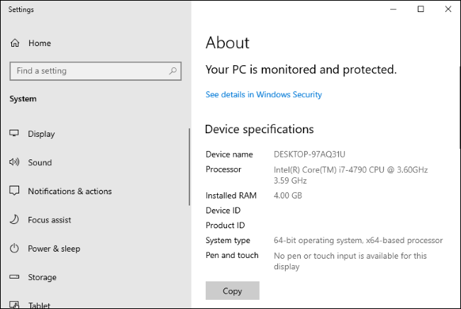
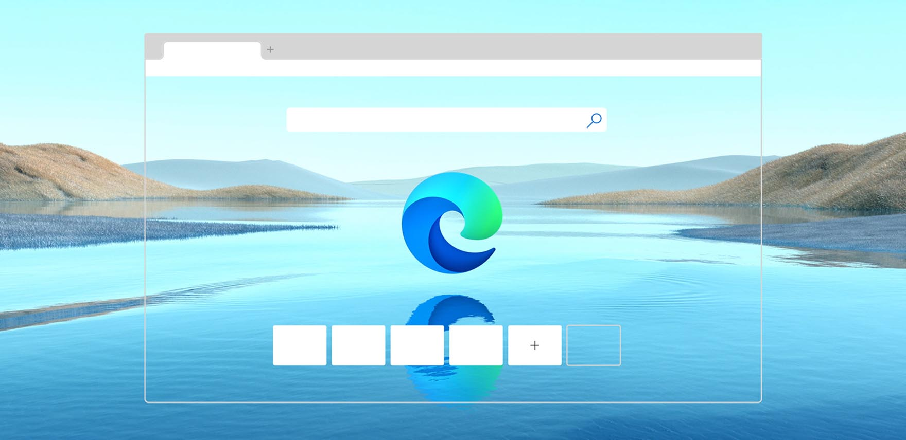
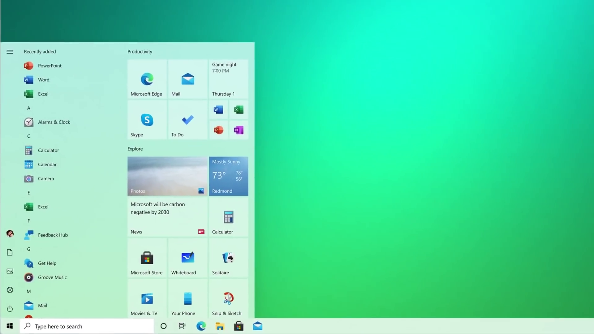
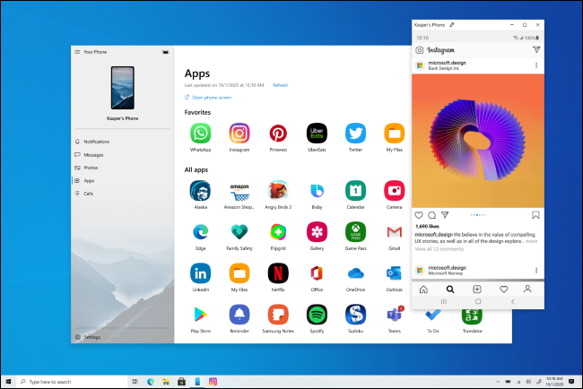
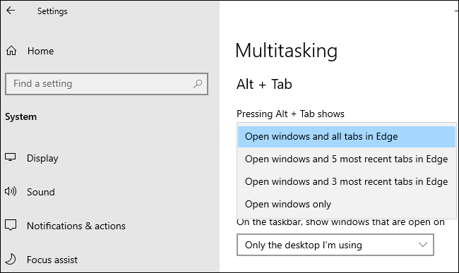
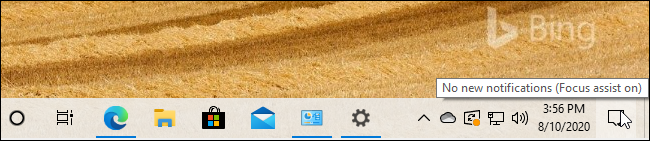
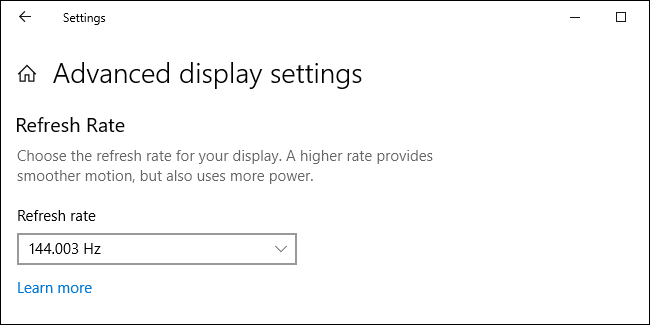
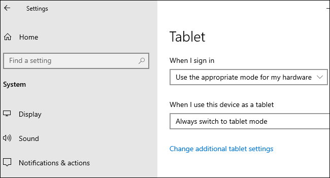
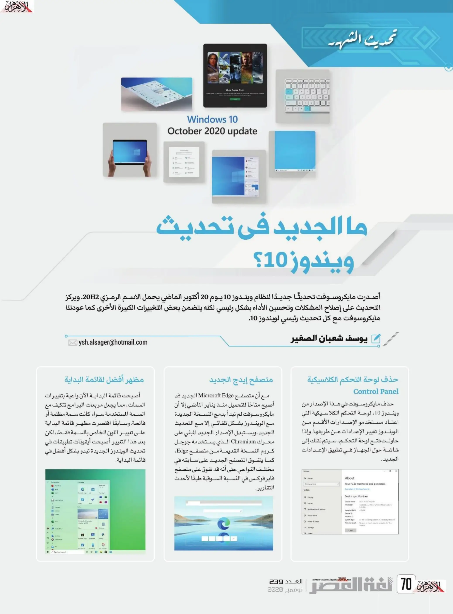
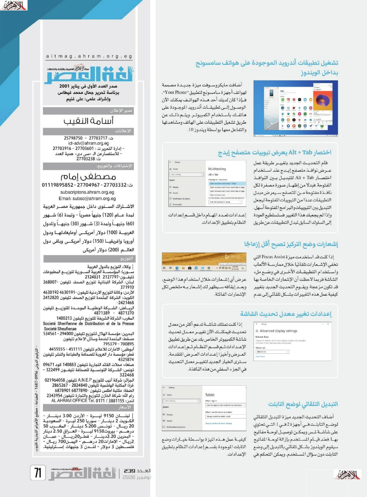

+++
title = "ما الجديد في تحديث ويندوز 10 أكتوبر 2020؟"
date = "2020-11-01"
description = "أصدرت مايكروسوفت تحديثًا جديدًا لنظام ويندوز 10 يوم 20 أكتوبر الماضي يحمل الاسم الرمزي 20H2. ويركز التحديث على إصلاح المشاكل وتحسين الأداء بشكل رئيسي لكنه يتضمن بعض التغييرات الكبيرة الأخرى كما عودتنا مايكروسوفت مع كل تحديث رئيسي لويندوز 10."
categories = ["ويندوز",]
tags = ["مجلة لغة العصر"]
series = ["ويندوز 10"]

+++

أصدرت مايكروسوفت تحديثًا جديدًا لنظام ويندوز 10 يوم 20 أكتوبر الماضي يحمل الاسم الرمزي 20H2. ويركز التحديث على إصلاح المشاكل وتحسين الأداء بشكل رئيسي لكنه يتضمن بعض التغييرات الكبيرة الأخرى كما عودتنا مايكروسوفت مع كل تحديث رئيسي لويندوز 10.

## حذف لوحة التحكم الكلاسيكية Control Panel

حذف مايكروسوفت في هذا الإصدار من ويندوز 10، تمت إزالة لوحة التحكم الكلاسيكية التي اعتاد مستخدمو الإصدارات الأقدم من الويندوز تغيير الإعدادات عن طريقها. وإذا حاولت فتح لوحة التحكم، سيتم نقلك إلى شاشة حول الجهاز في تطبيق الإعدادات الجديد.

## متصفح إيدج الجديد

مع أن متصفح Microsoft Edge الجديد قد أصبح متاحًا للتحميل منذ يناير الماضي إلا أن مايكروسوفت لم تبدأ بدمج النسخة الجديدة مع الويندوز بشكل تلقائي إلا مع التحديث الجديد. ويستبدل الإصدار الجديد المبني على محرك Chromium الذي يستخدمه جوجل كروم النسخة القديمة من متصفح Edge، كما يتفوق المتصفح الجديد على سابقه في مختلف النواحي حتى أنه قد تفوق على متصفح فايرفوكس في النسبة السوقية طبقًا لأحدث التقارير.

## مظهر أفضل لقائمة البداية

أصبحت قائمة البداية الآن واعية بتغييرات السمات، مما يجعل مربعات البرامج تتكيف مع السمة المستخدمة سواء كانت سمة مظلمة أو فاتحة. وسابقًا اقتصرت مظهر قائمة البداية على تغيير اللون الخاص بالسمة فقط، لكن بعد هذا التغيير أصبحت أيقونات تطبيقات في تحديث الويندوز الجديدة تبدو بشكل أفضل في قائمة البداية.

## تشغيل تطبيقات أندرويد الموجودة على هواتف سامسونج بداخل الويندوز

أضافت مايكروسوفت ميزة جديدة مصممة لهواتف أجهزة سامسونج لتطبيق "Your Phone". فإذا كان لديك أحد هذه الهواتف يمكنك الآن الوصول إلى تطبيقات أندرويد الموجودة على هاتفك باستخدام الكمبيوتر. ويتم ذلك عن طريق تشغيل التطبيقات على الهاتف ومشاهدتها والتفاعل معها بواسطة ويندوز 10.

## اختصار Alt + Tab يعرض تبويبات متصفح إيدج

قام التحديث الجديد بتغيير طريقة عمل عرض نوافذ متصفح إيدج عند استخدام اختصار Alt + Tab للتبديل بين النوافذ المفتوحة. فبدلًا من إظهار صورة مصغرة لكل نافذة مفتوحة من المتصفح سيعرض مبدل التطبيقات عددًا من التبويبات المفتوحة ليجعل التبديل بين التبويبات والبرامج المفتوحة أسهل. وإذا لم يجعبك هذا التغيير فستستطيع العودة إلى السلوك السابق لمبدل التطبيقات عن طريق إعدادات تعدد المهام داخل قسم الإعدادات النظام بتطبيق الإعدادات.

## إشعارات وضع التركيز تصبح أقل إزعاجًا

إذا كنت قد استخدمت ميزة Focus Assist التي تخفي الإشعارات تلقائيًا خلال ممارسة الألعاب واستخدام التطبيقات الأخرى في وضع ملء الشاشة فربما لاحظت أن الإشعارات الخاصة بها قد تكون مزعجة. ويقوم التحديث الجديد بتغيير كيفية عمل هذه التغييرات بشكل تلقائي إلى عدم عرض أي إشعارات خلال استخدام هذا الوضع، وبعد إيقافه سيظهر لك إشعار به ملخص لكل الإشعارات الفائتة.

## إعدادات تغيير معدل تحديث الشاشة

إذا كنت تمتلك شاشة تدعم أكثر من معدل تحديث فيمكنك الآن تغيير معدل تحديث شاشة الكمبيوتر الخاص بك عن طريق تطبيق الإعدادات ثم قسم النظام ثم إعدادات العرض وأخيرًا إعدادات العرض المتقدمة. سترى الخيار الجديد لتغيير معدل التحديث في الجزء السفلي من هذه النافذة.

## التبديل التلقائي لوضع التابلت

أضاف التحديث الجديد ميزة التبديل التلقائي لوضع التابلت في أجهزة 2 في 1 التي تحتوي على شاشة لمس ويمكن توصيل لوحة مفاتيح بها. فعند قيام المستخدم بإزالة لوحة المفاتيح سيقوم الويندوز بشكل تلقائي بالتبديل إلى وضع التابلت دون سؤال المستخدم. ويمكن التحكم في كيفية عمل هذه الميزة بواسطة خيارات وضع التابلت الموجودة بقسم إعدادات النظام بتطبيق الإعدادات.

---

هذا الموضوع نُشر باﻷصل في مجلة لغة العصر العدد 239 شهر 11-2020 ويمكن الإطلاع عليه [هنا](https://drive.google.com/file/d/18pHyhwDTp22NEEDfoZrRyg-Ha3f18wog/view?usp=sharing).

