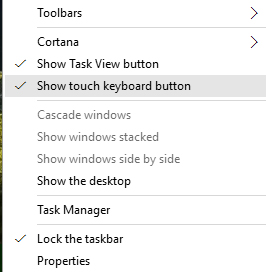
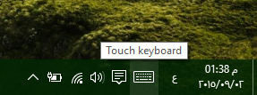
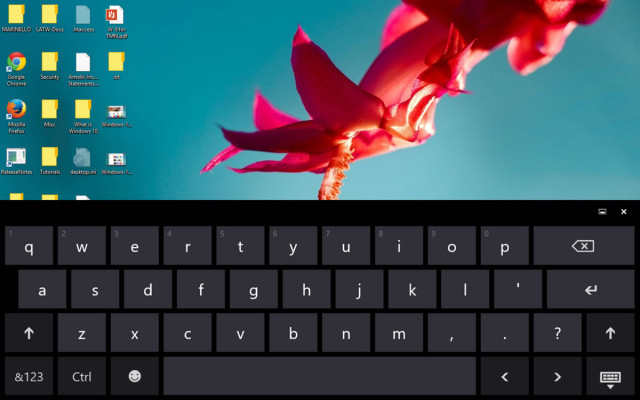
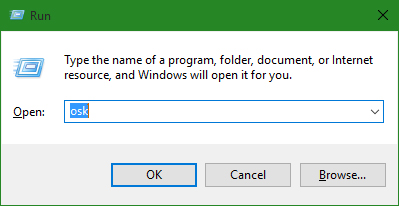
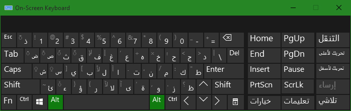
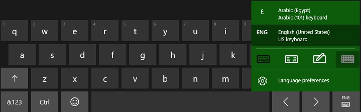

+++
title = "استخدام لوحة المفاتيح المرئية في ويندوز 10"
date = "2015-09-02"
description = "في ويندوز 10 تم تحسين ميزة لوحة المفاتيح المرئية بشكل كبير، هذه الميزة التي ظهرت مع ويندوز 8 تم تطوريها واضافة العديد من أنماط وأساليب الكتابة بما في ذلك الكتابة بلوحة الرسم، في درس اليوم أقدم لك عزيزي القارئ طريقة استخدام لوحة المفاتيح المرئية في ويندوز 10"
categories = ["ويندوز",]
series = ["ويندوز 10"]
tags = ["موقع لغة العصر"]
+++

في ويندوز 10 تم تحسين ميزة لوحة المفاتيح المرئية بشكل كبير، هذه الميزة التي ظهرت مع ويندوز 8 تم تطوريها واضافة العديد من أنماط وأساليب الكتابة بما في ذلك الكتابة بلوحة الرسم، في درس اليوم أقدم لك عزيزي القارئ طريقة استخدام لوحة المفاتيح المرئية في ويندوز 10.

**أولا: إظهار لوحة المفاتيح المرئية** **On Screen Keyboard** **على شريط المهام** **Taskbar:**

1. اضغط بزر الفأرة الأيمن في أي مكان فارغ على سطح المكتب ثم قم باختيار Show Touch Keyboard button.

2. ستظهر أيقونة لوحة المفاتيح على يسار الوقت والتاريخ.

3. قم بالضغط عليها لتفتح كما بالصورة:

**ثانيا: فتح لوحة المفاتيح المرئية** **On Screen Keyboard** **عن طريق أوامر** **Run:**
1. اضغط Windows+R ثم اكتب OSK.

2. ستظهر لوحة المفاتيح كما بالصورة.

**ثالثا: التعامل مع لوحة المفاتيح المرئية** **On Screen Keyboard:**

1. يمكنك الكتابة بالضغط على أزرار لوحة المفاتيح بالفأرة.
2. يمكنك تغيير نمط لوحة المفاتيح بالضغط على زر النمط الموجود جهة اليمين كما بالصورة، ثم اختر النمط الذي تريد التحويل اليه، مثل الكتابة بالرسم أو قسم لوحة المفاتيح إلى قسمين.

3. تستطيع تغيير اللغة بنفس الطريقة السابق.
4. لإغلاق لوحة المفاتيح اضغط على الزر X أو استخدم لوحة المفاتيح الحقيقة لإخفاء المرئية.

---
هذا الموضوع نٌشر باﻷصل على موقع مجلة لغة العصر.

http://aitmag.ahram.org.eg/News/24094.aspx