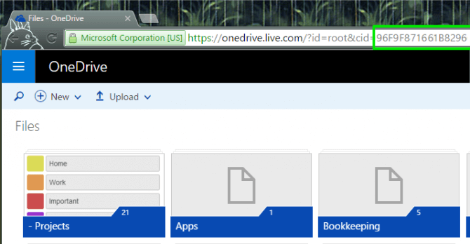
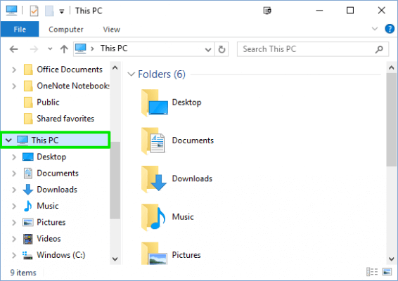
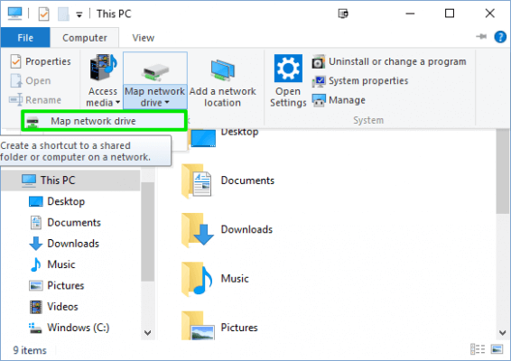
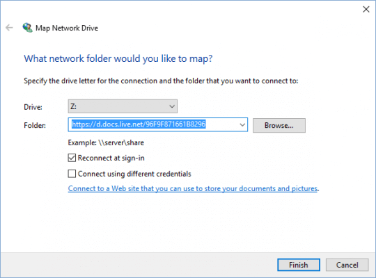
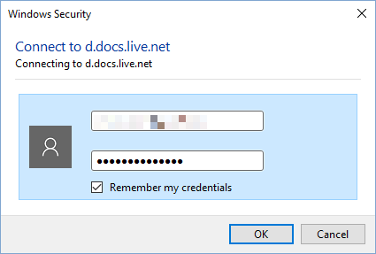

+++
title = "طريقة سحرية للوصول لكل ملفات OneDrive الخاصة بك بدون تحميلها"
date = "2016-06-26"
description = "خدمة OneDrive في ويندوز 10 تسمح لنا فقط بالتعامل مع الملفات التي تمت مزامنتها فقط، ولحل هذه المشكلة سنقوم بتعيين OneDrive ك محرك أقراص شبكة Network Drive"
categories = ["ويندوز",]
series = ["ويندوز 10"]
tags = ["موقع لغة العصر"]
+++

خدمة OneDrive في ويندوز 10 تسمح لنا فقط بالتعامل مع الملفات التي تمت مزامنتها فقط، ولحل هذه المشكلة سنقوم بتعيين OneDrive ك محرك أقراص شبكة Network Drive.

عند تعيين OneDrive واضافته إلى محرك أقراص الشبكة سيصبح بإمكاننا التعامل مع جميع الملفات الموجودة عليه، كما كان متاحا في ويندوز 8.1.
1. قم بتسجيل الدخول إلى حسابك على موقع [Onedrive.com](http://www.onedrive.com/).

2. انسخ رقم ال CID الخاص بحسابك والذي ستجده في شريط العنوان بعد " cid= " كما بالصورة.

3. قم بفتح This PC.

4. من التبويب Computer اضغط على Map network drive.

5. في خانة Folder قم بكتابة <https://d.docs.live.net/> ثم الCID الخاص بك، الذي قمت بنسخه في الخطوة 2.

6. قم بتفعيل الاختيار على المربع Connect using different credentials، ثم اضغط Finish.

7. قم بكتابة بيانات الدخول، لتجد جميع ملفاتك قد ظهرت في قسم جديد في This PC.

---
هذا الموضوع نٌشر باﻷصل على موقع مجلة لغة العصر.

http://aitmag.ahram.org.eg/News/54360.aspx